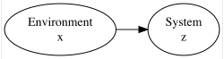
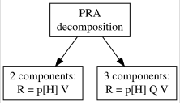
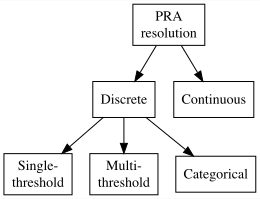
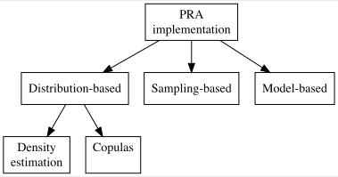

```{r, results="hide", message=FALSE}
  knitr::opts_chunk$set( collapse=TRUE, comment=">" )
  library(copula)
  library(DiagrammeR)
  library(DiagrammeRsvg)
  library(fields)
  library(MCMCpack)
  library(mvtnorm)
  library(nimble)
  library(plot.matrix)
  library(readxl)
  library(rsvg)
  library(scales)
  library(terra)
  library(truncnorm)
  library(VineCopula)
```


\clearpage
# Data

### Sparse Dataset: $\texttt{\{x\_4,z\_4\}}$

```{r}
  set.seed(1)

  n_4  <- 4              ; Sigma_4 <- matrix( c(1,0.5,0.5,1), nrow=2 )
  xz_4 <- rmvnorm( n_4, c(0,0), Sigma_4 ) %*% chol( Sigma_4 )
  xz_4 <- sweep( xz_4, 2, colMeans(xz_4) )
  xz_4 <- xz_4 %*% solve( chol(cov(xz_4)) ) %*% chol(Sigma_4)
  x_4  <- xz_4[,1]       ; z_4 <- xz_4[,2]
  m_4  <- colMeans(xz_4) ; S_4 <- cov(xz_4)
```

```{r, echo=F, fig.height=2.5}
  par( mfrow=c(1,2), mar=c(4,4,1,4) )
  plot( x_4, z_4, xlim=range(xz_4), ylim=range(xz_4), xlab="x", ylab="z" )
```

### A Collection of Linear Datasets: $\texttt{l\_xz.L}$

```{r}
  set.seed(1)

  mu  <- c(0,0) ; Sigma  <- diag(1,2)          ; Sigma[1,2] <- Sigma[2,1] <- 0.5
  n_d <- 1e2    ; l_xz.L <- vector("list",n_d) ; n <- 1e3
  for(d in 1:n_d) { l_xz.L[[d]] <- rmvnorm( n, mu, Sigma ) }
```

```{r, echo=F, fig.height=2.5, fig.align="center", fig.cap="The first two data sets generated from a noisy linear relationship."}
  par( mfrow=c(1,2), mar=c(4,4,1,4) )
  plot( l_xz.L[[1]][,1], l_xz.L[[1]][,2], main="dataset 1", xlab="x", ylab="z" )
  plot( l_xz.L[[2]][,1], l_xz.L[[2]][,2], main="dataset 2", xlab="x", ylab="z" )
```

### A Collection of Nonlinear Datasets: $\texttt{l\_xz.NL}$

```{r}
  set.seed(1)

  n_d <- 1e2 ; l_xz.NL <- vector("list",n_d) ; n <- 1e3 ; sz <- 0.1
  for(d in 1:n_d) {
    x <- runif( n, 0, 3 ) ; ez <- rnorm( n, 0, sz) ; z <- 1-exp(-x) + ez
    l_xz.NL[[d]] <- cbind(x,z) }
```

```{r, echo=F, fig.height=2.5, fig.align="center", fig.cap="The first two data sets generated from a noisy negatively exponential relationship."}
  par( mfrow=c(1,2), mar=c(4,4,1,4) )
  plot( l_xz.NL[[1]][,"x"], l_xz.NL[[1]][,"z"], main="dataset 1", xlab="x", ylab="z" )
  plot( l_xz.NL[[2]][,"x"], l_xz.NL[[2]][,"z"], main="dataset 2", xlab="x", ylab="z" )
```

### German Forestry Data: $\texttt{x\_r3, z\_Fs, z\_Q, z\_Pa, z\_Ps}$

```{r, fig.height=4}
  d.data        <- "data_Germany/"

  file.data     <- paste0( d.data, "2-bis-7_abb-tab_nsh_2024-04-08.xlsx" )
  sheet.data    <- "5_Daten"
  r.data        <- "B120:C153"
  y_r           <- read_excel( file.data, sheet=sheet.data, range=r.data, col_names=F )
  y_r           <- round( as.matrix(y_r) )
  colnames(y_r) <- c( "year", "rain.mm" )

  file.data     <- paste0( d.data, "absterberate_EI_GFI_GKI_RBU_zeitreihe.csv" )
  y_m           <- read.csv2( file.data )
  colnames(y_m) <- c( "year", "mort.%_Fs", "mort.%_Q", "mort.%_Pa", "mort.%_Ps" )
  y_r_m         <- cbind( y_r, y_m[ , startsWith( colnames(y_m), "mort" ) ] )

  # Annual mortality vs. summer rain of last three years
  meanlast <- function(v,k){as.vector(filter(v,f=rep(1/k,k),s=1))}
  n   <- dim(y_r_m)[1] ; k <- 3 
  x_r3 <- meanlast(y_r_m[,"rain.mm"],k)[k:n]
  
  par ( mfrow=c(2,2), mar=c(4,4,1,2) )
  z_Fs <- y_r_m[k:n,"mort.%_Fs"]
  plot( x_r3, z_Fs, main="Fs", xlab=""         , ylab="mortality (%)" )
  z_Q <- y_r_m[k:n,"mort.%_Q"]
  plot( x_r3, z_Q , main="Q" , xlab=""         , ylab=""              )
  z_Pa <- y_r_m[k:n,"mort.%_Pa"]
  plot( x_r3, z_Pa, main="Pa", xlab="rain (mm)", ylab="mortality (%)" )
  z_Ps <- y_r_m[k:n,"mort.%_Ps"]
  plot( x_r3, z_Ps, main="Ps", xlab="rain (mm)", ylab=""              )
```

### Trivariate Gaussian Dataset

```{r}  
  panel.hist <- function(x, ...) {
    h      <- hist(x, plot=F)
    breaks <- h$breaks; n_b <- length(breaks)
    y      <- h$counts; y   <- min(x) + (max(x)-min(x)) * y/max(y)
    rect(breaks[-n_b], min(x), breaks[-1], y, col="cyan", ...) }
```

```{r, fig.height=4}
  set.seed(1)

  n_G3  <- 1e3 ; Sigma_G3 <- matrix(0.5,nrow=3,ncol=3) ; diag(Sigma_G3) <- 1
  xz_G3 <- rmvnorm( n_G3, c(0,0,0), Sigma_G3 )

  pairs(xz_G3, diag.panel=panel.hist, label="" ) ; cor(xz_G3)
```


\clearpage
# Introduction to Probabilistic Risk Analysis (PRA) {#ChIntroPRA}

## From risk matrices to PRA

```{r, echo=FALSE}
  col1 <- c( "1 (minor)" , "2 (medium)", "3 (major)" )
  col2 <- c( 1, 2, 3 ) 
  col3 <- c( 2, 4, 6 )
  col4 <- c( 3, 6, 9 )

  table_RA    <- cbind( col1, col2, col3, col4 )
  colnames_RA <- c( "Consequence | Probability",
                    "1 (unlikely)",
                    "2 (medium)",
                    "3 (likely)" )
```

```{r, echo=FALSE}
  knitr::kable( table_RA, caption="Typical risk matrix.", col.names=colnames_RA )
```

## Basic equations for PRA

```{r DAGPRA, echo=FALSE, out.width="50%", fig.align="center", fig.cap="PRA as a probabilistic network."}
  DAGPRA <- grViz( "digraph{ graph[rankdir=LR]
    node[ shape=ellipse ]
      x [label='@@1'] ; z[label='@@2']
    edge[]
      x -> z }
    [1]: paste0( 'Environment', '\\nx' )
    [2]: paste0( 'System', '\\nz' ) ")
    
  export_svg(DAGPRA) %>% charToRaw() %>% rsvg() %>%
    png::writePNG("images/DAGPRA.png")
    
  
```
	
\begin{equation}
  R = E[z|\neg H] - E[z],
\end{equation}

where $\neg H$ stands for non-hazardous environmental conditions.

\begin{equation}
\begin{aligned}
  V &= R \, / \, p[H] \\
    &= ( E[z|\neg H] - E[z] ) \, / \, p[H] \\
    &= ( E[z|\neg H] - p[H] E[z|H] - (1-p[H]) E[z|\neg H] ) \, / \, p[H] \\
    &= E[z|\neg H] - E[z|H].
\end{aligned}
\end{equation}

## Decomposition of risk: 2 or 3 components

```{r DAGPRAdec, echo=FALSE, out.width="50%", fig.align="center", fig.cap="PRA-classification according to treatment of the hazardous region."}
  DAGPRAdec <- grViz( "digraph{ graph[]
    node[ shape=box ]
      PRA [label='@@1']
      PRA2[label='@@2'] ; PRA3[label='@@3']
    edge[]
      PRA -> {PRA2, PRA3} }
    [1]: paste0( 'PRA', '\\ndecomposition' )
    [2]: paste0( '2 components:', '\\nR = p[H] V' )
    [3]: paste0( '3 components:', '\\nR = p[H] Q V' ) ")
  export_svg(DAGPRAdec) %>% charToRaw() %>% rsvg() %>%
    png::writePNG("images/DAGPRAdec.png")
  
```

## Resolution of PRA: single-threshold, multi-threshold, categorical, continuous

```{r DAGPRAres, echo=FALSE, out.width="65%", fig.align="center", fig.cap="PRA-classification according to treatment of the hazardous region."}
  DAGPRAres <- grViz( "digraph{ graph[]
    node[ shape=box ]
      PRA [label='@@1']
      DIS [label='@@2'] ; CON [label='@@3']
      SING[label='@@4'] ; MULT[label='@@5'] ; CAT [label='@@6']
    edge[]
      PRA -> {DIS, CON}
      DIS -> {SING, MULT, CAT} }
    [1]: paste0( 'PRA', '\\nresolution' )
    [2]: paste0( 'Discrete' )
    [3]: paste0( 'Continuous' )
    [4]: paste0( 'Single-', '\\nthreshold' )
    [5]: paste0( 'Multi-', '\\nthreshold' ) 
    [6]: paste0( 'Categorical' ) ")
  export_svg(DAGPRAres) %>% charToRaw() %>% rsvg() %>%
    png::writePNG("images/DAGPRAres.png")
  
```

### Single-threshold PRA

\begin{equation}
\begin{aligned}
  V &= E[z|x \geq thr] - E[z|x < thr], \\
  R &= E[z|x \geq thr] - E[z] \\
    &= p[H] \, V.
  (\#eq:PRAthr1)
\end{aligned}
\end{equation}

### Multi-threshold PRA

\begin{equation}
\begin{aligned}
  p[H_i] &= p[thr_{i-1} \leq x < thr_i], \\
  V_i    &= E[z|\neg H] - E[z|H_i] \\
         &= E[z|x \geq thr_n] - E[z|thr_{i-1} \leq x < thr_i], \\
  R_i    &= p[H_i] \, V_i,
  (\#eq:PRAthrnB)
\end{aligned}
\end{equation}

for $i=1,..,n$ and where $thr_0=-\infty$.

\begin{equation}
\begin{aligned}
  p[H] &= \sum p[H_i], \\
  V    &= \sum \frac{p[H_i]}{p[H]} V_i, \\
  R    &= \sum R_i, \\
       &= p[H] \, V,
  (\#eq:PRAthrnA)
\end{aligned}
\end{equation}

with all summations running from $i=1$ to $n$.

### Categorical PRA

### Continuous PRA

\begin{equation}
  R = \int_{x=-\infty}^{thr} r(x) dx,
  (\#eq:PRAcontA)
\end{equation}

where

\begin{equation}
\begin{aligned}
  r(x) &= p[x] \, v(x), \\
  v(x) &= E[z|x \geq thr] - E[z|x].
  (\#eq:PRAcontB)
\end{aligned}
\end{equation}

## Implementation of PRA: distribution-based, sampling-based, model-based

```{r DAGPRAimp, echo=FALSE, out.width="65%", fig.align="center", fig.cap="PRA-classification according to implementation method."}
  DAGPRAimp <- grViz( "digraph{ graph[]
    node[ shape=box ]
      PRA [label='@@1']
      DIST[label='@@2'] ; SAMP[label='@@3'] ; MOD [label='@@4']
      DENS[label='@@5'] ; COPU[label='@@6']
    edge[]
      PRA  -> {DIST, SAMP, MOD}
      DIST -> {DENS, COPU} }
    [1]: paste0( 'PRA', '\\nimplementation' )
    [2]: paste0( 'Distribution-based' )
    [3]: paste0( 'Sampling-based' )
    [4]: paste0( 'Model-based' )
    [5]: paste0( 'Density', '\\nestimation' )
    [6]: paste0( 'Copulas', '\\n ' ) ")
  export_svg(DAGPRAimp) %>% charToRaw() %>% rsvg() %>%
    png::writePNG("images/DAGPRAimp.png")
  
```


\clearpage
# Distribution-based single-threshold PRA {#ChDistributionPRA}

## Conditional distributions for $z$

\begin{equation}
\begin{aligned}
  p[z|x < thr] &= \frac {p[z,x < thr]} {p[x < thr]} \\
               &= \frac {p[z] \int_{x=-\infty}^{thr} p[x|z] \, dx} {p[x < thr]} \\
               &= \frac {p[z] F_{x|z}[thr]} {F_x[thr]}, \\
  p[z|x \geq thr] &= \frac{p[z] (1-F_{x|z}[thr])} {1-F_x[thr]},
  (\#eq:pzGxbelowabove)
\end{aligned}
\end{equation}

where $F_x[thr]$ and $F_{x|z}[thr]$ are the cumulative distribution functions associated with $p[x]$ and $p[x|z]$, both evaluated at $x=thr$. Note that $F_x[thr] = p[x < thr]$ is the hazard probability $p[H]$.

\begin{equation}
\begin{aligned}
  E[z|x < thr] &= \int_{z=-\infty}^{\infty} z \, p[z|x < thr] \, dz \\
               &= \frac{1}{F_x[thr]}
                  \int_{z=-\infty}^{\infty} z \, p[z] \,
                  F_{x|z}[thr] \, dz, \\
  E[z|x \geq thr] &= \frac{1}{1-F_x[thr]}
                    \int_{z=-\infty}^{\infty} z \, p[z] \,
                    (1-F_{x|z}[thr]) \, dz.
  (\#eq:EzGxbelowaboveA)
\end{aligned}
\end{equation}

\begin{equation}
\begin{aligned}
  E[z|x < thr] &= \frac{1}{F_x[thr]}
                  \int_{x=-\infty}^{thr} p[x] \, E[z|x] \, dx, \\
  E[z|x \geq thr] &= \frac{1}{1-F_x[thr]}
                    \int_{x=thr}^{\infty} p[x] \, E[z|x] \, dx.
  (\#eq:EzGxbelowaboveB)
\end{aligned}
\end{equation}

### Conditions for V being constant

\begin{equation}
\begin{aligned}
  \frac{d \,V}{d\,thr} &= \frac{d \, (E[z|x \geq thr] - E[z|x < thr])}{d \, thr} \\
                       &= p[thr] \, \{ \frac{E[z|x \geq thr]-z[thr]}{1-F_x[thr]} - 
                          \frac{z[thr]-E[z|x < thr]}{F_x[thr]} \} \\
                       &= \frac{p[thr]}{F_x[thr](1-F_x[thr])} \,
                          \{E[z|x \geq thr] F_x[thr] - z[thr] +
                            E[z|x < thr](1-F_x[thr]) \},
  (\#eq:EzdVdthr)
\end{aligned}
\end{equation}

where $z[thr] = E[z|x=thr]$.

## Example of distribution-based PRA: Gaussian $p[x,z]$

\begin{equation}
\begin{aligned}
  &\underline{ \textrm{EXAMPLE: Bivariate Gaussian for } x \textrm{ and } z \textrm{:} } \\
  &p[x,z] = N[\mu,\Sigma], \textrm{where} \\
  &\mu   = \begin{bmatrix} \mu_x \\ \mu_z \end{bmatrix}
         = \begin{bmatrix} 0 \\ 0 \end{bmatrix} ; \quad
  \Sigma = \begin{bmatrix} \sigma^2_x & \rho\sigma_x\sigma_z \\
                           \rho\sigma_x\sigma_z & \sigma^2_z \end{bmatrix}
         = \begin{bmatrix} 1 & 0.5 \\ 0.5 & 1 \end{bmatrix}.
  (\#eq:pxzGaussian)
\end{aligned}
\end{equation}

\begin{equation}
\begin{aligned}
  p[x]   &= N[\mu_x,\sigma_x^2] = N[0,1], \\
  p[z]   &= N[\mu_z,\sigma_z^2] = N[0,1], \\
  p[z|x] &= N[\mu_z + \rho (x - \mu_x) \frac{\sigma_z}{\sigma_x},
              \sigma_z^2 (1-\rho^2)] = N[0.5 x,0.75]. \\
\end{aligned}
\end{equation}

```{r, echo=F}
  mx     <- mz <- 0 ; Vx  <- Vz <- 1 ; rxz <- 0.5
  mxz    <- c(mx,mz)
  Sxz    <- diag( c(Vx,Vz) ) ; Sxz[1,2] <- Sxz[2,1] <- rxz * sqrt(Vx * Vz)
  px     <- function( x , m=mx , V=Vx  ) { dnorm  ( x , m, sqrt(V) ) }
  pz     <- function( z , m=mz , V=Vz  ) { dnorm  ( z , m, sqrt(V) ) }
  pxz    <- function( xz, m=mxz, S=Sxz ) { dmvnorm( xz, m, S       ) }
  pa_b   <- function( a, b, ma, mb, Va, Vb, r ) { dnorm( a,
    mean = ma + r*(b-mb)*sqrt(Va/Vb), sd = sqrt( Va*(1-r^2) ) ) }
  pz_x   <- function( z, x ) { pa_b( z, x, mz, mx, Vz, Vx, rxz ) }
  px_z   <- function( x, z ) { pa_b( x, z, mx, mz, Vx, Vz, rxz ) }
```

```{r margjointcond, echo=F, out.width="80%", fig.height=4, fig.align="center", fig.cap="Marginal, joint, and conditional Gaussian distributions for $x$ and $z$."}
  n1       <- 41
  x.seq   <- seq( mx-2, mx+2, length.out=n1 )
  z.seq   <- seq( mz-2, mz+2, length.out=n1 )
  xz.grid <- as.matrix( expand.grid(x.seq,z.seq) )
  p.grid  <- pxz( xz.grid )
  # r.xzp   <- rasterFromXYZ( cbind( xz.grid, p.grid ) )
  r.xzp   <- rast( cbind( xz.grid, p.grid ), type="xyz" )

  par( mfrow=c(2,2), mar=c(4,2,2,1) )
  plot( x.seq, px(x.seq), type="l", main="p[x]", xlab="x", ylab="" )
  plot( z.seq, pz(z.seq), type="l", main="p[z]", xlab="z", ylab="" )
  plot( r.xzp,
        main="p[x,z]", breaks=seq(0,max(p.grid),length.out=n1),
        col=rev(gray.colors(n1,start=0,end=1)),
        axes=T, box=T, legend=F, xlab="x", ylab="z" )
  plot  ( z.seq, pz_x(z.seq,mx-1), type="l",
        main=paste0("p[z|x]"), xlab="z", ylab="" )
  points( z.seq, pz_x(z.seq,mx  ), type="l", col="red" )
  points( z.seq, pz_x(z.seq,mx+1), type="l", col="blue" )
  legend( "bottom", legend=c("x=-1","x=0","x=1"),
          col=c("black","red","blue"), lty=1, cex=0.75 )
```

### Hazard probability and conditional distributions

```{r pHpzGivenH, echo=F, out.width="100%", fig.height=3.5, fig.align="center", fig.cap="$p[H]$ and $p[z|x<thr]$ for the bivariate Gaussian."}
  thr.seq <- seq( mx-2, mx+2, length.out=101 )
  par( mfrow=c(1,2), mar=c(4,2,2,1) )
  plot( thr.seq, pnorm(thr.seq,0,1), type="l",
        main="p[H] = p[x<thr]", xlab="thr", ylab="")

  pz_xbelow <- function(thr,z, mz.=mz,mx.=mx,Vz.=Vz,Vx.=Vx,r=rxz) {
    mx_z  <- mx. + r * (z-mz.) * sqrt(Vx./Vz.)
    Vx_z  <- Vx. * (1-r^2)
    return( pz(z) * pnorm(thr,mx_z,sqrt(Vx_z)) /
                    pnorm(thr,mx. ,sqrt(Vx. ))   ) }
  plot  ( z.seq, pz_xbelow(mx-2,z.seq), type="l", col="black",
          xlab="z", ylab="",
          main=paste0("p[z|x < thr]") )
  points( z.seq, pz_xbelow(mx  ,z.seq), type="l", col="red"  )
  points( z.seq, pz_xbelow(mx+2,z.seq), type="l", col="blue" )
  legend( "topright", legend=c("thr=-2","thr=0","thr=2"),
          col=c("black","red","blue"), lty=1, cex=0.75 )
```

### Conditional expectations and PRA

```{r}
  Ez_xlo_NI <- function(thr=0, mz.=mz, mx.=mx, Vz.=Vz, Vx.=Vx, r=rxz) {
    x.seq    <- seq( thr-5*sqrt(Vx.), thr, length.out=101 )
    px.seq   <- px( x.seq, m=mx., V=Vx. ) ; px.sum <- sum(px.seq)
    Ez_x.seq <- mz. + r * (x.seq-mx.) * sqrt(Vz./Vx.)
    Ezxbelow <- sum(px.seq * Ez_x.seq) / px.sum
    return( Ezxbelow ) }
```

```{r, echo=F}
  Ez_xhi_NI <- function(thr=0, mz.=mz, mx.=mx, Vz.=Vz, Vx.=Vx, r=rxz) {
    x.seq    <- seq( thr,thr+5*sqrt(Vx.), length.out=101 )
    px.seq   <- px( x.seq, m=mx., V=Vx. ) ; px.sum <- sum(px.seq)
    Ez_x.seq <- mz. + r * (x.seq-mx.) * sqrt(Vz./Vx.)
    Ezxabove <- sum(px.seq * Ez_x.seq) / px.sum
    return( Ezxabove ) }
```

```{r EzcondPRA, echo=F, out.width="100%", fig.height=3.5, fig.align="center", fig.cap="Distribution-based single-threshold PRA: bivariate Gaussian example. Left: conditional expectations for $z$ as a function of threshold-value. Right: the corresponding values of $V$ and $R$."}
  thr.seq       <- seq( mx-2, mx+2, length.out=101 )
  Ez_xlo_NI.seq <- sapply( thr.seq, Ez_xlo_NI )
  Ez_xhi_NI.seq <- sapply( thr.seq, Ez_xhi_NI )

  par( mfrow=c(1,2), mar=c(4,2,2,1) )
  plot  ( thr.seq, Ez_xhi_NI.seq, col="black", type="l",
          xlab="thr", ylab="",
          ylim=range(Ez_xhi_NI.seq,Ez_xlo_NI.seq) )
  points( thr.seq, rep(mz,101)  , col="blue" , type="l", lty=2 )
  points( thr.seq, Ez_xlo_NI.seq, col="red"  , type="l" )
  legend( "bottomright", legend=c("E[z|x>=thr]","E[z]","E[z|x<thr]"),
          col=c("black","blue","red"),
          lty=c(1,2,1), cex=0.75 )

  V.seq <- Ez_xhi_NI.seq - Ez_xlo_NI.seq
  R.seq <- Ez_xhi_NI.seq - mz
  plot  ( thr.seq, V.seq, col="black", type="l",
          ylim=c(0,max(V.seq)), xlab="thr", ylab="" )
  points( thr.seq, R.seq, col="red"  , type="l" )
  legend( "bottomright", legend=c("V","R"), col=c("black","red"),
          lty=1, cex=0.75 )
```

## Approximation formulas for the conditional bivariate Gaussian expectations

\begin{equation}
\begin{aligned}
  &\underline{ \textrm{APPRXOXIMATION FOR BIVARIATE GAUSSIAN p[x,z]:} } \\
  &E[z|x < thr] \approx E[z] - \, \rho \, \sigma_x \, \sigma_z \,
                        \frac{p_x[thr]}{F_x[thr]}, \\
  &E[z|x \geq thr] \approx  E[z] + \, \rho \, \sigma_x \, \sigma_z \,
                        \frac{p_x[thr]}{1-F_x[thr]}.
  (\#eq:EzcondApproxGaussian)
\end{aligned}
\end{equation}

```{r}
  EzVz_Gauss <- function( m.=m, S.=S, thr.=thr ) {
    mx     <- m.[1]   ; mz <- m.[2]
    Vx     <- S.[1,1] ; Vz <- S.[2,2]   ; Vxz  <- S.[1,2] ; r <- Vxz/sqrt(Vx*Vz)
    pthr   <- dnorm(thr., mx, sqrt(Vx)) ; Fthr <- pnorm(thr., mx, sqrt(Vx))
    Ez_xlo <- mz - Vxz * pthr / Fthr
    Ez_xhi <- mz + Vxz * pthr / (1-Fthr)
    Vz_xlo <- Vz + r * (thr.-mx) * (Ez_xlo-mz) - (Ez_xlo-mz)^2
    Vz_xhi <- Vz + r * (thr.-mx) * (Ez_xhi-mz) - (Ez_xhi-mz)^2
    result <- c( Ez_xlo, Ez_xhi, Vz_xlo, Vz_xhi )
    names ( result ) <- c( "Ez_xlo", "Ez_xhi", "Vz_xlo", "Vz_xhi" )
    return( result ) }
```

```{r}
  xz <- l_xz.L[[1]] ; m <- colMeans(xz)           ; mx <- m[1]   ; mz <- m[2]
  S  <- var(xz)     ; r <- S[1,2] / sqrt(Vx * Vz) ; Vx <- S[1,1] ; Vz <- S[2,2]
```

```{r EzcondApproxGaussian, echo=F, out.width="50%", fig.height=6, fig.align="center", fig.cap="Conditional expectations for $z$ as a function of threshold-value in the case of bivariate Gaussian $p[x,z]$. Solid lines: Numerical integration. Dashed lines: approximation formulas."}
  thr.seq       <- seq( mx-2, mx+2, length.out=101 )

  Ez_xlo_NI.seq <- sapply( thr.seq, Ez_xlo_NI,
                           mz.=mz, mx.=mx, Vz.=Vz, Vx.=Vx, r=rxz)
  Ez_xhi_NI.seq <- sapply( thr.seq, Ez_xhi_NI,
                           mz.=mz, mx.=mx, Vz.=Vz, Vx.=Vx, r=rxz)
  Ez_xlo.seq <- sapply( thr.seq, function(thr){EzVz_Gauss(m,S,thr)["Ez_xlo"]} )
  Ez_xhi.seq <- sapply( thr.seq, function(thr){EzVz_Gauss(m,S,thr)["Ez_xhi"]} )
  zlim       <- range( Ez_xlo_NI.seq, Ez_xlo.seq, Ez_xhi_NI.seq, Ez_xhi.seq )

  par( mfrow=c(1,1), mar=c(4,4,2,1) )
  
  plot  ( thr.seq, Ez_xlo_NI.seq, col="red"  , type="l",
          xlab="thr", ylab="", ylim=zlim, cex.axis=2, cex.lab=2, lwd=2 )
  points( thr.seq, Ez_xhi_NI.seq, col="black", type="l", lwd=2        )
  points( thr.seq, Ez_xlo.seq   , col="red"  , type="l", lwd=2, lty=2 )
  points( thr.seq, Ez_xhi.seq   , col="black", type="l", lwd=2, lty=2 )
  
  legend( "bottomright",
          legend=c( "E[z|x>=thr] (num. int.)", "E[z|x>=thr] (approx.)",
                    "E[z|x<thr] (num. int.)" , "E[z|x<thr] (approx.)" ),
          col=c("black","black","red","red"),
          lty=c(1,2,1,2), lwd=2, cex=1.4 )
```

\begin{equation}
\begin{aligned}
  &\underline{ \textrm{APPROXIMATE PRA FOR BIVARIATE GAUSSIAN p[x,z]:} } \\
  &p[H] = F_x[thr], \\
  &V    \approx \frac{\rho \, \sigma_x \, \sigma_z \, p_x[thr]}
                     {F_x[thr] \, (1-F_x[thr])}, \\
  &R    \approx \frac{\rho \, \sigma_x \, \sigma_z \, p_x[thr]}
                     {1-F_x[thr]}.
  (\#eq:PRAapproxGaussian)
\end{aligned}
\end{equation}


\clearpage
# Sampling-based single-threshold PRA {#ChSamplingPRA}

\begin{equation}
\begin{alignedat}{2}
  &\underline{ \textrm{SAMPLE MEANS:} } \\
  &\hat{E}[z] &&= \overline{z}, \\
  &\hat{E}[z|x < thr] &&= \overline{z_H}, \\
  &\hat{E}[z|x \geq thr] &&= \overline{z_{\neg H}}.
  (\#eq:Esample)
\end{alignedat}
\end{equation}

```{r PRA0}
  PRA0 <- function( x, z, thr=0 ) {
    n    <- length(x)      ;  H       <- which(x < thr)  ;  n_H <- length(H)
    Ez_H <- mean( z[ H] )  ;  Ez_notH <- mean( z[-H] )
    pH   <- n_H / n        ;  V       <- Ez_notH - Ez_H  ;  R   <- pH * V
    return( c( pH=pH, V=V, R=R ) ) }
```

## Example of sampling-based PRA: linear relationship

```{r PRAlinear, echo=F, out.width="100%", fig.height=3.5, fig.align="center", fig.cap="Sampling-based single-threshold PRA on 'data set 1' with thr=0. Left: data and expectation values. Right: $V$ and $R$."}
  set.seed(1)

  xz  <- l_xz.L[[1]] ; x <- xz[,1]          ; z <- xz[,2]
  thr <- -1          ; H <- which(x < thr)
  Ez  <- mean( z )   ; Ez_H <- mean( z[H] ) ; Ez_notH <- mean( z[-H] )

  par( mfrow=c(1,2) )
  plot  ( x, z, xlab="x", ylab="z", asp=1, pch="." )
  abline( v=thr     , col="black" )
  lines( x=c(thr,max(x)), y=rep(Ez_notH,2), col="black", lty=1)
  abline( h=Ez      , col="blue" , lty=2)
  lines( x=c(min(x),thr), y=rep(Ez_H,2), col="red"  , lty=1)
  
  text( x=thr   , y=max(z) , adj=c(1.1, 0.7), font=2, "thr"                )
  text( x=max(x), y=Ez_notH, adj=c(1  ,-0.2), font=2, "E[z|not H]"         )
  text( x=max(x), y=Ez     , adj=c(1  , 1.2), font=2, "E[z]"  , col="blue" )
  text( x=min(x), y=Ez_H   , adj=c(0  , 1.5), font=2, "E[z|H]", col="red"  )
  
  PRA1 <- PRA0(x,z,0) ; V <- PRA1["V"] ; R <- PRA1["R"]
  barplot( rbind( V-R, R ), beside=F, axisnames=F, asp=5 )
  mtext( c("V","R"), side=4, at=c(V,R), las=1 )
```

### Varying the threshold

```{r PRAseqlinear, echo=F, out.width="100%", fig.height=3.5, fig.align="center", fig.cap="Sampling-based single-threshold PRA on data set 1 for a range of different thresholds. Left: $p[H]$. Right: $V$ and $R$."}
  PRA.seq <- sapply( thr.seq, function(t){PRA0(x,z,t)} )
  pH.seq  <- PRA.seq["pH",]
  V.seq   <- PRA.seq["V" ,]
  R.seq   <- PRA.seq["R" ,]
  
  par( mfrow=c(1,2) )
  plot  ( thr.seq, pH.seq, type="l",
          main="p[H]", xlab="thr", ylab="")

  plot  ( thr.seq, V.seq, col="black", type="l", ylim=c(0,max(V.seq)),
          main="V, R", xlab="thr", ylab="" )
  points( thr.seq, R.seq, col="red"  , type="l" )
  legend( "bottomright", legend=c("V","R"), col=c("black","red"),
          lty=1, cex=0.75 )
```

## Example of sampling-based PRA: nonlinear relationship

\begin{equation}
\begin{aligned}
  &\underline{ \textrm{NONLINEAR RELATIONSHIP BETWEEN x AND z:} } \\
  &z|x \sim N[ f(x), \sigma^2_z], \quad x \geq 0, where \\
  &f(x) = 1 - exp(-x).
  (\#eq:negexp)
\end{aligned}
\end{equation}

```{r PRAnegexp, echo=F, out.width="100%", fig.height=3, fig.align="center", fig.cap="PRA on a data set from a nonlinear relationship."}
  set.seed(1)

  n  <- 1e3 ; sz <- 0.1
  x <- runif( n, 0, 3 ) ; ez <- rnorm( n, 0, sz) ; z <- 1-exp(-x) + ez

  par( mfrow=c(1,3), mar=c(4,4,2,0) )
  plot( x, z, xlab="x", ylab="z", asp=1, pch=".", main="Data" )

  thr.seq <- seq(0,3,length.out=76)
  PRA.seq <- sapply( thr.seq, function(t){PRA0(x,z,t)} )
  pH.seq  <- PRA.seq["pH",]
  V.seq   <- PRA.seq["V" ,]
  R.seq   <- PRA.seq["R" ,]
  
  plot  ( thr.seq, pH.seq, type="l",
          main="p[H]", xlab="thr", ylab="")

  plot  ( thr.seq, V.seq, col="black", type="l",
          ylim=c(0,max(V.seq,na.rm=T)),
          main="V, R", xlab="thr", ylab="" )
  points( thr.seq, R.seq, col="red"  , type="l" )
  legend( "bottomright", legend=c("V","R"), col=c("black","red"),
          lty=1, cex=0.75 )
```


\clearpage
# Sampling-based single-threshold PRA: Uncertainty quantification (UQ) {#ChSamplingPRAUQ}

\begin{equation}
\begin{alignedat}{2}
  &\underline{ \textrm{STANDARD} } &&
   \underline{ \textrm{ DEVIATIONS OF SAMPLE MEANS:} } \\
  &\sigma_{\hat{E}[z|x < thr]}    &&=
   \sqrt{ \frac{ Var[z_H]       } {n_H  } }, \\
  &\sigma_{\hat{E}[z|x \geq thr]} &&=
   \sqrt{ \frac{ Var[z_{\neg H}]} {n-n_H} }.
  (\#eq:sigmasample)
\end{alignedat}
\end{equation}

## Uncertainty in $p[H]$

\begin{equation}
\begin{aligned}
  &\underline{ \textrm{SAMPLING UNCERTAINTY FOR } p[H]: } \\
  &\sigma_{p[H]} = \sqrt{ p[H] \, (1-p[H]) / n },
  (\#eq:sigmapH)
\end{aligned}
\end{equation}

\begin{equation}
\begin{aligned}
  &\underline{ \textrm{BAYESIAN POSTERIOR UNCERTAINTY FOR } p[H]: } \\
  &p[H]           \sim Be[a,b] \implies \\
  &\sigma_{p[H]} = \frac{1}{a+b} \sqrt{ \frac{a b}{a+b+1} },
  (\#eq:sigmapHBayes)
\end{aligned}
\end{equation}

where $a = 1+n_H$ and $b = 1+n-n_H$.

## Uncertainty in $V$

\begin{equation}
\begin{aligned}
  &\underline{ \textrm{SAMPLING UNCERTAINTY FOR } V: } \\
  &\sigma_V = \sqrt{ \sigma^2_{\hat{E}[z|x \geq thr]} +
                     \sigma^2_{\hat{E}[z|x < thr]} },
  (\#eq:sigmaV)
\end{aligned}
\end{equation}

where $\sigma_{\hat{E}[z|x \geq thr]}$ and $\sigma_{\hat{E}[z|x < thr]}$ are as defined in Eq. \@ref(eq:sigmasample).

## Uncertainty in $R$

\begin{equation}
\begin{aligned}
  &\underline{ \textrm{SAMPLING UNCERTAINTY FOR } R: } \\
  &\sigma_R = \sqrt{ \sigma^2_{p[H]} \sigma^2_{V} +
                            \sigma^2_{V} p[H]^2 + \sigma^2_{p[H]} V^2 }.
  (\#eq:sigmaR)
\end{aligned}
\end{equation}

## Extension of R-code for PRA: adding the UQ

```{r PRA}
  PRA <- function( x, z, thr=0 ) {
    n       <- length(x)     ; H         <- which(x < thr) ; n_H <- length(H)
    Ez_H    <- mean( z[ H] ) ; s_Ez_H    <- sqrt( var(z[ H]) /    n_H  )
    Ez_notH <- mean( z[-H] ) ; s_Ez_notH <- sqrt( var(z[-H]) / (n-n_H) )
    pH      <- n_H / n       ; V         <- Ez_notH - Ez_H ; R  <- pH * V
    s_pH    <- sqrt( pH*(1-pH) / n )
    s_V     <- sqrt( s_Ez_H^2 + s_Ez_notH^2 )
    s_R     <- sqrt( s_pH^2*s_V^2 + s_pH^2*V^2 + pH^2*s_V^2 )
    return( c(pH=pH,V=V,R=R,s_pH=s_pH,s_V=s_V,s_R=s_R) )
  }
```

## PRA with UQ on the nonlinear data set

```{r PRAnegexpUQ, echo=F, out.width="100%", fig.height=4, fig.align="center", fig.cap="PRA on nonlinearly related $x$ and $z$, with UQ. Top row: as previous example. Bottom row: same but just 10\\% of data being used. Dashed lines are 2 standard deviations away from the mean."}
  set.seed(1)

  n  <- 1e3 ; sz <- 0.1
  x <- runif( n, 0, 3 ) ; ez <- rnorm( n, 0, sz) ; z <- 1-exp(-x) + ez

  par( mfrow=c(2,3), mar=c(4,4,2,0) )

  thr.seq  <- seq(0,3,length.out=76)
  PRA.seq  <- sapply( thr.seq, function(t){PRA(x,z,t)} )
  pH.seq   <- PRA.seq["pH",]
  V.seq    <- PRA.seq["V" ,]
  R.seq    <- PRA.seq["R" ,]
  s_pH.seq <- PRA.seq["s_pH",]
  s_V.seq  <- PRA.seq["s_V" ,]
  s_R.seq  <- PRA.seq["s_R" ,]
  
  plot( x, z, xlab="", ylab="z", asp=1, pch=".", main="Data" )

  plot  ( thr.seq, pH.seq, type="l",
          main="p[H]", xlab="", ylab="")
  points( thr.seq, pH.seq+2*s_pH.seq, type="l", lty=2 )
  points( thr.seq, pH.seq-2*s_pH.seq, type="l", lty=2 )

  plot  ( thr.seq, V.seq, col="black", type="l",
          ylim=c(0,max(V.seq,na.rm=T)),
          main="V, R", xlab="", ylab="" )
  points( thr.seq, V.seq+2*s_V.seq, type="l", lty=2 )
  points( thr.seq, V.seq-2*s_V.seq, type="l", lty=2 )
  
  points( thr.seq, R.seq          , col="red", type="l" )
  points( thr.seq, R.seq+2*s_R.seq, col="red", type="l", lty=2 )
  points( thr.seq, R.seq-2*s_R.seq, col="red", type="l", lty=2 )
  
  legend( "bottomright", legend=c("V","R"), col=c("black","red"),
          lty=1, cex=0.75 )
  
  # Subsample of 10%
  isub <- sample( 1:n, n/10 )
  x    <- x[isub] ; ez <- ez[isub] ; z <- z[isub]
  
  PRA.seq  <- sapply( thr.seq, function(t){PRA(x,z,t)} )
  pH.seq   <- PRA.seq["pH",]
  V.seq    <- PRA.seq["V" ,]
  R.seq    <- PRA.seq["R" ,]
  s_pH.seq <- PRA.seq["s_pH",]
  s_V.seq  <- PRA.seq["s_V" ,]
  s_R.seq  <- PRA.seq["s_R" ,]

  plot( x, z, xlab="x", ylab="z", asp=1, pch=".", main="" )

  plot  ( thr.seq, pH.seq, type="l",
          main="", xlab="thr", ylab="")
  points( thr.seq, pH.seq+2*s_pH.seq, type="l", lty=2 )
  points( thr.seq, pH.seq-2*s_pH.seq, type="l", lty=2 )

  plot  ( thr.seq, V.seq, col="black", type="l",
          ylim=c(0,max(V.seq,na.rm=T)),
          main="", xlab="thr", ylab="" )
  points( thr.seq, V.seq+2*s_V.seq, type="l", lty=2 )
  points( thr.seq, V.seq-2*s_V.seq, type="l", lty=2 )
  
  points( thr.seq, R.seq          , col="red", type="l" )
  points( thr.seq, R.seq+2*s_R.seq, col="red", type="l", lty=2 )
  points( thr.seq, R.seq-2*s_R.seq, col="red", type="l", lty=2 )
  
  legend( "bottomright", legend=c("V","R"), col=c("black","red"),
          lty=1, cex=0.75 )
```

## Verification of the UQ by simulating multiple data sets

### UQ-verification: Nonlinear relationship

```{r}
  thr <- 1

  PRA.tbl <- t( sapply( 1:length(l_xz.NL), function(d) {
    PRA( l_xz.NL[[d]][,1], l_xz.NL[[d]][,2], thr) } ) )

  PRA.tbl[1:3,]
```

```{r}
  slist_pH <- sd( PRA.tbl[,"pH"] )
  slist_V  <- sd( PRA.tbl[,"V" ] )
  slist_R  <- sd( PRA.tbl[,"R" ] )
```

```{r PRAnegexpUQrepeated, echo=F, out.width="100%", fig.height=4, fig.align="center", fig.cap="PRAs on 100 realisations (virtual data sets) from the same nonlinear relationship between $x$ and $z$. Top row: distributions of the 100 estimates for $p[H]$, $V$ and $R$. Bottom row: distributions of the 100 uncertainty estimates (sigma-values). The vertical red lines indicate the standard deviations of the top-row estimates (widths of top-row histograms)."}
  par( mfrow=c(2,3) )

  range.pH   <- range( 0, PRA.tbl[,"pH"  ]           )
  range.V    <- range( 0, PRA.tbl[,"V"   ]           )
  range.R    <- range( 0, PRA.tbl[,"R"   ]           )
  range.s_pH <- range( 0, PRA.tbl[,"s_pH"], slist_pH )
  range.s_V  <- range( 0, PRA.tbl[,"s_V" ], slist_V  )
  range.s_R  <- range( 0, PRA.tbl[,"s_R" ], slist_R  )
  
  hist( PRA.tbl[,"pH"], main="p[H]", xlab="", ylab="", xlim=range.pH )
  hist( PRA.tbl[,"V" ], main="V"   , xlab="", ylab="", xlim=range.V  )
  hist( PRA.tbl[,"R" ], main="R"   , xlab="", ylab="", xlim=range.R  )

  hist( PRA.tbl[,"s_pH"], xlim=range.s_pH, main="sd( p[H] )", xlab="", ylab="" )
    abline( v=slist_pH, col="red", lwd=1 )
  hist( PRA.tbl[,"s_V" ], xlim=range.s_V , main="sd( V )"   , xlab="", ylab="" )
    abline( v=slist_V , col="red", lwd=1 )
  hist( PRA.tbl[,"s_R" ], xlim=range.s_R , main="sd( R )"   , xlab="", ylab="" )
    abline( v=slist_R , col="red", lwd=1 )
```

### UQ-verification: Linear relationship

```{r, echo=F}
  thr <- -1

  PRA.tbl <- t( sapply( 1:length(l_xz.L), function(d) {
    PRA( l_xz.L[[d]][,1], l_xz.L[[d]][,2], thr) } ) )
  
  PRA.tbl[1:3,]
```

```{r, echo=F}
  slist_pH <- sd( PRA.tbl[,"pH"])
  slist_V  <- sd( PRA.tbl[,"V" ])
  slist_R  <- sd( PRA.tbl[,"R" ])
```

```{r PRAlinearUQrepeated, echo=F, out.width="100%", fig.height=4, fig.align="center", fig.cap="PRAs on 1000 realisations from the same linear relationship between $x$ and $z$. Top row: 1000 estimates for $p[H]$, $V$ and $R$. Bottom row: 1000 uncertainty estimates. Vertical red lines indicate standard deviations of the top-row estimates."}
  par( mfrow=c(2,3), mar=c(2,2,2,2) )

  range.pH   <- range( 0, PRA.tbl[,"pH"  ]           )
  range.V    <- range( 0, PRA.tbl[,"V"   ]           )
  range.R    <- range( 0, PRA.tbl[,"R"   ]           )
  range.s_pH <- range( 0, PRA.tbl[,"s_pH"], slist_pH )
  range.s_V  <- range( 0, PRA.tbl[,"s_V" ], slist_V  )
  range.s_R  <- range( 0, PRA.tbl[,"s_R" ], slist_R  )
  
  hist( PRA.tbl[,"pH"], main="p[H]", xlab="", ylab="", xlim=range.pH )
  hist( PRA.tbl[,"V" ], main="V"   , xlab="", ylab="", xlim=range.V  )
  hist( PRA.tbl[,"R" ], main="R"   , xlab="", ylab="", xlim=range.R  )

  hist( PRA.tbl[,"s_pH"], xlim=range.s_pH, main="sd( p[H] )", xlab="", ylab="" )
    abline( v=slist_pH, col="red", lwd=1 )
  hist( PRA.tbl[,"s_V" ], xlim=range.s_V , main="sd( V )"   , xlab="", ylab="" )
    abline( v=slist_V , col="red", lwd=1 )
  hist( PRA.tbl[,"s_R" ], xlim=range.s_R , main="sd( R )"   , xlab="", ylab="" )
    abline( v=slist_R , col="red", lwd=1 )
```

## Approximation formulas for the conditional bivariate Gaussian variances 

\begin{equation}
\begin{aligned}
  &\underline{ \textrm{APPRXOXIMATION FOR BIVARIATE GAUSSIAN p[x,z]:} } \\
  &Var[z|x < thr]    \approx \sigma_z^2 + \rho \, (thr-E[x]) \, (\mu_1 - E[z]) - (\mu_1 - E[z])^2, \\
  &Var[z|x \geq thr] \approx \sigma_z^2 + \rho \, (thr-E[x]) \, (\mu_2 - E[z]) - (\mu_2 - E[z])^2,
  (\#eq:VarzcondApproxGaussian)
\end{aligned}
\end{equation}

where $\mu_1 = E[z|x < thr]$ and $\mu_2 = E[z|x \geq thr]$ for which the approximations were given in Eq. \@ref(eq:EzcondApproxGaussian).

```{r}
  PRA0_Gauss <- function( m.=m, S.=S, thr.=thr ) {
    mx <- m.[1] ; sx <- sqrt(S.[1,1]) ; Vxz <- S.[1,2]
    pH <- pnorm( thr., mx, sx )
    V  <- Vxz * dnorm(thr., mx, sx) / (pH * (1-pH))
    R  <- pH * V
    return( c( pH=pH, V=V, R=R ) ) }
```

```{r}
  PRA_Gauss <- function( m.=m, S.=S, n.=n, thr.=thr ) {
    pH <- V <- R <- rep( NA, 1e3 )
    for(j in 1:1e3){
      S     <- riwish( n.-1, S. * (n.-1) ) ; m <- rmvnorm( 1, m., S/n. )
      PRA   <- PRA0_Gauss( m, S, thr. )
      pH[j] <- PRA["pH"] ; V[j] <- PRA["V"] ; R[j] <- PRA["R"]
    }
    return( c( pH=mean(pH),   V=mean(V),   R=mean(R),
             s_pH=sd  (pH), s_V=sd  (V), s_R=sd  (R) ) )
  }
```

```{r, echo=F}
  thr <- -1

  mx  <- mz <- 0 ; Vx <- Vz <- 1 ; rxz <- 0.5
  mxz <- c(mx,mz)
  Sxz <- diag( c(Vx,Vz) ) ; Sxz[1,2] <- Sxz[2,1] <- rxz * sqrt(Vx * Vz)

  n   <- 1e6
  xz1 <- rmvnorm( n, mxz, Sxz ) ; x <- xz1[,1] ; z <- xz1[,2]

  PRA( x, z, thr )
  PRA_Gauss( m.=mxz, S.=Sxz, n.=n, thr.=thr )
```


\clearpage
# Density estimation to move from sampling- to distribution-based PRA {#ChDensityEstimation}

```{r}
  xz <- l_xz.L[[1]] ; m <- colMeans(xz) ; V <- var(xz)
```

```{r}
  mx     <- m[1]   ; mz <- m[2]
  Vx     <- V[1,1] ; Vz <- V[2,2] ; rxz <- V[1,2] / sqrt(Vx * Vz)
  thr    <- -1
  Ez     <- mz
  Ez_xlo <- Ez_xlo_NI(thr=thr, mz.=mz, mx.=mx, Vz.=Vz, Vx.=Vx, r=rxz)
  Ez_xhi <- Ez_xhi_NI(thr=thr, mz.=mz, mx.=mx, Vz.=Vz, Vx.=Vx, r=rxz)
```

```{r}
  V  <- Ez_xhi - Ez_xlo
  R  <- Ez_xhi - Ez
  pH <- R / V
```

```{r, echo=F}
  cat( "PRA using density estimation and eqs for conditional expectations:\n", pH, V, R, "\n" )
```

```{r, echo=F}
  PRA.tbl[1,]
```


\clearpage
# Copulas for distribution-based PRA {#ChCopulas}

\begin{equation}
\begin{aligned}
  &\underline{ \textrm{SKLAR's THEOREM:} } \\
  &F_{xz}(x,z) = C( \, F_x(x), \, F_z(z) \, ), 
  (\#eq:Sklar)
\end{aligned}
\end{equation}

## Sampling from copulas and carrying out PRA

```{r}
  cpN    <- normalCopula( param=0.5, dim=2 )
  mvN.NN <- mvdc( cpN, margins = c("norm", "norm"),
                  paramMargins = list( list( mean=0, sd=1 ),
                                       list( mean=2, sd=1 ) ) )
```

```{r}
  n             <- 1e3
  sample.cpN    <- rCopula( n, cpN )
           Fx.N <- sample.cpN[,1]    ; Fz.N   <- sample.cpN[,2]
  sample.mvN.NN <- rMvdc  ( n, mvN.NN )
         x.N.NN <- sample.mvN.NN[,1] ; z.N.NN <- sample.mvN.NN[,2]
```

```{r CopulaSamplingNNN, echo=F, fig.height=4, fig.align="center", fig.cap="Top left: sample from a Gaussian copula with correlation parameter $\\rho$ = 0.5. Top right: sample from the joint distribution determined by this copula when the marginals for $x$ and $z$ are N[0,1] and N[2,1]. Bottom row: marginal samples."}
  par( mfrow=c(2,2), mar=c(4,4,3,0) )
  
  plot( Fx.N  , Fz.N  , main="Sample from\nGaussian copula", xlab="Fx", ylab="Fz" )
  plot( x.N.NN, z.N.NN, main="Sample from\np[x,z]", xlab="x" , ylab="z"  )
  hist( z.N.NN, main="", xlab="z", ylab="")
  hist( x.N.NN, main="", xlab="x", ylab="")

  # Verifying that the samples from copula and from p[x,z] are consistent
  # plot( pnorm( x), pnorm( z,2),
  #       main=paste0( "r=", signif( cor(pnorm( x),pnorm( z,2)), 2 ) ),
  #       xlab="F(x)", ylab="F(z)" )
  # plot( qnorm(Fx), qnorm(Fz,2),
  #       main=paste0( "r=", signif( cor(qnorm(Fx),qnorm(Fz,2)), 2 ) ),
  #       xlab="d(Fx)" , ylab="d(Fz)"  )
```

```{r}
  mvN.NG        <- mvdc( cpN, margins = c("norm", "gamma"),
                         paramMargins = list( list( mean =0, sd   =1 ),
                                        list( shape=4, scale=2 ) ) )
  sample.mvN.NG <- rMvdc( n, mvN.NG )
         x.N.NG <- sample.mvN.NG[,1] ; z.N.NG <- sample.mvN.NG[,2]
```

```{r CopulaSamplingNNG, echo=F, fig.height=4, fig.align="center", fig.cap="Sampling from a Gaussian copula with correlation parameter $\\rho$ = 0.5 combined with N[0,1] and Gamma[4,2] marginals for $x$ and $z$."}
  par( mfrow=c(2,2), mar=c(4,4,3,0) )
  
  plot( Fx.N  , Fz.N  , main="Sample from\nGaussian copula", xlab="Fx", ylab="Fz" )
  plot( x.N.NG, z.N.NG, main="Sample from\np[x,z]", xlab="x" , ylab="z"  )
  hist( z.N.NG, main="", xlab="z", ylab="")
  hist( x.N.NG, main="", xlab="x", ylab="")
```

```{r, echo=F}
  signif( PRA( x.N.NN, z.N.NN, thr=-1 ), 2 )
```

```{r, echo=F}
  signif( PRA( x.N.NG, z.N.NG, thr=-1 ), 2 )
```

```{r}
  cpt <- tCopula( param=0.5, df=1 )
```

```{r CopulaSamplingtNG, echo=F, fig.height=4, fig.align="center", fig.cap="Sampling from a t-copula with correlation parameter $\\rho$ = 0.5 and $df$ = 1 combined with N[0,1] and Gamma[4,2] marginals for $x$ and $z$."}
  sample.cpt <- rCopula( n, cpt )
        Fx.t <- sample.cpt[,1] ; Fz.t   <- sample.cpt[,2]
  mvt.NG <- mvdc( cpt, margins = c("norm", "gamma"),
                  paramMargins = list( list( mean =0, sd   =1 ),
                                       list( shape=4, scale=2 ) ) )
  sample.mvt.NG <- rMvdc( n, mvt.NG )
         x.t.NG <- sample.mvt.NG[,1] ; z.t.NG <- sample.mvt.NG[,2]

  par( mfrow=c(2,2), mar=c(4,4,3,0) )
  plot( Fx.t  , Fz.t  , main="Sample from\nt-copula", xlab="Fx", ylab="Fz" )
  plot( x.t.NG, z.t.NG, main="Sample from\np[x,z]", xlab="x" , ylab="z"  )
  hist( z.t.NG, main="", xlab="z", ylab="")
  hist( x.t.NG, main="", xlab="x", ylab="")

  signif( PRA( x.t.NG, z.t.NG, thr=-1 ), 2 )
```

## Copula selection

```{r, eval=F, echo=F}
# Pseudo-observations between 0 and 1:
xp.N.NN <- pobs( cbind(x.N.NN,z.N.NN) )[,1]
zp.N.NN <- pobs( cbind(x.N.NN,z.N.NN) )[,2]
xp.N.NG <- pobs( cbind(x.N.NG,z.N.NG) )[,1]
zp.N.NG <- pobs( cbind(x.N.NG,z.N.NG) )[,2]
xp.t.NG <- pobs( cbind(x.t.NG,z.t.NG) )[,1]
zp.t.NG <- pobs( cbind(x.t.NG,z.t.NG) )[,2]

# par( mfrow=c(3,2) )
# plot(x.N.NN,xp.N.NN) ; plot(z.N.NN,zp.N.NN)
# plot(x.N.NG,xp.N.NG) ; plot(z.N.NG,zp.N.NG)
# plot(x.t.NG,xp.t.NG) ; plot(z.t.NG,zp.t.NG)

BiCopSelect( xp.N.NN, zp.N.NN )
BiCopSelect( xp.N.NG, zp.N.NG )
BiCopSelect( xp.t.NG, zp.t.NG )
```

```{r}
fitC <- function(x,z){ BiCopSelect( ecdf(x)(x)*n/(n+1), ecdf(z)(z)*n/(n+1),
                                    sel="BIC" ) }
fitC( x.N.NN, z.N.NN )
fitC( x.N.NG, z.N.NG )
fitC( x.t.NG, z.t.NG )
```

```{r SamplingCopulas, echo=F, fig.height=6, fig.align="center", fig.cap="Sampling from different copula families and parameter settings. Top row: Gaussian copulas. Middle row: t-copulas. Bottom row: Clayton, Frank and Gumbel copulas."}
s.cpN1 <- rCopula( n, normalCopula (param=0.1) )
s.cpN2 <- rCopula( n, normalCopula (param=0.5) )
s.cpN3 <- rCopula( n, normalCopula (param=0.9) )

s.cpt1 <- rCopula( n, tCopula      (param=0.5, df= 1 ) )
s.cpt2 <- rCopula( n, tCopula      (param=0.9, df= 1) )
s.cpt3 <- rCopula( n, tCopula      (param=0.9, df=99) )

s.cpC <- rCopula( n, claytonCopula(param=10) )
s.cpF <- rCopula( n, frankCopula  (param=10) )
s.cpG <- rCopula( n, gumbelCopula (param=10) )

par( mfrow=c(3,3), mar=c(4,4,3,0) )

plot( s.cpN1[,1], s.cpN1[,2], main="Gaussian copula\nrho = 0.1",
      xlab="Fx", ylab="Fz" )
plot( s.cpN2[,1], s.cpN2[,2], main="Gaussian copula\nrho = 0.5",
      xlab="Fx", ylab="Fz" )
plot( s.cpN3[,1], s.cpN3[,2], main="Gaussian copula\nrho = 0.9",
      xlab="Fx", ylab="Fz" )

plot( s.cpt1[,1], s.cpt1[,2], main="t-copula\nrho=0.5, df=1",
      xlab="Fx", ylab="Fz" )
plot( s.cpt2[,1], s.cpt2[,2], main="t-copula\nrho=0.9, df=1",
      xlab="Fx", ylab="Fz" )
plot( s.cpt3[,1], s.cpt3[,2], main="t-copula\nrho=0.9, df=99",
      xlab="Fx", ylab="Fz" )

plot( s.cpC[,1], s.cpC[,2], main="Clayton copula\ntheta = 10",
      xlab="Fx", ylab="Fz" )
plot( s.cpF[,1], s.cpF[,2], main="Frank copula\ntheta = 10",
      xlab="Fx", ylab="Fz" )
plot( s.cpG[,1], s.cpG[,2], main="Gumbel copula\ntheta = 10",
      xlab="Fx", ylab="Fz" ) 
```

## Using copulas in PRA


\clearpage
# Bayesian model-based PRA {#ChBayesModel}

## Linear example - Full Bayesian PRA with uncertainty

```{r}
  xz <- l_xz.L[[1]] ; x  <- xz[,1] ; X  <- cbind( 1, x )
  z  <- xz[,2]      ; Vz <- 1      ; Sz <- diag(Vz,n)
```

```{r}
  # Prior:
  mb        <- c(0,0) ; Vb <- c(1.e4,1.e4) ; Sb <- diag(Vb)
  # Posterior:
  Sb_y_LS72 <- solve( solve(Sb) + t(X) %*% solve(Sz) %*% X )
  mb_y_LS72 <- Sb_y_LS72 %*% (solve(Sb) %*% mb + t(X) %*% solve(Sz) %*% z)
```

```{r, fig.height=2.5}
  par(mfrow=c(1,2))
  plot( x, z ) ; abline( mb_y_LS72, col="red" )
  nsmpl <- 10  ; smpl_b <- rmvnorm( nsmpl, mean=mb_y_LS72, sigma=Sb_y_LS72 )
  for( i in 1:nsmpl) { abline( smpl_b[i,], lty=2 ) }
```

### PRA

```{r}
  thr  <- seq( -2, 2, by=0.05 ) ; n_thr <- length(thr)
  n_H <- n_notH <- Ez_H <- Ez_NOTH <- Vz_H <- Vz_notH <- numeric(n_thr)
  R   <- V      <- pH   <- s_R     <- s_V  <- s_pH    <- numeric(n_thr)
  LCIR     <- UCIR     <- LCIV  <- UCIV               <- numeric(n_thr)
  LCIzNOTH <- UCIzNOTH <- LCIzH <- UCIzH              <- numeric(n_thr)
  for(i in 1:n_thr) {
    i_H    <- which( x <  thr[i] ) ; n_H[i]    <- length(i_H)
    i_notH <- which( x >= thr[i] ) ; n_notH[i] <- length(i_notH)
    pH[i]  <- n_H[i] / n           ; s_pH[i]   <- sqrt( pH[i]*(1-pH[i]) / n )
    # V, R from model expectations and UQ from law of total variance
    Ex_H       <- mean( x[i_H] )    ; Ez_H[i]    <- c(1,Ex_H)    %*% mb_y_LS72
    Ex_notH    <- mean( x[i_notH] ) ; Ez_notH[i] <- c(1,Ex_notH) %*% mb_y_LS72
    V[i]       <- Ez_notH[i] - Ez_H[i]
    R[i]       <- pH[i] * V[i]
    Vzi        <- function(i){ t(c(1,x[i])) %*% Sb_y_LS72 %*% c(1,x[i]) + Vz }
    Vz_H[i]    <- sum( sapply(i_H   ,Vzi) ) / n_H[i]    + mb_y_LS72[2]^2 * var(x[i_H])
    Vz_notH[i] <- sum( sapply(i_notH,Vzi) ) / n_notH[i] + mb_y_LS72[2]^2 * var(x[i_notH])
    s_V[i]     <- sqrt( Vz_H[i] / n_H[i] + Vz_notH[i] / n_notH[i] )
    s_R[i]     <- sqrt( s_pH[i]^2 * s_V[i]^2 + s_pH[i]^2 * V[i]^2 + pH[i]^2 * s_V[i]^2 )
  }
  LCIzNOTH <- Ez_notH - sqrt( Vz_notH / n_notH )
  UCIzNOTH <- Ez_notH + sqrt( Vz_notH / n_notH )
  LCIzH    <- Ez_H    - sqrt( Vz_H    / n_H    )
  UCIzH    <- Ez_H    + sqrt( Vz_H    / n_H    )
  LCIV     <- V - s_V ; UCIV <- V + s_V
  LCIR     <- R - s_R ; UCIR <- R + s_R 
```

```{r, echo=F, fig.height=2.5}
  par    ( mfrow=c(1,2), mar=c(3,5,1,1) )

  plot   ( thr, Ez_H, type="l",
           ylim=range(c(LCIzNOTH,LCIzH,UCIzNOTH,UCIzH),na.rm=T),
           xlab="Threshold", ylab="(Conditional) Expectation of z")
  polygon( c(thr,thr[n_thr:1]), c(LCIzH,UCIzH[n_thr:1]),
           col=alpha("pink",0.6), border=NA )
  polygon( c(thr,thr[n_thr:1]), c(LCIzNOTH,UCIzNOTH[n_thr:1]),
           col=alpha("grey",0.6), border=NA )
  abline ( h=m[2], col="blue", lty=3 )
  lines  ( thr, Ez_H, col="red") ; lines( thr, Ez_notH, col="black" )
  legend ( "bottomright", legend=c("E[z|¬H]","E[z]","E[z|H]"),
           col=c("black","blue","red"), lty=c(1,3,1), cex=0.75 )

  plot   ( thr, V, col="black", type="l",
           ylim=range(c(LCIV,UCIV,LCIR,UCIR),na.rm=T),
           xlab="Threshold", ylab="V, R" )
  polygon( c(thr,thr[n_thr:1]), c(LCIV,UCIV[n_thr:1]),
           col=alpha("grey",0.6), border=NA )
  polygon( c(thr,thr[n_thr:1]), c(LCIR,UCIR[n_thr:1]),
           col=alpha("pink",0.6), border=NA )
  lines  ( thr, V, col="black" ) ; lines( thr, R, col="red" )
  legend ( "bottomright", legend=c("V","R"), col=c("black","red"), lty=1, cex=0.75 )
```

## Nonlinear example - Full Bayesian PRA with uncertainty

```{r}
  xz <- l_xz.NL[[1]] ; m <- colMeans(xz) ; S <- cov(xz)
  x  <- xz[,1]       ; z <- xz[,2]       ; n <- length(x)
```

```{r}
  Model1.Code <- nimbleCode({
    lm.alpha  ~ dnorm( 0, sd=100 )
    lm.beta   ~ dnorm( 0, sd=100 )
    lm.tau    ~ dgamma( 0.01, 0.01 )
    lm.sigma <- 1 / sqrt(lm.tau)
    for(i in 1:ndata){
      lm.mu[i] <- lm.alpha + lm.beta*exp(-x[i])
      z[i]      ~ dnorm( lm.mu[i], sd=lm.sigma )
    }
  } )
```

```{r, echo=FALSE, message=FALSE}
  Model1.Constants <- list( ndata=n, x=x )
  Model1.Data      <- list(z=z)
  Model1.Nimble    <- nimbleModel  ( Model1.Code, constants=Model1.Constants,
                                                  data=Model1.Data )
  Model1.Comp      <- compileNimble( Model1.Nimble )
  Model1.Conf      <- configureMCMC( Model1.Nimble, print=F )
  Model1.Conf$addMonitors( c("lm.sigma"), print=F )
  Model1.MCMC      <- buildMCMC    ( Model1.Conf )
  Model1.MCMC.Comp <- compileNimble( Model1.MCMC )
  ntheta           <- 1e4 ; nburnin <- 1e3 ; niter <- ntheta + nburnin

  set.seed(1)
  
  theta <- runMCMC( Model1.MCMC.Comp, nburnin=nburnin, niter=niter, prog=F )
```

### Checking the MCMC

```{r TracePlots, echo=F, message=F, fig.height=3.5, fig.align="center", fig.cap="Parameter trace plots generated by Nimble for the nonlinear example."}
  par( mfrow=c(3,1), mar=c(0,5,0,0) )
  plot(theta[ , "lm.alpha"], type="l", ylab="lm.alpha" )
  plot(theta[ , "lm.beta" ], type="l", ylab="lm.beta"  )
  plot(theta[ , "lm.sigma"], type="l", ylab="lm.sigma" )

  summary( theta[ ,"lm.alpha"] )
  summary( theta[ ,"lm.beta" ] )
  summary( theta[ ,"lm.sigma"] )
  summary( lm(z~exp(-x))        )
```

### PRA

```{r Simulations for the PRA, message=FALSE}
  n_unc    <- 1e3
  itheta   <- sample( 1:ntheta, n_unc, replace=(ntheta<n_unc) )
  thr      <- seq( 0.1, 2.9, by=0.05 )  ;   n_thr <- length(thr)
  EzHj     <- EzNOTHj  <-   Rj  <-   Vj          <- numeric(n_unc)
  EzH      <- EzNOTH   <-   R   <-   V   <-   pH <- numeric(n_thr)
                          s_R   <- s_V   <- s_pH <- numeric(n_thr)
  LCIR     <- UCIR     <- LCIV  <- UCIV          <- numeric(n_thr)
  LCIzNOTH <- UCIzNOTH <- LCIzH <- UCIzH         <- numeric(n_thr)
  lm.alpha <- theta[,1] ; lm.beta <- theta[,2] ; lm.sigma <- theta[,3]
  for(i in 1:n_thr) {
    i_H   <- which( x < thr[i] ) ; n_H     <- length(i_H)
    pH[i] <- n_H / n             ; s_pH[i] <- sqrt( pH[i]*(1-pH[i]) / n )
    for(j in 1:n_unc) {
      zj      <- lm.alpha[itheta[j]] + lm.beta[itheta[j]] * exp(-x) +
                 rnorm( n, 0, lm.sigma[itheta[j]] )
      EzHj[j] <- mean( zj[i_H] ) ; EzNOTHj[j] <- mean( zj[-i_H] )
      Vj[j]   <- EzNOTHj[j] - EzHj[j]
      Rj[j]   <- pH[i] * Vj[j] }
    R[i]   <- mean( Rj ) ; V[i]   <- mean( Vj )
    s_R[i] <- sd  ( Rj ) ; s_V[i] <- sd  ( Vj )
    EzH[i]      <- mean( EzHj )  ; EzNOTH[i]   <- mean( EzNOTHj ) 
    qu          <- function( z, q=0.025 ){ quantile( z, q, na.rm=T ) }
    LCIzNOTH[i] <- qu( EzNOTHj ) ; UCIzNOTH[i] <- qu( EzNOTHj, 0.975 )
    LCIzH[i]    <- qu( EzHj    ) ; UCIzH[i]    <- qu( EzHj   , 0.975 )
    LCIV[i]     <- qu( Vj      ) ; UCIV[i]     <- qu( Vj     , 0.975 )
    LCIR[i]     <- qu( Rj      ) ; UCIR[i]     <- qu( Rj     , 0.975 )
  }
```

```{r PRAnegexpUQnimble, echo=F, out.width="100%", fig.height=2.5, fig.align="center", fig.cap="PRA on nonlinearly related $x$ and $z$, with UQ following Bayesian modelling with Nimble."}
  par    ( mfrow=c(1,2), mar=c(3,5,1,1) )

  plot   ( thr, EzH, type="l",
           ylim=range(c(LCIzNOTH,LCIzH,UCIzNOTH,UCIzH)),
           xlab="Threshold", ylab="(Conditional) Expectation of z")
  polygon( c(thr,thr[n_thr:1]), c(LCIzH,UCIzH[n_thr:1]),
           col=alpha("pink",0.6), border=NA )
  polygon( c(thr,thr[n_thr:1]), c(LCIzNOTH,UCIzNOTH[n_thr:1]),
           col=alpha("grey",0.6), border=NA )
  abline ( h=m[2], col="blue", lty=3 )
  lines  ( thr, EzH, col="red") ; lines( thr, EzNOTH, col="black" )
  legend ( "bottomright", legend=c("E[z|¬H]","E[z]","E[z|H]"),
           col=c("black","blue","red"), lty=c(1,3,1), cex=0.75 )

  plot   ( thr, V, col="black", type="l",
           ylim=range(c(LCIV,UCIV,LCIR,UCIR)),
           xlab="Threshold", ylab="V, R" )
  polygon( c(thr,thr[n_thr:1]), c(LCIV,UCIV[n_thr:1]),
           col=alpha("grey",0.6), border=NA )
  polygon( c(thr,thr[n_thr:1]), c(LCIR,UCIR[n_thr:1]),
           col=alpha("pink",0.6), border=NA )
  lines  ( thr, V, col="black" ) ; lines( thr, R, col="red" )
  legend ( "bottomright", legend=c("V","R"), col=c("black","red"), lty=1, cex=0.75 )
```

## Advantages of the Bayesian modelling approach


\clearpage
# Sampling-based multi-threshold PRA: Gaussian linear example {#ChSamplingMultithresholdPRA}

```{r}
  PRAm <- function( x, z, thr=-1:1 ) {
    n   <- length(x) ; n_thr <- length(thr)
    H   <- vector("list",n_thr)
    n_H <- pH <- V <- R <- s_pH <- s_V <- s_R <- rep(NA,n_thr)
    H[[1]]  <- which( x < thr[1] ) ; n_H[1] <- length(H[[1]])
    for(i in 2:n_thr) { H[[i]] <- which( thr[i-1] <= x & x < thr[i])
                       n_H[i] <- length(H[[i]]) } ; n_notH <- n - sum(n_H)
    H.all   <- which( x < thr[n_thr] )
    pH      <- n_H / n             ; s_pH      <- sqrt( pH*(1-pH) / n )
    Ez_notH <- mean( z[-H.all] )   ; s_Ez_notH <- sqrt( var(z[-H.all] ) / n_notH )   
    for(i in 1:n_thr) {
      Ez_Hi <- mean( z[ H[[i]] ] ) ; s_Ez_Hi <- sqrt( var(z[ H[[i]]]) /  n_H[i] )
      V[i]  <- Ez_notH - Ez_Hi     ; s_V[i]  <- sqrt( s_Ez_notH^2 + s_Ez_Hi^2 ) }
    R       <- pH * V
    s_R     <- sqrt( s_pH^2 * s_V^2 + s_pH^2 * V^2 + pH^2 * s_V^2 )
    R.sum   <- sum(R) ; pH.sum <- sum(pH) ; V.wsum <- R.sum / pH.sum
    return( list( sum = c( pH.sum=pH.sum, V.wsum=V.wsum, R.sum=R.sum ),
                  seq = cbind( thr, pH, V, R, s_pH, s_V, s_R ) ) )
  }
```

```{r}
  xz <- l_xz.L[[1]] ; x <- xz[,1] ; z <- xz[,2]
```

```{r}
  thr <- -1:-0 ; pram2 <- PRAm(x, z, thr)
```

```{r, echo=F}
  cat( "Overall values: pH.sum =", pram2$sum["pH.sum"], "; V.wsum =",
       pram2$sum["V.wsum"], "; R.sum =", pram2$sum["R.sum"] )
  cat( "Vector values pH:", pram2$seq[,"pH"] )
  cat( "Vector values V :", pram2$seq[,"V" ] )
  cat( "Vector values R :", pram2$seq[,"R" ] )
```

```{r}
thr <- seq(-2,1,0.1) ; pram30 <- PRAm (x, z, thr)
```

```{r PRAmulti, echo=F, out.width="100%", fig.height=6, fig.align="center", fig.cap="Multi-threshold PRA applied to a Gaussian linear data set. Left: results for 31 hazard-levels. Right: overall (summed) values for all hazard levels combined."}
  par( mfrow=c(3,2), mar=c(5,3,3,0) )
  barplot( pram30$seq[,"pH"]   , main="p[H]"       , xlab="", ylab=""              )
  barplot( pram30$sum["pH.sum"], main="sum( p[H] )", xlab="", ylab="", ylim=c(0,1) )
  barplot( pram30$seq[,"V"]    , main="V"          , xlab="", ylab=""              )
  barplot( pram30$sum["V.wsum"], main="w. sum( V )", xlab="", ylab="", ylim=c(0,1) )
  barplot( pram30$seq[,"R"]    , main="R",
           names.arg=thr, xlab="Upper bound of interval", ylab=""          )
  barplot( pram30$sum["R.sum"] , main="sum( R )"   , xlab="", ylab="", ylim=c(0,1) )
```


\clearpage
# Distribution-based continuous PRA: Gaussian linear example {#ChDistributionPRAlinear}

```{r}
  p <- px # Gaussian density function as defined above
    mx   <- mz <- 0 ; rxz <- 0.5
    Ez_x <- function(x){ mz + (x-mx)*rxz }
  v <- function(x,thr=0) { Ez_xhi_NI(thr) - Ez_x(x) }
  r <- function(x,thr=0) { p(x) * v(x,thr) }

  thr   <- 1
  p.seq <- p(x.seq) ; v.seq <- v(x.seq,thr) ; r.seq <- r(x.seq,thr)
```
  
```{r PRAcont, echo=F, out.width="60%", fig.height=9, fig.align="center", fig.cap="Continuous PRA applied to a bivariate Gaussian dsistribution."}
  par( mfrow=c(3,1), mar=c(3,3,1,0), bty="n", lwd=2, cex=1.5 )
  plot( x.seq, p.seq, type="l", xlab="" , xlim=c(-2,1), main="p[x]" )
    abline( v=thr, col="red", lty=2 )
  plot( x.seq, v.seq, type="l", xlab="" , xlim=c(-2,1), main="v(x)" )
    abline( v=thr, col="red", lty=2 )
  plot( x.seq, r.seq, type="l", xlab="x", xlim=c(-2,1), main="r(x)" )
    abline( v=thr, col="red", lty=2 )
```


\clearpage
# Categorical PRA with other splits than for threshold-levels: spatio-temporal example {#ChCategoricalPRA}

## Spatio-temporal environmental data: $x(s,t)$

```{r}
  GP.AR <- function( s0, s, x, Vx.s, phi, x0past=0, Vx.t=0, alpha=0 ) {
    ds  <- as.matrix( dist(s) )
    rx  <- exp( -ds/phi )
    ds0 <- sapply(1:length(x),function(i){dist(rbind(s0,s[i,]))})
    r0  <- exp( -ds0/phi )
    m0  <- t(r0) %*% solve(rx) %*% x + alpha * x0past
    V0  <- Vx.s * (1 - t(r0) %*% solve(rx) %*% r0 ) + Vx.t
    return( c( m0=m0, V0=V0 ) ) }
```

```{r}
  ns1  <- 8 ; ns2 <- 8 ; nt <- 9
  xst  <- array( NA, dim=c(ns1,ns2,nt) )
  
  Vx.s <- 0.5 ; phi   <- 1
  Vx.t <- 0.5 ; alpha <- 0.5
```

```{r, echo=F}
  set.seed(11)

  for(it in 1:nt) {
    m11 <- if(it==1) { 0 } else { alpha * xst[1,1,it-1] }
    xst[1,1,it] <- rnorm( 1, m11, sqrt(Vx.t) )
    for( s1 in 1:ns1) {
      for( s2 in 1:ns2) {
        if( s1==1 && s2==1) next
        xsti <- xst[,,it]
        s    <- which( !is.na(xsti), arr.ind=T )
        x    <- xsti[s]
        s0   <- c(s1,s2)
        E0   <- if(it==1) { GP.AR( s0, s, x, Vx.s, phi ) }
                else      { GP.AR( s0, s, x, Vx.s, phi,
                                   x0past=xst[s1,s2,it-1], Vx.t, alpha ) }
        xst[s1,s2,it] <- rnorm(1, mean=E0["m0"], sd=sqrt(E0["V0"]) )
      }
    }
  }

  xst <- (xst-min(xst)) / (max(xst)-min(xst))
```

```{r xst, echo=F, fig.height=3, fig.cap="Evolution of the environmental variable $x(s,t)$ over time."}
  ncols <- 5 ; nrows <- ceiling( nt / ncols )
  par( mfrow=c(nrows,ncols), mar=c(0,2,0,1), oma=c(0,0,0,0) )
  range.xst <- range(xst,na.rm=T) 
  for(it in 1:nt) {
    if(it < nt) plot( xst[,,it], main="",
                      asp=T, xlab="", ylab="", breaks=range.xst,
                      col=heat.colors(11),
                      axis.col=NULL, axis.row=NULL, key=NULL )
    else        plot( xst[,,it], main="",
                      asp=T, xlab="", ylab="", breaks=range.xst,
                      col=heat.colors(11),
                      axis.col=NULL, axis.row=NULL, fmt.key="%.1f" )
    title( paste0("x(t=",it,")"), line=-2 )
  }
```

```{r xvariograms, echo=F, fig.height=3, fig.cap="Spatial variograms for $x(z,t)$."}
  ncols <- 5 ; nrows <- ceiling( nt / ncols )
  par( mfrow=c(nrows,ncols), mar=c(2,2,1,1), oma=c(0,0,0,0) )

  maxdist <- sqrt( (ns1-1)^2 + (ns2-1)^2 )
  for(it in 1:nt) {
    vgr <- vgram.matrix( xst[,,it], R=maxdist )
    plot( vgr$d, vgr$vgram,
          xlab="", ylab="" ) 
    title( paste0("x(t=",it,")") )
  }
```

```{r xtcorr, echo=F, out.width="50%", fig.align="center", fig.cap="Temporal correlation of the environmental variable."}
  par( mfrow=c(1,1), mar=c(4,5,0,0) )
  plot( c(xst[,,1:(nt-1)]), c(xst[,,2:nt]), main="",
        xlab="x(t-1)", ylab="x(t)", asp=1, cex.axis=2, cex.lab=2 )
  abline( 0, 1 )
```

## Spatio-temporal system data: $z(s,t)$

```{r}
  fz  <- function( x, xpast=1, k=10 ) {
    1 / (1 + exp( -k * (x + xpast/2 - 0.5 ) ) ) }
```

```{r, echo=F}
  zst         <- array( NA, dim=c(ns1,ns2,nt) )
  zst[,,1   ] <- fz( xst[,,1   ] )
  zst[,,2:nt] <- fz( xst[,,2:nt], xst[,,1:(nt-1)] )
  zst         <- (zst-min(zst)) / (max(zst)-min(zst))
```

```{r zst, echo=F, fig.height=3, fig.cap="Evolution of the response variable $z(s,t)$ over time."}
  ncols <- 5 ; nrows <- ceiling( nt / ncols )
  par( mfrow=c(nrows,ncols), mar=c(0,2,0,1), oma=c(0,0,0,0) )
  range.zst <- range(zst,na.rm=T) 
  for(it in 1:nt) {
    if(it < nt) plot( zst[,,it], main="",
                      asp=T, xlab="", ylab="", breaks=range.zst,
                      col=rev(terrain.colors(11)),
                      axis.col=NULL, axis.row=NULL, key=NULL )
    else        plot( zst[,,it], main="",
                      asp=T, xlab="", ylab="", breaks=range.zst,
                      col=rev(terrain.colors(11)),
                      axis.col=NULL, axis.row=NULL, fmt.key="%.1f" )
    title( paste0("x(t=",it,")"), line=-2 )
  }
```

```{r xzst, echo=F, out.width="50%", fig.cap="Responses of $z$ to $x$ for all locations and times."}
  par( mfrow=c(1,1), mar=c(4,4,0,0), oma=c(0,0,0,0) )
  plot( xst, zst, xlab="x", ylab="z", asp=1, cex.axis=2, cex.lab=2, main="" )
```

## Single-category single-threshold PRA for the spatio-temporal data

```{r}
  thr.xst <- quantile( xst, pnorm(-1) )
```

```{r, echo=F}
  PRAst <- array( NA, dim=c(ns1,ns2,3) )
  for( s1 in 1:ns1) {
    for( s2 in 1:ns2) { PRAst[s1,s2,] <-
      PRA0( x=xst[s1,s2,], z=zst[s1,s2,], thr=thr.xst )
    }
  }
```

```{r PRAst, echo=F, fig.height=2, out.width="80%", fig.cap="PRAs for all cells in a square region. Each of the 64 PRAs was based on a single cell's time series of $(x,z)$."}
  par( mfrow=c(1,3), mar=c(0,0,0,4), oma=c(0,0,0,0) )
  plot( PRAst[,,1], main="", asp=T, xlab="", ylab="", breaks=c(0,1),
        col=rev(heat.colors(11)), axis.col=NULL , axis.row=NULL, fmt.key="%.1f" )
  title( "p[H]", line=-1 )

  plot( PRAst[,,2], main="", asp=T, xlab="", ylab="", breaks=c(0,1),
        col=rev(heat.colors(11)), axis.col=NULL , axis.row=NULL, fmt.key="%.1f" )
  title( "V", line=-1 )
  
  plot( PRAst[,,3], main="", asp=T, xlab="", ylab="", breaks=c(0,1),
        col=rev(heat.colors(11)), axis.col=NULL , axis.row=NULL, fmt.key="%.1f" )
  title( "R", line=-1 )
```

## Two-category single-threshold PRA for spatio-temporal data

```{r, echo=F}
  PRA.h <- function( x, xpast, z, thr=0 ) {
    n     <- length(z) ; H    <- which(x < thr) ; nH      <- length(H)
    Ez    <- mean( z ) ; Ez_H <- mean( z[H] )   ; Ez_notH <- mean( z[-H] )
    pH    <- nH / n    ; V    <- Ez_notH - Ez_H ; R       <- Ez_notH - Ez
    
    H1    <- which(x < thr & xpast <  thr)      ; nH1     <- length(H1)
    H2    <- which(x < thr & xpast >= thr)      ; nH2     <- length(H2)
    Ez_H1 <- mean( z[H1] )
    Ez_H2 <- mean( z[H2] )
    pH1   <- nH1 / n   ; V1 <- Ez_notH - Ez_H1  ; R1      <- pH1 * V1
    pH2   <- nH2 / n   ; V2 <- Ez_notH - Ez_H2  ; R2      <- pH2 * V2
    return( c(pH=pH,V=V,R=R, pH1=pH1,V1=V1,R1=R1, pH2=pH2,V2=V2,R2=R2) ) }
```

```{r, echo=F}
  PRAst.h <- array( NA, dim=c(ns1,ns2,9) )
  for( s1 in 1:ns1) {
    for( s2 in 1:ns2) { PRAst.h[s1,s2,] <-
      PRA.h( x=xst[s1,s2,2:nt], xpast=xst[s1,s2,1:(nt-1)],
             z=zst[s1,s2,2:nt], thr=thr.xst )
    }
  }
```

```{r PRAst2, echo=F, fig.height=4, out.width="80%", fig.cap="Two-category PRAs for all cells in a square region. Top row: category 1 droughts (preceded by drought in the time step before). Bottom row: category 2 droughts (not preceded by drought)."}
  par( mfrow=c(2,3), mar=c(0,0,0,4), oma=c(0,0,0,0) )

  titles <- c( "p[H]","V","R", "p[H1]","V1","R1", "p[H2]","V2","R2" )
  for( p in 4:8) {
    plot( PRAst.h[,,p], main="", asp=T, xlab="", ylab="", breaks=c(0,1),
          col=rev(heat.colors(11)), axis.col=NULL, axis.row=NULL, key=NULL )
    title( titles[p], line=-1 ) }
  plot(   PRAst.h[,,9], main="", asp=T, xlab="", ylab="", breaks=c(0,1),
          col=rev(heat.colors(11)), axis.col=NULL, axis.row=NULL, fmt.key="%.1f" )
  title( titles[9], line=-1 )
```


\clearpage
# Three-component PRA {#Ch3componentPRA}

## Three-component PRA for spatio-temporal data

```{r NOT USED coordinate-free general PRA, eval=F, echo=F}
  pra2 <- PRA0( xst, zst, thr.xst )
  cat( "Two-component general PRA:\npH =",
       pra2["pH"], "; V =", pra2["V"], "; R =", pra2["R"] )
```

```{r, echo=F}
  xminst <- apply( xst, c(1,2), min )
  sQ     <- which( xminst < thr.xst, arr.ind=TRUE )
  Q      <- dim(sQ)[1]
```

```{r, echo=F}
  xstQ  <- sapply( 1:nt, function(i){xst[,,i][sQ]} )
  zstQ  <- sapply( 1:nt, function(i){zst[,,i][sQ]} )
  pra2Q <- PRA0( xstQ, zstQ, thr.xst )

  Rextensive <- Q * pra2Q["R"]
  cat( "Three-component PRA:\n",
       "  Q ="            , Q,
       "; pH ="           , pra2Q["pH"],
       "; V ="            , pra2Q["V"],
       "\n   Rintensive =", pra2Q["R"],
       "; Rextensive ="   , Rextensive )
```

## Country-wide application of three-component PRA

## UQ for three-component PRA

\begin{equation}
  \sigma_{R_e} = \sqrt{ \sigma^2_{Q} \sigma^2_{R_i} +
                            \sigma^2_{Q} E[R_i]^2 + \sigma^2_{R_i} E[Q]^2 }. 
  (\#eq:sigmaRe)
\end{equation}


\clearpage
