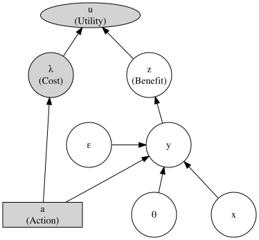
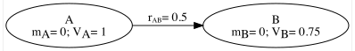
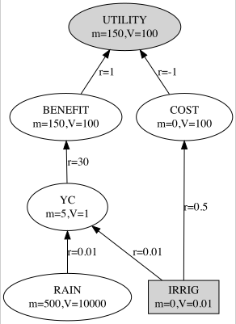

```{r, results="hide", message=FALSE}
  knitr::opts_chunk$set( collapse=TRUE, comment=">" )
  library(DiagrammeR)
  library(DiagrammeRsvg)
  library(geodata)
  library(mvtnorm)
  library(nimble)
  library(rsvg)
  library(terra)
  library(truncnorm)
```

```{r, echo=FALSE}
  m2l <- function(matr) {
    # Code from Maxim.K et al. https://stackoverflow.com/questions/20759444/
    printmrow <- function(x) {
      ret <- paste(paste(x,collapse = " & "),"\\\\")
      sprintf(ret) }
    out  <- apply(matr,1,printmrow)
    out2 <- paste("\\begin{bmatrix}",paste(out,collapse=' '),"\\end{bmatrix}")
    return(out2) }
```

```{r, echo=F}
  set.seed(1)
```


\clearpage
# Introduction to Bayesian Decision Theory (BDT) {#ChIntroBDT}

```{r DAGBDT, echo=FALSE, out.width="60%", fig.align="center", fig.cap="\\label{fig::DAGBDT}A graphical model for Bayesian decision theory. See text for explanation of symbols."}
  DAGBDT <- grViz( "digraph {
    graph [rankdir=BT]
  
    node [shape=circle, fixedsize = true, width = 0.9]
    a [label='@@1'] ; e [label='@@2'] ; l [label='@@3']
    t [label='@@4'] ; u [label='@@5'] ; x [label='@@6']
    y [label='@@7'] ; z [label='@@8']
    node [shape=circle, fixedsize = true, width = 0.9]
    edge [minlen=1]
    nodesep = 0.7
    {rank = same; t, x, a}
    {rank = same; y, e}
    {rank = same; l, z}
    a      -> l -> u
    t -> y -> z -> u
    a -> y
    x -> y
    e -> y
    l [fillcolor=lightgray,style=filled]
    a [shape=box,fillcolor=lightgray,style=filled,width=1.6]
    u [shape=ellipse,fillcolor=lightgray,style=filled,width=2] }
    [1]: paste0( 'a'         , '\\n(Action)'  )
    [2]: paste0( '&epsilon;'                  )
    [3]: paste0( '&lambda;'  , '\\n(Cost)'    )
    [4]: paste0( '&theta;'                    )
    [5]: paste0( 'u'         , '\\n(Utility)' )
    [6]: paste0( 'x'                          )
    [7]: paste0( 'y'                          )
    [8]: paste0( 'z'         , '\\n(Benefit)' )
  ")
  export_svg(DAGBDT) %>% charToRaw() %>% rsvg() %>%
    png::writePNG("images/DAGBDT.png")
  
```

## Example of BDT in action

$~$
```{r}
  u <- function( a, x, f, t, e, ka, ky ) {
    y       <- f(a,x,t) + e
    cost    <- ka * a
    benefit <- ky * y
    return( benefit - cost ) }
```

```{r}
  fy <- function(a,x,t) { t * (1-exp(-a-x)) }
  fu <- function( a, x=1, t=1, e=0, ka=0.2, ky=1 ) {
                  u( a, x, f=fy, t, e, ka, ky) }
```

```{r BDTa, echo=FALSE, out.width="50%", fig.height=5, fig.align="center", fig.cap="\\label{fig::BDTa}Utility as a function of action $a$ for a negative exponential performance function and linear cost and benefit functions."}
  par( mfrow=c(1,1), mar=c(4,2,3,0) )

  na    <- 31
  a.seq <- seq( 0, 3, length.out=na )
  u.seq <- fu(a.seq)
  imaxu <- which( u.seq == max(u.seq) ) ; amaxu <- a.seq[imaxu]
  plot( a.seq, fu(a.seq), xlab="a", ylab="", main="Utility\n(no uncertainty)",
        type="l" )
  abline( v=amaxu, col="red", lty=2 )
  text( amaxu, mean(u.seq), labels=paste("a_opt =",amaxu ), pos=4 )
```

\begin{equation}
\begin{alignedat}{2}
&x  &&\sim N[1  ,1  ], \\
&t  &&\sim N[1  ,0.5], \\
&e  &&\sim N[0  ,1  ], \\
&ka &&\sim U[0.1,0.3], \\
&ky &&\sim U[0.5,1.5].
\end{alignedat}
\end{equation}

```{r, echo=F}
  set.seed(1)

  # np     <- 1e5
  np     <- 5e3
  x.smp  <- rnorm( np, 1  , 1   )
  t.smp  <- rnorm( np, 1  , 0.5 )
  e.smp  <- rnorm( np, 0  , 1   )
  ka.smp <- runif( np, 0.1, 0.3 )
  ky.smp <- runif( np, 0.5, 1.5 )
  
  Qlo    <- 0.25 ; Qhi <- 0.75
```

```{r, echo=F}
  kunc    <- c( 1/1.5, 1, 1.5 )

  x.smp1  <- 1   + (x.smp  - 1   ) * kunc[1]
  t.smp1  <- 1   + (t.smp  - 1   ) * kunc[1]
  e.smp1  <-        e.smp          * kunc[1]
  ka.smp1 <- 0.2 + (ka.smp - 0.2 ) * kunc[1]
  ky.smp1 <- 1   + (ky.smp - 1   ) * kunc[1]
  
  x.smp2  <- 1   + (x.smp  - 1   ) * kunc[2]
  t.smp2  <- 1   + (t.smp  - 1   ) * kunc[2]
  e.smp2  <-        e.smp          * kunc[2]
  ka.smp2 <- 0.2 + (ka.smp - 0.2 ) * kunc[2]
  ky.smp2 <- 1   + (ky.smp - 1   ) * kunc[2]
  
  x.smp3  <- 1   + (x.smp  - 1   ) * kunc[3]
  t.smp3  <- 1   + (t.smp  - 1   ) * kunc[3]
  e.smp3  <-        e.smp          * kunc[3]
  ka.smp3 <- 0.2 + (ka.smp - 0.2 ) * kunc[3]
  ky.smp3 <- 1   + (ky.smp - 1   ) * kunc[3]
  
  u.tbl1  <- u.tbl2 <- u.tbl3 <- NULL
  for(i in 1:np) {
    u.tbl1 <- rbind( u.tbl1,
      fu( a.seq, x.smp1[i], t.smp1[i], e.smp1[i], ka.smp1[i], ky.smp1[i] ) )
    u.tbl2 <- rbind( u.tbl2,
      fu( a.seq, x.smp2[i], t.smp2[i], e.smp2[i], ka.smp2[i], ky.smp2[i] ) )
    u.tbl3 <- rbind( u.tbl3,
      fu( a.seq, x.smp3[i], t.smp3[i], e.smp3[i], ka.smp3[i], ky.smp3[i] ) )
  }
  
  uQlo.seq1 <- sapply( 1:na, function(i) { quantile( u.tbl1[,i], probs=Qlo ) } )
  uQlo.seq2 <- sapply( 1:na, function(i) { quantile( u.tbl2[,i], probs=Qlo ) } )
  uQlo.seq3 <- sapply( 1:na, function(i) { quantile( u.tbl3[,i], probs=Qlo ) } )
  umn.seq1  <- colMeans(u.tbl1)
  umn.seq2  <- colMeans(u.tbl2)
  umn.seq3  <- colMeans(u.tbl3)
  uQhi.seq1 <- sapply( 1:na, function(i) { quantile( u.tbl1[,i], probs=Qhi ) } )
  uQhi.seq2 <- sapply( 1:na, function(i) { quantile( u.tbl2[,i], probs=Qhi ) } )
  uQhi.seq3 <- sapply( 1:na, function(i) { quantile( u.tbl3[,i], probs=Qhi ) } )

  imaxmnu.1 <- which( umn.seq1 == max(umn.seq1) ) ; amaxmnu.1 <- a.seq[imaxmnu.1]
  imaxmnu.2 <- which( umn.seq2 == max(umn.seq2) ) ; amaxmnu.2 <- a.seq[imaxmnu.2]
  imaxmnu.3 <- which( umn.seq3 == max(umn.seq3) ) ; amaxmnu.3 <- a.seq[imaxmnu.3]
```

```{r, echo=F, eval=F}
  save( a.seq  ,
        e.smp1 , e.smp2 , e.smp3 ,
        fy     ,
        ka.smp1, ka.smp2, ka.smp3,
        ky.smp1, ky.smp2, ky.smp3,
        x.smp1 , x.smp2 , x.smp3 ,
        t.smp1 , t.smp2 , t.smp3 ,
        u.tbl1 , u.tbl2 , u.tbl3 ,
        file="data/tmpBDTexample.RData" )
```

```{r BDTa2, echo=FALSE, out.width="100%", fig.height=3, fig.align="center", fig.cap="\\label{fig::BDTa2}Utility as a function of action $a$ for a negative exponential performance function and linear cost and benefit functions. Solid line: expectation. Dashed lines: Q25 and Q75. Middle panel: uncertainty levels (standard deviations) as indicated in the text. Left panel: uncertainties divided by 1.5. Right panel: uncertainties multiplied by 1.5."}
  par( mfrow=c(1,3), mar=c(4,2,3,0) )

  u.range <- range( uQlo.seq1, umn.seq1, uQhi.seq1,
                    uQlo.seq2, umn.seq2, uQhi.seq2,
                    uQlo.seq3, umn.seq3, uQhi.seq3 )
  
  plot  ( a.seq, umn.seq1 , xlab="a", ylab="", type="l", 
          main="Utility\n(low uncertainty)", ylim=u.range )
  points( a.seq, uQlo.seq1, type="l", lty=2 )
  points( a.seq, uQhi.seq1, type="l", lty=2 )
  abline( v=amaxmnu.1, col="red", lty=2 )
  text( amaxmnu.1, min(umn.seq1), labels=paste("a_opt =",amaxmnu.1 ), pos=2 )

  plot  ( a.seq, umn.seq2 , xlab="a", ylab="", type="l", 
          main="Utility", ylim=u.range )
  points( a.seq, uQlo.seq2, type="l", lty=2 )
  points( a.seq, uQhi.seq2, type="l", lty=2 )
  abline( v=amaxmnu.2, col="red", lty=2 )
  text( amaxmnu.2, min(umn.seq2), labels=paste("a_opt =",amaxmnu.2 ), pos=4 )

  plot  ( a.seq, umn.seq3 , xlab="a", ylab="", type="l", 
          main="Utility\n(high uncertainty)", ylim=u.range )
  points( a.seq, uQlo.seq3, type="l", lty=2 )
  points( a.seq, uQhi.seq3, type="l", lty=2 )
  abline( v=amaxmnu.3, col="red", lty=2 )
  text( amaxmnu.3, min(umn.seq3), labels=paste("a_opt =",amaxmnu.3 ), pos=2 )
```


\clearpage
# Implementation of BDT using Bayesian Networks {#ChBN}

$~$
```{r DAGabLabelled, echo=FALSE, out.width="50%", fig.align="center", fig.cap="\\label{fig::DAGabLabelled}DAG with means and conditional variances specified in the node-ellipses and edge labelled with the regression coefficient."}
  DAGabLabelled <- grViz( "digraph{ graph[rankdir=LR]
    node[]
      A[label=<A<br/>m<SUB>A</SUB>= 0; V<SUB>A</SUB>= 1>]
      B[label=<B<br/>m<SUB>B</SUB>= 0; V<SUB>B</SUB>= 0.75>]
    edge[] A->B [label='r@_{AB}= 0.5'] }
  ")
  export_svg(DAGabLabelled) %>% charToRaw() %>% rsvg() %>%
    png::writePNG("images/DAGabLabelled.png")
  
```
$~$

### Switching between the three different specifications of the multivariate Gaussian

```{r}
precMatrix <- function( nodes, Vcond, R ){
  n <- length(nodes) ; W <- 1 / Vcond[1]
  for(k in 2:n){
    rk       <- R[ k, 1:(k-1) ]
    W_top    <- cbind( W * Vcond[k] + rk %*% t(rk), -rk ) / Vcond[k] 
    W_bottom <- cbind(                      -t(rk),   1 ) / Vcond[k]
    W        <- rbind( W_top, W_bottom ) }
  rownames(W) <- colnames(W) <- nodes
  return(W) }
```

```{r}
  VcondR <- function( W ) {
    n  <- dim(W)[1] ; Vcond <- rep( NA, n )
    Wk <- W         ; R     <- matrix( 0, nrow=n, ncol=n )
    for(k in n:2){
      ik       <- 1 : (k-1)
      Vcond[k] <- 1 / Wk[ k, k]
      R[k,ik]  <-    -Wk[ k,ik] * Vcond[k]
      Wk       <-     Wk[ik,ik] - as.matrix(R[k,ik]) %*% R[k,ik] / Vcond[k] }
    Vcond[1] <- 1 / Wk[1,1]
    return( list( Vcond=Vcond, R=zapsmall(R) ) ) }
```

## Sampling from a GBN and Bayesian updating

### Updating a GBN when information about nodes becomes available

```{r}
  GaussCond <- function( mz, Sz, y ) {
    i <- 1 : ( length(mz) - length(y) )
    m  <- mz[i]   + Sz[i,-i] %*% solve(Sz[-i,-i]) %*% (y-mz[-i])
    S  <- Sz[i,i] - Sz[i,-i] %*% solve(Sz[-i,-i]) %*% Sz[-i,i]
    return( list( m=m, S=S ) ) }
```

## A linear BDT example implemented as a GBN

```{r, echo=F}
  nodes <-         c( "RAIN", "IRRIG", "YC", "BENEFIT", "COST", "UTILITY")
  m   <-           c( 500   ,   0    ,  5  , 150      ,   0   , 150      )
  Vcond <-         c( 1e4   ,   0.01 ,  1  , 100      , 100   , 100      )
  R     <- matrix( c(   0   ,   0    ,  0  ,   0      ,   0   ,   0 ,
                        0   ,   0    ,  0  ,   0      ,   0   ,   0 ,
                        0.01,   0.01 ,  0  ,   0      ,   0   ,   0 ,
                        0   ,   0    , 30  ,   0      ,   0   ,   0 ,
                        0   ,   0.5  ,  0  ,   0      ,   0   ,   0 ,
                        0   ,   0    ,  0  ,   1      ,  -1   ,   0      ),
                   byrow=T, nrow=6 )
```

```{r DAGBDTlinear, echo=FALSE, out.width="60%", out.height="300pt", fig.align="center", fig.cap="\\label{fig::DAGBDTlinear}Example of linear BDT represented by a DAG with six nodes and six edges. Each node shows the values of the prior mean and conditional variance. Each edge is labelled with the regression coefficient."}
  DAGBDTlinear <- grViz( "digraph{
    graph[rankdir=BT]
    node[]
      RAIN   [label='@@1'] ; IRRIG[label='@@2'] ; YC     [label='@@3']
      BENEFIT[label='@@4'] ; COST [label='@@5'] ; UTILITY[label='@@6']
    {rank = same; RAIN, IRRIG}
    {rank = same; YC}
    {rank = same; BENEFIT, COST}
    {rank = same; UTILITY}
    edge[]
      RAIN    -> YC     [label='@@7-1'] ; IRRIG -> YC     [label='@@7-2']
      YC      -> BENEFIT[label='@@8-1'] ; IRRIG -> COST   [label='@@8-2']
      BENEFIT -> UTILITY[label='@@9-1'] ; COST  -> UTILITY[label='@@9-2']
    IRRIG  [shape=box,fillcolor=lightgray,style=filled]
    UTILITY[          fillcolor=lightgray,style=filled] }
    [1]: paste0( 'RAIN'   , '\\nm=', m[1], ',V=', Vcond[1] )
    [2]: paste0( 'IRRIG'  , '\\nm=', m[2], ',V=', Vcond[2] )
    [3]: paste0( 'YC'     , '\\nm=', m[3], ',V=', Vcond[3] )
    [4]: paste0( 'BENEFIT', '\\nm=', m[4], ',V=', Vcond[4] )
    [5]: paste0( 'COST'   , '\\nm=', m[5], ',V=', Vcond[5] )
    [6]: paste0( 'UTILITY', '\\nm=', m[6], ',V=', Vcond[6] )
    [7]: c( paste0('r=',R[3,1]), paste0('r=',R[3,2]) )
    [8]: c( paste0('r=',R[4,3]), paste0('r=',R[5,2]) )
    [9]: c( paste0('r=',R[6,4]), paste0('r=',R[6,5]) )
  ")
  export_svg(DAGBDTlinear) %>% charToRaw() %>% rsvg() %>%
    png::writePNG("images/DAGBDTlinear.png")
  
```

```{r, echo=F}
  W     <- precMatrix( nodes, Vcond, R )
  S     <- solve(W)
  # Retrieving the {Vcond,R} GBN-specification using VcondR(precisionMatrix):
  # VcondR(W) ; VcondR(solve(S))
```

\begin{equation}
\begin{aligned}
  \underline{ \textrm{Original network:} } \\
  `r m2l( as.matrix(nodes))`: \qquad
  &\mu   = `r m2l( as.matrix(round(m,1)))`; \quad
  \Sigma = `r m2l(           round(S,1) )`; \\
  &W     = `r m2l(           round(W,2) )`.
\end{aligned}
\end{equation}

```{r, echo=F, eval=F}
# We visualise the prior uncertainty for utility by
# sampling from the joint Gaussian distribution
  n       <- 1e4
  sample  <- rmvnorm( n, m, S )
  colnames( sample ) <- nodes
  sampleU <- sample[,"UTILITY"]
  sampleB <- sample[,"BENEFIT"]
  sampleC <- sample[,"COST"]
  # Using R's 'lm'-function to confirm that our GBN treats utility
  # as the difference between benefits and costs:
  # lm( sampleU ~ sampleB + sampleC )
  
  mU  <- round( mean(sampleU), 1 )
  sdU <- round( sd  (sampleU), 1 )
  VU  <- round( var (sampleU), 1 )
```

```{r, echo=F}
  # New ordering of nodes to have the observed node (RAIN) at the end:
  i.alt   <- c(2:6,1)  ; nodes.alt <- nodes[i.alt]
  m.alt   <- m[i.alt]  ; S.alt     <- S    [i.alt,i.alt]
  
  # Adding information about the last node (RAIN):
  GBN1    <- GaussCond( m.alt, S.alt, 600 )
  m1      <- GBN1$m ; S1 <- GBN1$S ; nodes1 <- colnames(S1)
```

\begin{equation}
\begin{aligned}
  &\underline{ \textrm{Posterior network after accounting for RAIN:} } \\
  &`r m2l( as.matrix(nodes1))`: \qquad
  \mu    = `r m2l( as.matrix(round(m1,2)))`; \quad
  \Sigma = `r m2l(           round(S1,2) )`.
\end{aligned}
\end{equation}

```{r, echo=F}
  # New ordering of nodes to have the RAIN and IRRIG at the end:
  i.alt2  <- c(3:6,1:2) ; nodes.alt2 <- nodes[i.alt2]
  m.alt2  <- m[i.alt2]  ; S.alt2     <- S    [i.alt2,i.alt2]

  GBN2 <- GaussCond( m.alt2, S.alt2, c(600,400) )
  m2   <- GBN2$m ; S2 <- GBN2$S ; nodes2 <- colnames(S2)
```

\begin{equation}
\begin{aligned}
  &\underline{ \textrm{Posterior network after accounting for RAIN and IRRIG:} } \\
  &`r m2l( as.matrix(nodes2))`: \qquad
  \mu    = `r m2l( as.matrix(round(m2,2)))`; \quad
  \Sigma = `r m2l(           round(S2,2) )`.
\end{aligned}
\end{equation}

## A linear BDT example implemented using $\texttt{Nimble}$

```{r}
  BDT.Code <- nimbleCode({
    RAIN     ~ dnorm( 500, sd= 100   )
    IRRIG    ~ dnorm(   0, sd=   0.1 )
    YC      <- (RAIN + IRRIG) * 0.01 + eps.YC
    BENEFIT <-  YC            * 30   + eps.BE
    COST    <-  IRRIG         * 0.5  + eps.CO
    UTILITY <-  BENEFIT - COST       + eps.UT
    eps.YC   ~ dnorm( 0, sd= 1 )
    eps.BE   ~ dnorm( 0, sd=10 )
    eps.CO   ~ dnorm( 0, sd=10 )
    eps.UT   ~ dnorm( 0, sd=10 )
  } )
```

```{r, echo=F, message=F, warning=F, eval=F}
  BDT0.Nimble    <- nimbleModel  ( BDT.Code )
  BDT0.Comp      <- compileNimble( BDT0.Nimble )
  BDT0.Conf      <- configureMCMC( BDT0.Nimble, print=F )
  BDT0.Conf$addMonitors( c("UTILITY"), print=F )
  BDT0.MCMC      <- buildMCMC    ( BDT0.Conf )
  BDT0.MCMC.Comp <- compileNimble( BDT0.MCMC )
  
  BDT1.Data      <- list( RAIN=600 )
  BDT1.Nimble    <- nimbleModel  ( BDT.Code, data=BDT1.Data )
  BDT1.Comp      <- compileNimble( BDT1.Nimble )
  BDT1.Conf      <- configureMCMC( BDT1.Nimble, print=F )
  BDT1.Conf$addMonitors( c("UTILITY"), print=F )
  BDT1.MCMC      <- buildMCMC    ( BDT1.Conf )
  BDT1.MCMC.Comp <- compileNimble( BDT1.MCMC )
  
  BDT2.Data      <- list( RAIN=600, IRRIG=400 )
  BDT2.Nimble    <- nimbleModel  ( BDT.Code, data=BDT2.Data )
  BDT2.Comp      <- compileNimble( BDT2.Nimble )
  BDT2.Conf      <- configureMCMC( BDT2.Nimble, print=F )
  BDT2.Conf$addMonitors( c("UTILITY"), print=F )
  BDT2.MCMC      <- buildMCMC    ( BDT2.Conf )
  BDT2.MCMC.Comp <- compileNimble( BDT2.MCMC )
```

```{r, echo=F, message=F, warning=F, eval=F}
  nsims <- 1e4 ; nburnin <- 1e3 ; niter <- nsims+nburnin
  set.seed(1)
  
  samples0  <- runMCMC( BDT0.MCMC.Comp,
                        nburnin=nburnin, niter=niter, prog=F )
  samples0U <- samples0[ , "UTILITY" ]
  m0        <- round( mean(samples0U  ), 1 )
  V0        <- round( var (samples0U  ), 0 )

  samples1  <- runMCMC( BDT1.MCMC.Comp,
                        nburnin=nburnin, niter=niter, prog=F )
  samples1U <- samples1[ , "UTILITY" ]
  m1        <- round( mean(samples1U  ), 1 )
  V1        <- round( var (samples1U  ), 0 )

  samples2  <- runMCMC( BDT2.MCMC.Comp,
                        nburnin=nburnin, niter=niter, prog=F )
  samples2U <- samples2[ , "UTILITY"]
  m2        <- round( mean(samples2U), 1 )
  V2        <- round( var (samples2U), 0 )

  save( nburnin, niter, samples0, samples1, samples2, m0, m1, m2, V0, V1, V2,
        file="data/tmpUnimble.RData" )
```

```{r, echo=F}
  load( "data/tmpUnimble.RData" )
```

```{r Unimble, echo=F, fig.height=3.5, fig.align="center", fig.cap="\\label{fig::Unimble}Linear model. Sampling from the marginal Gaussian distribution for utility using the R-package $\\texttt{Nimble}$. Left: prior. Middle: posterior after setting rain at 600 $mm \\, y^{-1}$. Right: posterior after additionally setting irrigation at 400 $mm \\, y^{-1}$."}
  par( mfrow=c(1,3), mar=c(2,5,3,5) )

  hist( samples0[,"UTILITY"],
        main=paste0( "Prior utility 1\nm=", m0, ", V=", V0 ),
        xlab="", ylab="" )
  abline( v=m0, col="red", lwd=1 )
  
  hist( samples1[,"UTILITY"],
        main=paste0( "Posterior utility 1\nm=", m1, ", V=", V1 ),
        xlab="", ylab="" )
  abline( v=m1, col="red", lwd=1 )
  
  hist( samples2[,"UTILITY"],
        main=paste0( "Posterior utility 2\nm=", m2, ", V=", V2 ),
        xlab="", ylab="" )
  abline( v=m2, col="red", lwd=1 )
```

### Varying IRRIG to identify the value for which E[U] is maximized

```{r, echo=F, message=F, warning=F, eval=F}
  IRRIG.seq <- seq( 0, 500, by=100 ) ; ni <- length( IRRIG.seq )
  EU.seq    <- rep (NA, ni )
  for(i in 1:ni) {
    BDTi.Data      <- list( RAIN=600, IRRIG=IRRIG.seq[i] )
    BDTi.Nimble    <- nimbleModel  ( BDT.Code, data=BDTi.Data )
    BDTi.Comp      <- compileNimble( BDTi.Nimble )
    BDTi.Conf      <- configureMCMC( BDTi.Nimble, print=F )
    BDTi.Conf$addMonitors( c("UTILITY"), print=F )
    BDTi.MCMC      <- buildMCMC    ( BDTi.Conf )
    BDTi.MCMC.Comp <- compileNimble( BDTi.MCMC )
    samplesi       <- runMCMC( BDTi.MCMC.Comp,
                               nburnin=nburnin, niter=niter, prog=F )
    EU.seq[i]      <- mean( samplesi[,"UTILITY"] )
  }

  save( IRRIG.seq, EU.seq,
        file="data/tmpBDTnimble.RData" )
```

```{r, echo=F}
  load( "data/tmpBDTnimble.RData" )
```

```{r BDTnimble, echo=F, fig.height=3.5, fig.align="center", fig.cap="\\label{fig::BDTnimble}BDT for a linear network: identifying the level of irrigation for which the expectation of utility is maximized."}
  par( mfrow=c(1,1), mar=c(5,5,3,3) )

  IRRIGopt <- IRRIG.seq[ which.max(EU.seq) ]
  plot( IRRIG.seq, EU.seq, type="b",
        xlab="IRRIG (mm y-1)", ylab="E [ utility ]" )
  abline( v=IRRIGopt, col="red", lty=2 )
  text( IRRIGopt, mean(EU.seq), labels=paste("a_opt =",IRRIGopt ),
        pos=4, col="red" )
```

## A nonlinear BDT example implemented using $\texttt{Nimble}$

```{r, eval=F}
  YC <- 50 * (1-exp(-0.001*(RAIN + IRRIG))) + eps.YC
```

```{r, echo=F}
  BDT.nl.Code <- nimbleCode({
    RAIN     ~ dnorm( 500, sd= 100   )
    IRRIG    ~ dnorm(   0, sd=   0.1 )
    YC      <- 50 * (1-exp(-0.001*(RAIN + IRRIG))) + eps.YC
    BENEFIT <-  YC            * 30   + eps.BE
    COST    <-  IRRIG         * 0.5  + eps.CO
    UTILITY <-  BENEFIT - COST       + eps.UT
    eps.YC   ~ dnorm( 0, sd= 1 )
    eps.BE   ~ dnorm( 0, sd=10 )
    eps.CO   ~ dnorm( 0, sd=10 )
    eps.UT   ~ dnorm( 0, sd=10 )
  } )
```

```{r, echo=F, message=F, warning=F, eval=F}
  BDT.nl0.Nimble    <- nimbleModel  ( BDT.nl.Code )
  BDT.nl0.Comp      <- compileNimble( BDT.nl0.Nimble )
  BDT.nl0.Conf      <- configureMCMC( BDT.nl0.Nimble, print=F )
  BDT.nl0.Conf$addMonitors( c("UTILITY"), print=F )
  BDT.nl0.MCMC      <- buildMCMC    ( BDT.nl0.Conf )
  BDT.nl0.MCMC.Comp <- compileNimble( BDT.nl0.MCMC )
  
  BDT.nl1.Data      <- list( RAIN=600 )
  BDT.nl1.Nimble    <- nimbleModel  ( BDT.nl.Code, data=BDT.nl1.Data )
  BDT.nl1.Comp      <- compileNimble( BDT.nl1.Nimble )
  BDT.nl1.Conf      <- configureMCMC( BDT.nl1.Nimble, print=F )
  BDT.nl1.Conf$addMonitors( c("UTILITY"), print=F )
  BDT.nl1.MCMC      <- buildMCMC    ( BDT.nl1.Conf )
  BDT.nl1.MCMC.Comp <- compileNimble( BDT.nl1.MCMC )
  
  BDT.nl2.Data      <- list( RAIN=600, IRRIG=400 )
  BDT.nl2.Nimble    <- nimbleModel  ( BDT.nl.Code, data=BDT.nl2.Data )
  BDT.nl2.Comp      <- compileNimble( BDT.nl2.Nimble )
  BDT.nl2.Conf      <- configureMCMC( BDT.nl2.Nimble, print=F )
  BDT.nl2.Conf$addMonitors( c("UTILITY"), print=F )
  BDT.nl2.MCMC      <- buildMCMC    ( BDT.nl2.Conf )
  BDT.nl2.MCMC.Comp <- compileNimble( BDT.nl2.MCMC )

  nsims <- 1e4 ; nburnin <- 1e3 ; niter <- nsims+nburnin
  set.seed(1)
  
  samples.nl0  <- runMCMC( BDT.nl0.MCMC.Comp,
                        nburnin=nburnin, niter=niter, prog=F )
  samples.nl0U <- samples.nl0[ , "UTILITY" ]
  m.nl0        <- round( mean(samples.nl0U  ), 1 )
  V.nl0        <- round( var (samples.nl0U  ), 0 )

  samples.nl1  <- runMCMC( BDT.nl1.MCMC.Comp,
                        nburnin=nburnin, niter=niter, prog=F )
  samples.nl1U <- samples.nl1[ , "UTILITY" ]
  m.nl1        <- round( mean(samples.nl1U  ), 1 )
  V.nl1        <- round( var (samples.nl1U  ), 0 )

  samples.nl2  <- runMCMC( BDT.nl2.MCMC.Comp,
                          nburnin=nburnin, niter=niter, prog=F )
  samples.nl2U <- samples.nl2[ , "UTILITY"]
  m.nl2        <- round( mean(samples.nl2U), 1 )
  V.nl2        <- round( var (samples.nl2U), 0 )
  
  save( nburnin, niter, samples.nl0U, samples.nl1U, samples.nl2U,
        m.nl0, m.nl1, m.nl2, V.nl0, V.nl1, V.nl2,
        file="data/tmpUnlnimble.RData" )
```

```{r, echo=F}
  load( "data/tmpUnlnimble.RData" )
```

```{r Unlnimble, echo=F, fig.height=3.5, fig.align="center", fig.cap="\\label{fig::Unlnimble}Nonlinear model. Sampling from the marginal Gaussian distribution for utility using the R-package $\\texttt{Nimble}$. Left: prior. Middle: posterior after setting rain at 600 $mm \\, y^{-1}$. Right: posterior after additionally setting irrigation at 400 $mm \\, y^{-1}$."}
  par( mfrow=c(1,3), mar=c(2,5,3,5) )

  hist( samples.nl0U,
        main=paste0( "Prior utility 1\nm=", m.nl0, ", V=", V.nl0 ),
        xlab="", ylab="" )
  abline( v=m.nl0, col="red", lwd=1 )
  
  hist( samples.nl1U,
        main=paste0( "Posterior utility 1\nm=", m.nl1, ", V=", V.nl1 ),
        xlab="", ylab="" )
  abline( v=m.nl1, col="red", lwd=1 )
  
  hist( samples.nl2U,
        main=paste0( "Posterior utility 2\nm=", m.nl2, ", V=", V.nl2 ),
        xlab="", ylab="" )
  abline( v=m.nl2, col="red", lwd=1 )
```

```{r, echo=F, message=F, warning=F, eval=F}
  IRRIG.seq <- seq( 0, 1000, by=100 ) ; ni <- length( IRRIG.seq )
  EU.nl.seq    <- rep (NA, ni )
  for(i in 1:ni) {
    BDT.nli.Data      <- list( RAIN=600, IRRIG=IRRIG.seq[i] )
    BDT.nli.Nimble    <- nimbleModel  ( BDT.nl.Code, data=BDT.nli.Data )
    BDT.nli.Comp      <- compileNimble( BDT.nli.Nimble )
    BDT.nli.Conf      <- configureMCMC( BDT.nli.Nimble, print=F )
    BDT.nli.Conf$addMonitors( c("UTILITY"), print=F )
    BDT.nli.MCMC      <- buildMCMC    ( BDT.nli.Conf )
    BDT.nli.MCMC.Comp <- compileNimble( BDT.nli.MCMC )
    samples.nli       <- runMCMC( BDT.nli.MCMC.Comp,
                               nburnin=nburnin, niter=niter, prog=F )
    EU.nl.seq[i]      <- mean( samples.nli[,"UTILITY"] )
  }
  
  save( IRRIG.seq, EU.nl.seq,
        file="data/tmpBDTnlnimble.RData" )
```

```{r, echo=F}
  load( "data/tmpBDTnlnimble.RData" )
```

```{r BDTnlnimble, echo=F, fig.height=3.5, fig.align="center", fig.cap="\\label{fig::BDTnlnimble}BDT for a nonlinear network: identifying the level of irrigation for which the expectation of utility is maximized."}
  par( mfrow=c(1,1), mar=c(5,5,3,3) )

  IRRIG.nl.opt <- IRRIG.seq[ which.max(EU.nl.seq) ]
  plot( IRRIG.seq, EU.nl.seq, type="b",
        xlab="IRRIG (mm y-1)", ylab="E [ utility ]" )
  abline( v=IRRIG.nl.opt, col="red", lty=2 )
  text( IRRIG.nl.opt, mean(EU.nl.seq), labels=paste("a_opt =",IRRIG.nl.opt ),
        pos=4, col="red" )
```


\clearpage
# A spatial example: forestry in Scotland  {#ChIntroSpatial}

## A decision problem: forest irrigation in Scotland

## Computational demand of BDT and emulation

## Data

```{r, echo=T, eval=F}
  spdf_GBR <- gadm( country="GBR", level=0, path="data" ) # Great Britain
```

```{r, echo=F, eval=T}
  spdf_GBR <- readRDS( "data/GADM/gadm41_GBR_0_pk.rds" )

  spdf_SCO <- crop( spdf_GBR, ext(-7.7,-1.8,54.5,58.6) ) # Scotland
  ext_SCO  <- ext( spdf_SCO )
```

```{r, echo=F}
  dir_WC <- "/Users/marcelvanoijen/Documents/CAF2021_SEACAF/weather/WorldClim/"
  dir_WC_prec.2000_2009 <- paste0( dir_WC, "prec_2000_2009/" )
  dir_WC_prec.2010_2018 <- paste0( dir_WC, "prec_2010_2018/" )
```

```{r, echo=F, eval=F}
  s_prec.mon            <- rast( c(
    list.files( dir_WC_prec.2000_2009, ".tif", full.names=T ),
    list.files( dir_WC_prec.2010_2018, ".tif", full.names=T ) ) )
  s_prec.mon            <- crop(s_prec.mon, ext_SCO)
  s_prec.mon            <- s_prec.mon[[1:228]] # Keep Jan 2000 to Dec 2018
  names(s_prec.mon)     <- str_sub( names(s_prec.mon), -7, -1 )
  years                 <- rep( 2000:2018, each=12 )
  s_prec                <- tapp( s_prec.mon, index=years, fun=sum )
```

```{r, echo=F, eval=F}
  writeRaster( s_prec, "data/climate/s_prec.tif", overwrite=T )
```

```{r, echo=F}
  s_prec     <- rast( "data/climate/s_prec.tif" )
```

```{r, eval=F}
  # Code: see https://damariszurell.github.io/EEC-QCB/Occ3_EnvData.html

  r_alt_GBR   <- elevation_30s( country='GBR', path='data', mask=F )
  r_alt.hires <- crop( r_alt_GBR, ext_SCO )
  r_alt       <- resample( r_alt.hires, s_prec )
```

```{r, echo=F, eval=F}
  writeRaster( r_alt, "data/elevation/r_alt.tif", overwrite=T )
```

```{r, echo=F}
  r_alt      <- rast( "data/elevation/r_alt.tif" )
```

```{r, eval=F}
  # Code: see https://damariszurell.github.io/EEC-QCB/Occ3_EnvData.html
  r_tree <- landcover(var='trees', path='data', download=F) # Global
  r_tree <- crop( r_tree, ext_SCO )
  r_tree <- mask( r_tree, r_alt.hires )
```

```{r, echo=F, eval=F}
  writeRaster( r_tree    , "data/landuse/r_tree.tif"    , overwrite=T )
```

```{r TreeCover, echo=F, fig.cap="\\label{fig::TreeCover}Tree cover in Scotland in 2020 (ESA WorldCover data set)."}
  par( mfrow=c(1,2) )

  r_tree     <- rast( "data/landuse/r_tree.tif" )

  plot( r_tree    , col=terrain.colors(100,rev=T) )
```

```{r AltRain, echo=F, fig.height=2.5, out.width="100%", fig.align="center", fig.cap="\\label{fig::AltRain}Scotland: altitude and precipitation in 2000 and 2018."}
  par( mfrow=c(1,3), mar=c(2,2,2,3) )

  plot( r_alt, col=terrain.colors(100), main="Altitude (m)" )
  
  plot( s_prec[[ 1]], main="Prec. in 2000 (mm)",
        col=rainbow(100,end=0.7), range=c(0,3000), xaxt="n", yaxt="n" )
  plot( s_prec[[19]], main="Prec. in 2018 (mm)",
        col=rainbow(100,end=0.7), range=c(0,3000), xaxt="n", yaxt="n" )
```

## A simple model for forest yield class (YC)

$$ YC = 10 * (1-exp(-R/1000)) * (1-A/1000) $$
```{r, echo=T}
  YC <- function( x1, x2 ) {
    alt <- x1  ; prec <- x2
    YC  <- max(0, 10 * (1-exp(-prec/1000)) * (1-alt/1000) )
    return( YC ) }
```

```{r, echo=T}
  r_prec_2000 <- s_prec[[1]]
# r_prec_2000 <- rast( s_prec, nlyrs=1 )
  r_YC <- xapp( r_alt, r_prec_2000, fun=YC )
  s_YC <- rast( sapply( 1:19, function(i){xapp( r_alt, s_prec[[i]], fun=YC )} ) )
```

## Emulation

```{r, echo=T}
  n_design    <- 50
  alt_design  <- runif( n_design, 0, 1000 )
  prec_design <- runif( n_design, 0, 3000 )
  YC_design   <- sapply( 1:n_design, function(i) {
    YC( alt_design[i], prec_design[i] ) } )
```

```{r}
  x1 <- alt_design   ; x2  <- prec_design          ; y  <- YC_design
  ny <- length(y)
  Vy <- 1            ; phi <- 1000
  x  <- cbind(x1,x2) ; dx  <- as.matrix( dist(x) ) ; Sy <- exp( -dx/phi ) * Vy
```

```{r, echo=T}
  GP.est <- function( x, y, Sy, mb, Sb, X=cbind(1,x) ) {
    Sb_y <- solve( solve(Sb) + t(X) %*% solve(Sy) %*% X )
    mb_y <- Sb_y %*% ( solve(Sb) %*% mb + t(X) %*% solve(Sy) %*% y )
    return( list( "mb_y"=mb_y, "Sb_y"=Sb_y ) ) }

  mb   <- c(0,0,0) ; Sb <- diag(1,3) ; X <- cbind(1,x)
  b_y  <- GP.est( x, y, Sy, mb=mb, Sb=Sb, X=X )
  mb_y <- b_y$mb_y; Sb_y <- b_y$Sb_y
```

## Application of the emulator

```{r, echo=T}
  GP.pred <- function(x0,x,y,Sy,phi,mb_y,Sb_y,X0=c(1,x0),X=cbind(1,x)) {
    dx0  <- if( is.vector(x) ) { abs(x-x0)
            } else { sapply(1:length(y),function(i){dist(rbind(x0,x[i,]))}) }
    C0   <- Sy[1] * exp( -dx0/phi )
    m0_y <- X0 %*% mb_y - t(C0) %*% solve(Sy) %*% (X %*% mb_y - y)
       a <- X0 - t(C0) %*% solve(Sy) %*% X
    S0_y <- Sy[1] - t(C0) %*% solve(Sy) %*% C0 + a %*% Sb_y %*% t(a)
    return( list( "m0_y"=m0_y, "S0_y"=S0_y ) ) }

  x0   <- c(0,0) ; X0 <- c(1,x0)
  y0_y <- GP.pred( x0, x, y, Sy, phi, mb_y, Sb_y, X0=X0, X=X )
  m0_y <- y0_y$m0_y ; S0_y <- y0_y$S0_y
```

```{r, echo=T}
  YC_em <- function( x1, x2 ) {
    x0 <- cbind(x1,x2)
    YC <- GP.pred( x0, x, y, Sy, phi, mb_y, Sb_y,
                   X0=c(1,x0), X=cbind(1,x) )$m0_y
    return( YC ) }
  YC_em.S <- function( x1, x2 ) {
    x0 <- cbind( x1, x2 )
    S  <- GP.pred( x0, x, y, Sy, phi, mb_y, Sb_y,
                   X0=c(1,x0), X=cbind(1,x) )$S0_y
    return( S ) }
```

```{r, echo=T}
  r_YC_em   <- xapp( r_alt, r_prec_2000, fun=YC_em  )
  r_YC_em.S <- xapp( r_alt, r_prec_2000, fun=YC_em.S  )
```

```{r check emulator, echo=F, eval=F}
  for(i in 1:n_design) {
    cat( "\n", i, YC_design[i],
                  YC   ( alt_design[i], prec_design[i] ),
                  YC_em( alt_design[i], prec_design[i] ) )
  }
```

```{r ModelledEmulated, echo=F, fig.height=5, out.width="100%", fig.cap="\\label{fig::ModelledEmulated}Top left: outputs from the original nonlinear model for yield class (YC, $m^3 \\, ha^{-1} \\, y^{-1}$) applied to precipitation data from the year 2000. Top right: emulated YC. Bottom left: original outputs vs. emulated values. Bottom right: emulator uncertainty (kriging variance)."}
  par( mfrow=c(2,2), mar=c(3,3,3,1), cex=0.7 )

  plot( r_YC     , main="YC: Model",
        col=terrain.colors(100,rev=T), range=c(0,9) )
  plot( r_YC_em  , main="YC: Emulator",
        col=terrain.colors(100,rev=T), range=c(0,9) )
  plot( c(terra::values(r_YC_em)), c(terra::values(r_YC)),
        main="YC: Model vs. emulator", pch="." )
  plot( r_YC_em.S, main="YC: Variance of emulator",
        col=rainbow(100,end=0.7) )
```


\clearpage
# Spatial BDT using model and emulator {#ChBDTspatial}

```{r, echo=T}
  ky <- 30 ; r_U     <- r_YC     * ky ; r_U_em     <- r_YC_em     * ky
```

```{r, echo=T}
  IRRIG         <- 500
  r_YC.IRRIG    <- xapp( r_alt, r_prec_2000 + IRRIG, fun=YC    )
  r_YC_em.IRRIG <- xapp( r_alt, r_prec_2000 + IRRIG, fun=YC_em )
  ka            <- 0.1
  r_U.IRRIG     <- r_YC.IRRIG    * ky - IRRIG * ka
  r_U_em.IRRIG  <- r_YC_em.IRRIG * ky - IRRIG * ka
```

```{r UIRRIG, echo=F, fig.height=5, fig.cap="\\label{fig::UIRRIG}Top: utility in the year 2000 without irrigation. Bottom: gain in utility with irrigation of 500 $mm \\, y^{-1}$. Left: original model. Right: emulator."}
  par( mfrow=c(2,2), mar=c(3,3,3,1), cex=0.7 )

  plot( r_U                  , main="U: IRRIG=0" )
  plot( r_U_em               , main="U: IRRIG=0 (emul.)" )
  plot( r_U.IRRIG    - r_U   , main="U-gain from IRRIG=500",
        zlim=c(-50,50) )
  plot( r_U_em.IRRIG - r_U_em, main="U-gain from IRRIG=500 (emul.)",
        zlim=c(-50,50) )
```

## Multiple action levels

```{r, echo=T}
  nI    <- 10 ; layers <- 1:nI ; IRRIG <- (layers-1)*50
  s_U.a <- NULL
  for(i in layers) {
    r_YC.a <- xapp( r_alt, r_prec_2000 + IRRIG[i], fun=YC )
    r_U.a  <- r_YC.a * ky - IRRIG[i] * ka
    s_U.a  <- c( s_U.a, r_U.a ) }
  s_U.a <- rast(s_U.a)
  a.opt <- (which.max( s_U.a ) - 1) * 50
```
  
```{r aopt, echo=F, fig.height=4, fig.align="center", fig.cap="\\label{fig::aopt}Outcome from a decision problem where action choice was between a large number of irrigation levels."}
  par( mfrow=c(1,2), mar=c(2,2,2,3), cex=0.8 )

  plot( a.opt    , main="Optimum irrigation (mm y-1)", xaxt="n", yaxt="n",
        col=terrain.colors(100,rev=T))
```


\clearpage
