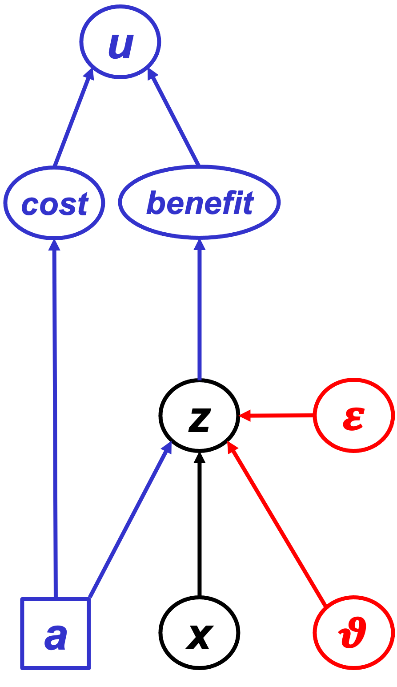

```{r, include=FALSE}
  knitr::opts_chunk$set( collapse=TRUE, comment=">" )
  library(geodata)
  library(MCMCpack)
  library(mvtnorm)
  library(nimble)
  library(readxl)
  library(scales)
  library(terra)
  library(truncnorm)
```


\clearpage
# Practicalities

## My lectures
- Can I use my own MBP, i.e. can my laptop screen be projected?

## Where, When, Who
- Course: Lubeck 2025-09-24 to 26.
- Travel: out 2025-09-23, return 2025-09-27.
- Local organisers:
  - Reinard Vonthein (Lubeck, mathematics of medicine and life sci.)
  - Tobias Mette (Freising, interested in GAM)
  - Gerhard Nehmiz (Bieberach, mathematics, biostatistics)
  - Wolfgang Falk

## Prerequisites
- R and R Studio installed
- PRAbook code tested?
  - New GitHub repository
- Participants will be familiar with R, but let them know which R-packages need to be installed.
- Make slides freely available to all!

## Material for participants to download


\clearpage
# Lectures

## Agenda

We aim to cover the following six topics:

1. Introduction to PRA: Basic ideas & equations (**BC2: 18.1-18.6, PRA-BDT: 1-9**)
2. Model-based PRA (incl. NIMBLE example Spain) (**PRA-BDT: 7**)
3. Expanding PRA-theory (incl. Interacting hazards) (**BC2: 18.7, PRA-BDT: 10-11, 18**)
4. Introduction to BDT (**BC2: 19.1-19.3, BC1: 17.2, PRA-BDT: 12-15**)
5. Links between PRA and BDT (**BC2: 19.4, PRA-BDT: 16-17**)
6. General discussion (**BC2: 25.1, PRA-BDT: 19**)

There will be four sessions of 1.5 hours each, so some sessions will cover multiple topics. The progress through the material will be decided together with the audience, but roughly we can expect the following scheduling of the topics:

Session I  : 1
Session II : 2
Session III: 2,3
Session IV : 4,5,6

We aim to include exercises in each session to initiate discussion.

## Content ideas
- Briefly summarise our previous work: @VanOijen_2024_Bayesian, @VanOijen_2022_Probabilistic, @VanOijen_2019_Probabilistic, @VanOijen_2019_Tools, @VanOijen_2014_Impact, @VanOijen_2013_novel.
- Show examples from other authors who used (parts of) our PRA approach explicitly: @Ren_2023_Risk, @Nandintsetseg_2021_Risk, @He_2021_Drought, @Zhou_2018_Drought, @Kuhnert_2017_Impact, @Liu_2020_new, @Nandintsetseg_2024_Future.
- Study examples (with pictures) of published risk analyses that do NOT use our PRA approach and ask: do these risk analyses distinguish and quantify $x, z, p[x], p[z], E[x], E[z], E[x|..], E[z|..], V, R$?
  - Fun different example: risk of large meteorite hitting the earth [https://www.nasa.gov/solar-system/asteroids/asteroid-fast-facts/; @Wheeler_2024_Risk]
- In structuring the course, mainly follow BC2, Chapters 18 and 19 [@VanOijen_2024_Bayesian].
  - For additional material, see also our notes on @VanOijen_2022_Probabilistic in the next chapter of this document, and the other chapters on specific topics.
- What **not** to include? (Maybe mention briefly but do not treat in any depth.)
  - Gerhard suggests not to include copulas. But note that an additional use of copulas (besides our use in expressing p[x,z]) may be in spatial upscaling of local risks to larger areas [@Hochrainer-Stigler_2019_Large].
  - Extreme value theory.
- Add a line-plot of $E[z|x]$ and for the multi-threshold PRA also a barplot with the set of x-interval conditional expectations for $z$, i.e $E[z|thr_{i-1} \leq x < thr_i]$ where $i=1,..,n$ and $thr_0=-\infty$.
- Revive fingerprint-analysis for bifactorial hazard (or for mean and s.d. of hazard).
- Mention Bayesian packages?
  - brms
  - BayesX (developed and used in Germany)
    - https://cran.r-project.org/web/packages/BayesX/index.html
    - https://www.rdocumentation.org/packages/BayesXsrc/versions/3.0-6
  - ...
- Can NIMBLE be linked to external PBMs?
- Should Bayesian approaches to regression (incl. machine learning, CART) be mentioned?
  - https://proceedings.mlr.press/r1/chipman97a.html
- Can fault-tree-analysis (FTA, the nuclear industry's form of PRA) be carried out within our PRA framework? Maybe FTA can be seen as a decomposition of the hazard probability?
  - https://pipelinepodcastnetwork.com/probabilistic-risk-analysis/
- Do we need to think about exchangeability? See blog posts by Jessica Hullman and the reference in the comments there to Jaynes' article about the de Finetti representation theorem. Exchangeability is also covered in Jaynes' book. 
  - https://statmodeling.stat.columbia.edu/2025/03/26/individual-probability-model-multiplicity-and-multicalibration/?utm_source=substack&utm_medium=email
- When carrying out PRA, can my standard time-series analysis (replication over time) be replaced by a spatial analysis (replication over space)?
- Mention increasing role of machine learning?
  - @Salcedo-Sanz_2023_Analysis: "Analysis, Characterization, Prediction and Attribution of Extreme Atmospheric Events with Machine Learning: a Review"
- When to normalise V and R? Loss can be expressed in absolute terms (e.g. m^3 ha-1 y-1) or relative terms (%, where 100% is equated with $\overline{z_{\neg H}}$)? Generally it may be good to normalise, but it may lead to confusion in case of spatially distributed PRA if we normalise every cell separately. Assessing total risk over the whole area then becomes complicated.
  - Do we also have such problems with area-integration if we use local measures of p[H], such as the SPEI?
- Marcel to keep discussion of Bayes and model-based PRA very short: will be covered by Mark.
- In the PowerPoint file: use the term 'Graphical Model' (GM) throughout rather than BBN.
- After presenting different forms of PRA (e.g. sampling-, distribution-, and model-based PRA for the German *Picea abies* data), ask why the results differ. Which method seems most reliable? More generally, what prior information does each method require?
- BDT explained simply: http://www.statsathome.com/2017/10/12/bayesian-decision-theory-made-ridiculously-simple/
- We show, in paragraph 2.1.1 (p.10) of @VanOijen_2022_Probabilistic that a uniform hazard distribution together with a linear response function leads to constant V irrespective of the choice of threshold. Maybe show this as a simple example of distribution- and model-based PRA?

### PRA using forest data
- Explain all variants of PRA by applying them to forest mortality.
- Show naive PRA on time series German forest death (Thunen institute) and point out that *domain knowledge* is essential. For example, in a simplistic PRA we would ignore the cumulative effects that have led to droughts in recent years becoming more damaging than earlier droughts. In other words, annual drought levels should not be viewed as constituting independent hazard occurrences.
- ANotHer simplistic aspect: ignoring correlations between different environmental variables such as drought and heat and disease and pests. This is not always wrong: if the correlations are very strong than we can indeed treat them as one compound hazard. But generally the correlations are weak to moderate so *different hazard variables should not be lumped*.
- Include the topic of *reporting the results* from PRA. Examine how to put the results of PRA in accurate, informative and easily understandable language. Show how the PRA is useful to a forest manager.

### Mark's PRA for the Spanish data (Nimble example)
- Demonstrate practical application of the PRA to real data from Spain.
- Develop the Nimble approach of PRAbook Ch. 7 into a large realistic case-study. Use Manuel’s Spanish data that Mark wanted to analyse anyway with our methods. So that would be for both the course and a publication. That example will be of interest to the audience because many of them likely work on climate extremes impacts on German forests.
- Extend to data from Germany and Finland? Like Spain, these countries have long-term data on forest growth, so the three countries together could be used to analyse environmental risks in different climates.


\clearpage
# @VanOijen_2022_Probabilistic

## Errata
- p.14 refers to 'Monte Carlo' (MC) four times but the approach here is based on numerical solutions to the conditional expectation values without any MC sampling.
- p.21, 4.3 "any deviation ... $E[z \geq thr]$" should be ... $E[z|x \geq thr]$. (But note that the whole equation for $\sigma_R$ may be simplified, see next section on book improvements.)
- There are errors in text, equations and underlying code of section 4.7 (pp. 26-27).
  - **Text**: "The same authors also provided a formula to approximate the conditional variance for the same distribution: $Var[z|x < thr] = 1 + \rho \, thr \, E[z] - E[z]^2$" should have conditional expectations on the right: "$... = 1 + \rho \, thr \, E[z|x < thr] - E[z|x<thr]^2$".
  - **Equation 4.5**: The equations as written give a value equal to 1 for the conditional variances if $\rho = 0$ and $thr \to \infty$ resp. $thr \to -\infty$. The proper limits are $\sigma^2_z$ so that is what both appearances of "$1$" should be replaced by. 
  - **Code**: In the underlying code (not shown in the book) for functions $\texttt{Varz\_xbelowAppr}$ and $\texttt{Varz\_xaboveAppr}$, the calculation of $\texttt{Varzxbelow}$ resp. $\texttt{Varzxabove}$ should operate on $\texttt{mx.}$ and $\texttt{mz.}$ instead of $\texttt{mx}$ and $\texttt{mz}$. And for consistence we may also prefer to use $\texttt{thr.}$ and $\texttt{r.}$ rather than $\texttt{thr}$ and $\texttt{r}$ as function arguments. The old argument-names will generally not cause problems but should be changed anyway. When also correcting the above-mentioned equation-errors, the corrected code becomes:
    - $\texttt{Varzxbelow}$ <- Vz. + r. * (thr.-mx.) * (Ezxbelow-mz.) - (Ezxbelow-mz.)^2
    - $\texttt{Varzxabove}$ <- Vz. + r. * (thr.-mx.) * (Ezxabove-mz.) - (Ezxabove-mz.)^2
- Eq. 11.1 is (very) wrong: the four $R_e$ should each be $Q$. So correct the equation and extend the paragraph with a test of the corrected equation on virtual data from a known joint spatial distribution $p[x_i,z_i]$ for an 8x8 grid, just like the other examples in the chapter.

## Improvements
- Mention a new location for downloadable R-code (i.e. my Zenodo/GitHub), and
explain where errors were corrected and for which topics additional code is provided.
- Include exercises?
- Remove Eq. 2.2 (not used anywhere), and modify Eq. 2.1 (any term involving $x|z$ is confusing) such that it more clearly leads to the current Eq. 2.3.
- Chapter ordering is confusing: better start from the structure of BC2 Ch. 18, or from the order used in this document.
- Move paragraphs 2.3 and 4.7 to Ch. 5? And then simplify the title of that chapter to "Distribution-Based Single-Threshold PRA" or just "Distribution-Based PRA".
- p.21, 4.3. Replace Eq. 4.4 with the simpler $\sigma^2_R = \sigma^2_{p[H]} \sigma^2_V + \sigma^2_{p[H]} V^2 + p[H]^2 \sigma^2_V$.
  - The same simplification for s_R can be introduced in the R-function of p.28.
- Also UQ to the sampling-based multi-threshold PRA of Ch.8. This can use the above-mentioned new formula: $\sigma^2_{R[i]} = \sigma^2_{p[H[i]]} \sigma^2_{V[i]} + \sigma^2_{p[H[i]]} V[i]^2 + p[H[i]]^2 \sigma^2_{V[i]}$.
- Provide some Bayesian justification for our treatment of UQ in sampling based-PRA, in particular Eqs 3.1 and 4.1 of the PRAbook. Those are unbiased estimators (which need not be the best estimators at all, see e.g. @Jaynes_2003_Probability or @Oliphant_2006_Bayesian). Note that the problem of "measuring" a population mean using a finite sample with sampling uncertainty from population variation is similar to that of measuring the value of a parameter from repeated measurements with measurement uncertainty. Both problems are somewhat difficult if a priori not only the mean but also the variance among individual observations is unknown. We could then still use conjugate analysis using a Normal-Gamma prior (for mean and *precision*) leading to a marginal posterior Student's distribution for the mean (@Murphy_2007_Conjugate) which is reasonably well approximated by our Eqs 3.1 and 4.1 if prior uncertainty is high. For a comparison of the Bayesian treatment with other methods, see Oliphant (2006).
- If we consistently point out Bayesian justifications for our formulas, we can rename the book "Bayesian Risk Analysis and Decision Theory".
- Interactions: include examples where the p[H]_i and/or the V_{ij} are not independent.
  - Check my handwritten notes on that (separate A4).
  - Spatially interacting hazards: see my remarks about that at the end of the book (paragraph 19.8) with reference to Timonina-Farkas et al. (2013, 2015). Also check the literature for newer publications by the same authors (maybe already in my Zotero library).
- Code of Ch. 7: simplify where possible and make consistent with coding conventions in rest of the book (e.g. use of the term 'pH' rather than 'xweight' etc.).
- The function PRAm (formerly PRAn) now produces a list of length 2, containing a summary vector, and a matrix with results for all thresholds.
- Our user-defined R-functions:
  - Be consistent in argument-naming: always have a decimal point at the end. So write $\texttt{x., z., m., S., thr., thr.seq.}$ etc.
  - Rename our R-functions: we should assume that UQ is always required in PRA, so no need to have ".UQ" at the end of algorithm-names. The few examples of code that do not include UQ should perhaps be removed.
- We formerly used the beta distribution to model uncertainty about hazard probability pH, but often summarise its posterior as mean plus-minus standard deviation. Better to calculate the 95% credibility interval associated with the asymmetric posterior beta distribution. [Or do not use the beta distribution at all but leave it at standard sampling theory.]
- Does Ch. 5 add anything substantial to what was already explained in section 4.7?
- Update references, e.g. replace @VanOijen_2020_Bayesian by @VanOijen_2024_Bayesian.
- In the Discussion chapter summarise the key differences between sampling-, distribution-, and model-based PRA, in both formulation and applicability.
  - Only the latter two specify a function $E[z|x]$, and they are in fact closely related. For example, a Gaussian bivariate distribution is equivalent to a linear regression model.
  - Sampling-based PRA is easiest to apply, but that brings its own risks: it is necessarily non-Bayesian and thus does not have a prior that can keep results sensible even if there are only few data.
- More generally, explain the value of Bayesian approaches to PRA and BDT.
- Remove sections on model emulation? It is not specific to PRA and/or BDT.

### BDT
- Include a decision tree (although most variables in our book are continuous including the action levels such as irrigation).
- The GM of @VanOijen_2024_Bayesian Fig. 19.1 seems more natural than its predecessor Fig. 12.1 of @VanOijen_2022_Probabilistic.
  - Include a DAG for PRA (simply x -> z), then a very simple one for BDT ({a,x} -> z with {a,z} -> u), then the one for Fig. 19.1 and explain that we can add detail as we see fit, commensurate with our knowledge of the system. Make clear that we can have the action 'a' operate on any subset of {x, z, u}. For example, if a is irrigation we could model that as an extra resource affecting the system 'z', but also as management that increases environmental water availability {x}.  
  - Mention the two key values of DAG for BDT:
    - 1. Visual representation of joint probability distribution,
    - 2. Showing *conditional* independencies as pairs of nodes without an arrow between them, affording an easy way to factorise the joint distribution.


\clearpage
# Data

We use several virtual and one real dataset in this notebook.

### Sparse Dataset: $\texttt{\{x\_4,z\_4\}}$
We create a sparse dataset (n=4) for $\{x,z\}$ that has a zero mean vector, unit variances and covariance 0.5 as follows:

```{r, fig.height=2.5}
  set.seed(1)

  n_4  <- 4 ; Sigma_4 <- matrix( c(1,0.5,0.5,1), nrow=2 )
  xz_4 <- rmvnorm( n_4, c(0,0), Sigma_4 ) %*% chol( Sigma_4 )
  xz_4 <- sweep( xz_4, 2, colMeans(xz_4) )
  xz_4 <- xz_4 %*% solve( chol(cov(xz_4)) ) %*% chol(Sigma_4)
  x_4  <- xz_4[,1]       ; z_4 <- xz_4[,2]
  m_4  <- colMeans(xz_4) ; S_4 <- cov(xz_4)
  
  par( mfrow=c(1,2), mar=c(4,4,1,4) )
  plot( x_4, z_4, xlim=range(xz_4), ylim=range(xz_4), xlab="x", ylab="z" )
```

### A Collection of Linear Datasets: $\texttt{l\_xz.L}$

```{r, fig.height=2.5}
  set.seed(1)

  mu  <- c(0,0) ; Sigma  <- diag(1,2)          ; Sigma[1,2] <- Sigma[2,1] <- 0.5
  n_d <- 1e2    ; l_xz.L <- vector("list",n_d) ; n <- 1e3
  for(d in 1:n_d) { l_xz.L[[d]] <- rmvnorm( n, mu, Sigma ) }

  par( mfrow=c(1,2), mar=c(4,4,1,4) )
  plot( l_xz.L[[1]][,1], l_xz.L[[1]][,2], main="dataset 1", xlab="x", ylab="z" )
  plot( l_xz.L[[2]][,1], l_xz.L[[2]][,2], main="dataset 2", xlab="x", ylab="z" )
```

### A Sequence of Linear Datasets (n linearly increasing)

```{r, fig.height=2.5}
  set.seed(1)

  mu  <- c(0,0) ; Sigma  <- diag(1,2) ; Sigma[1,2] <- Sigma[2,1] <- 0.5
  n_d <- 1e2    ; l_xz.L2 <- vector("list",n_d)
  for(d in 1:n_d) { l_xz.L2[[d]] <- rmvnorm( d, mu, Sigma ) }

  par( mfrow=c(1,2), mar=c(4,4,1,4) )
  plot( l_xz.L2[[1  ]][,1], l_xz.L2[[1  ]][,2], main="dataset 1",
        xlab="x", ylab="z" )
  plot( l_xz.L2[[n_d]][,1], l_xz.L2[[n_d]][,2], main=paste("dataset",n_d),
        xlab="x", ylab="z" )
```

### A Sequence of Linear Datasets (n exponentially increasing)

```{r, fig.height=2.5}
  set.seed(1)

  mu  <- c(0,0) ; Sigma  <- diag(1,2) ; Sigma[1,2] <- Sigma[2,1] <- 0.5
  n_d <- 14     ; l_xz.L3 <- vector("list",n_d)
  for(d in 1:n_d) { l_xz.L3[[d]] <- rmvnorm( 2^d, mu, Sigma ) }

  par( mfrow=c(1,2), mar=c(4,4,1,4) )
  plot( l_xz.L3[[1  ]][,1], l_xz.L3[[1  ]][,2], main="dataset 1",
        xlab="x", ylab="z" )
  plot( l_xz.L3[[n_d]][,1], l_xz.L3[[n_d]][,2], main=paste("dataset",n_d),
        xlab="x", ylab="z" )
```

### A Collection of Nonlinear Datasets: $\texttt{l\_xz.NL}$

```{r, fig.height=2.5}
  set.seed(1)

  n_d <- 1e2 ; l_xz.NL <- vector("list",n_d) ; n <- 1e3 ; sz <- 0.1
  for(d in 1:n_d) {
    x <- runif( n, 0, 3 ) ; ez <- rnorm( n, 0, sz) ; z <- 1-exp(-x) + ez
    l_xz.NL[[d]] <- cbind(x,z) }

  par( mfrow=c(1,2), mar=c(4,4,1,4) )
  plot( l_xz.NL[[1]][,"x"], l_xz.NL[[1]][,"z"], main="dataset 1", xlab="x", ylab="z" )
  plot( l_xz.NL[[2]][,"x"], l_xz.NL[[2]][,"z"], main="dataset 2", xlab="x", ylab="z" )
```

### A Sequence of Nonlinear Datasets (n exponentially increasing)

```{r, fig.height=2.5}
  set.seed(1)

  n_d <- 14 ; l_xz.NL3 <- vector("list",n_d) ; sz <- 0.1
  for(d in 1:n_d) {
    x <- runif( 2^d, 0, 3 ) ; ez <- rnorm( 2^d, 0, sz) ; z <- 1-exp(-x) + ez
    l_xz.NL3[[d]] <- cbind(x,z) }

  par( mfrow=c(1,2), mar=c(4,4,1,4) )
  plot( l_xz.NL3[[1  ]][,1], l_xz.NL3[[1  ]][,2], main="dataset 1",
        xlab="x", ylab="z" )
  plot( l_xz.NL3[[n_d]][,1], l_xz.NL3[[n_d]][,2], main=paste("dataset",n_d),
        xlab="x", ylab="z" )
```

### German Forestry Data: $\texttt{x\_r3, z\_Fs, z\_Q, z\_Pa, z\_Ps}$

```{r, fig.height=4}
  d.data        <- "data_Germany/"

  file.data     <- paste0( d.data, "2-bis-7_abb-tab_nsh_2024-04-08.xlsx" )
  sheet.data    <- "5_Daten"
  r.data        <- "B120:C153"
  y_r           <- read_excel( file.data, sheet=sheet.data, range=r.data, col_names=F )
  y_r           <- round( as.matrix(y_r) )
  colnames(y_r) <- c( "year", "rain.mm" )

  file.data     <- paste0( d.data, "absterberate_EI_GFI_GKI_RBU_zeitreihe.csv" )
  y_m           <- read.csv2( file.data )
  colnames(y_m) <- c( "year", "mort.%_Fs", "mort.%_Q", "mort.%_Pa", "mort.%_Ps" )
  y_r_m         <- cbind( y_r, y_m[ , startsWith( colnames(y_m), "mort" ) ] )

  # Annual mortality vs. summer rain of last three years
  meanlast <- function(v,k){as.vector(filter(v,f=rep(1/k,k),s=1))}
  n   <- dim(y_r_m)[1] ; k <- 3 
  x_r3 <- meanlast(y_r_m[,"rain.mm"],k)[k:n]
  
  par ( mfrow=c(2,2), mar=c(4,4,1,2) )
  z_Fs <- y_r_m[k:n,"mort.%_Fs"]
  plot( x_r3, z_Fs, main="Fs", xlab=""         , ylab="mortality (%)" )
  z_Q <- y_r_m[k:n,"mort.%_Q"]
  plot( x_r3, z_Q , main="Q" , xlab=""         , ylab=""              )
  z_Pa <- y_r_m[k:n,"mort.%_Pa"]
  plot( x_r3, z_Pa, main="Pa", xlab="rain (mm)", ylab="mortality (%)" )
  z_Ps <- y_r_m[k:n,"mort.%_Ps"]
  plot( x_r3, z_Ps, main="Ps", xlab="rain (mm)", ylab=""              )
```

### Trivariate Gaussian Dataset
We use the following histogram-grid function to show sample data from the joint distribution $p[x1,x2,z]$:

```{r}  
  panel.hist <- function(x, ...) {
    h      <- hist(x, plot=F)
    breaks <- h$breaks; n_b <- length(breaks)
    y      <- h$counts; y   <- min(x) + (max(x)-min(x)) * y/max(y)
    rect(breaks[-n_b], min(x), breaks[-1], y, col="cyan", ...) }
```

```{r, fig.height=4}
  set.seed(1)

  n_G3  <- 1e3 ; Sigma_G3 <- matrix(0.5,nrow=3,ncol=3) ; diag(Sigma_G3) <- 1
  xz_G3 <- rmvnorm( n_G3, c(0,0,0), Sigma_G3 )

  pairs(xz_G3, diag.panel=panel.hist, label="" ) ; cor(xz_G3)
```


\clearpage
# Sampling-Based PRA

## Single-threshold PRA

Our function $\texttt{PRA}$ for single-threshold sampling-based PRA was already coded before (@VanOijen_2022_Probabilistic p.21) and that code is repeated below, with two modifications:

- $s_R$ is now calculated as the square root of the variance of the product of pH and V
- $s_pH$ is now calculated following standard sampling theory as $s_{pH} = \sqrt{p_H (1-p_H) \, / \, n}$. Formerly a Bayesian Beta-posterior was used. 

```{r PRA.UQ MODIFIED}
  PRA <- function( x, z, thr=0 ) {
    n       <- length(x)      ; H         <- which(x < thr) ; n_H <- length(H)
    Ez_H    <- mean( z[ H] )  ; s_Ez_H    <- sqrt( var(z[ H]) /    n_H  )
    Ez_NotH <- mean( z[-H] )  ; s_Ez_NotH <- sqrt( var(z[-H]) / (n-n_H) )
    pH      <- n_H / n        ; V         <- Ez_NotH - Ez_H ; R  <- pH * V
    s_pH    <- sqrt( pH*(1-pH) / n )
    s_V     <- sqrt( s_Ez_H^2 + s_Ez_NotH^2 )
    s_R     <- sqrt( s_pH^2*s_V^2 + s_pH^2*V^2 + pH^2*s_V^2 )
    return( c(pH=pH,V=V,R=R,s_pH=s_pH,s_V=s_V,s_R=s_R) )
  }
```

Sampling-based PRA requires a sufficiently large dataset to allow calculation of variances and thus UQ: $n_H \ge 2$ and $(n-n_H) >= 2$.

## Multi-threshold PRA
We now consider PRA where the number of thresholds $n_{thr}$ exceeds 1. The space of $x$ then consists of $k = n_{thr}+1$ disjoint intervals of which one is the non-hazardous region.

The following code for function $\texttt{PRAm}$ (multiple-threshold PRA) is new in that it now includes UQ. It is an extension of the original code for function $\texttt{PRAn}$ (@VanOijen_2022_Probabilistic p.45).

```{r}
  PRAm <- function( x, z, thr=-1:1 ) {
    n   <- length(x) ; n_thr <- length(thr)
    H   <- vector("list",n_thr)
    n_H <- pH <- V <- R <- s_pH <- s_V <- s_R <- rep(NA,n_thr)
    H[[1]]  <- which( x < thr[1] ) ; n_H[1] <- length(H[[1]])
    for(i in 2:n_thr) { H[[i]] <- which( thr[i-1] <= x & x < thr[i])
                       n_H[i] <- length(H[[i]]) } ; n_NotH <- n - sum(n_H)
    H.all   <- which( x < thr[n_thr] )
    pH      <- n_H / n             ; s_pH      <- sqrt( pH*(1-pH) / n )
    Ez_NotH <- mean( z[-H.all] )   ; s_Ez_NotH <- sqrt( var(z[-H.all] ) / n_NotH )   
    for(i in 1:n_thr) {
      Ez_Hi <- mean( z[ H[[i]] ] ) ; s_Ez_Hi <- sqrt( var(z[ H[[i]]]) /  n_H[i] )
      V[i]  <- Ez_NotH - Ez_Hi     ; s_V[i]  <- sqrt( s_Ez_NotH^2 + s_Ez_Hi^2 ) }
    R       <- pH * V
    s_R     <- sqrt( s_pH^2 * s_V^2 + s_pH^2 * V^2 + pH^2 * s_V^2 )
    R.sum   <- sum(R) ; pH.sum <- sum(pH) ; V.wsum <- R.sum / pH.sum
    return( list( sum = c( pH.sum=pH.sum, V.wsum=V.wsum, R.sum=R.sum ),
                  seq = cbind( thr, pH, V, R, s_pH, s_V, s_R ) ) )
  }
```

## Comparison of Single- and Multi-threshold PRA

Here's a quick check for our sparse dataset and the first linear one: 

```{r}
  PRA ( x_4, z_4,        0.5  )
  PRAm( x_4, z_4, c(-0.5,0.5) )

  PRA ( l_xz.L[[1]][,1], l_xz.L[[1]][,2], 1 )
  PRAm( l_xz.L[[1]][,1], l_xz.L[[1]][,2]    )
```

We verify more thoroughly that the UQ-formulas in the code chunks for PRA and PRAm are correct by using our full collection of nonlinear datasets $\texttt{l\_xz.NL}$.

```{r}
  l_xz <- l_xz.NL ; n_d <- length(l_xz)
```

```{r}
  thr.seq   <- c( 0.5, 1.5 )

  PRA.tbl   <- t( sapply( 1:n_d, function(d){
    PRA ( l_xz[[d]][,"x"], l_xz[[d]][,"z"], thr=thr.seq[2]) } ) )
  
  PRAm.tbl1 <- t( sapply( 1:n_d, function(d){
    PRAm( l_xz[[d]][,"x"], l_xz[[d]][,"z"], thr=thr.seq)$seq[1,] } ) )
  PRAm.tbl2 <- t( sapply( 1:n_d, function(d){
    PRAm( l_xz[[d]][,"x"], l_xz[[d]][,"z"], thr=thr.seq)$seq[2,] } ) )
  
  # Standard deviation of the PRA-results over the n_d samples
  s_pH <- sd(PRA.tbl[,"pH"]) ; s_V <- sd(PRA.tbl[,"V"]) ; s_R <- sd(PRA.tbl[,"R"])
  c( s_pH , s_V , s_R )
  
  # Standard deviation of the PRAm-results over the n_d samples
  # the ".1" and ".2" refer to (x <= thr[1]) and (thr[1] < x <= thr[2]) resp.
  s_pH1 <- sd(PRAm.tbl1[,"pH"]) ; s_pH2 <- sd(PRAm.tbl2[,"pH"])
  s_V1  <- sd(PRAm.tbl1[,"V" ]) ; s_V2  <- sd(PRAm.tbl2[,"V" ])
  s_R1  <- sd(PRAm.tbl1[,"R" ]) ; s_R2  <- sd(PRAm.tbl2[,"R" ])
  rbind( c( thr.seq[1], s_pH1 , s_V1 , s_R1 ),
         c( thr.seq[2], s_pH2 , s_V2 , s_R2 ) )
```

```{r, echo=F, fig.height=4}
  par( mfrow=c(3,3), mar=c(2,2,2,2) )

  range.s_pH <- range( 0, PRA.tbl[,"s_pH"], s_pH, s_pH1, s_pH2 )
  range.s_V  <- range( 0, PRA.tbl[,"s_V" ], s_V , s_V1 , s_V2  )
  range.s_R  <- range( 0, PRA.tbl[,"s_R" ], s_R , s_R1 , s_R2  )

  hist( PRA.tbl  [,"s_pH"], xlim=range.s_pH, main="sd( p[H] )", xlab="", ylab="" )
    abline( v=s_pH, col="red", lwd=1 )
  hist( PRA.tbl  [,"s_V" ], xlim=range.s_V , main="sd( V )"   , xlab="", ylab="" )
    abline( v=s_V , col="red", lwd=1 )
  hist( PRA.tbl  [,"s_R" ], xlim=range.s_R , main="sd( R )"   , xlab="", ylab="" )
    abline( v=s_R , col="red", lwd=1 )

  hist( PRAm.tbl1[,"s_pH"], xlim=range.s_pH, main="sd( p[H1] )", xlab="", ylab="" )
    abline( v=s_pH1, col="red", lwd=1 )
  hist( PRAm.tbl1[,"s_V" ], xlim=range.s_V , main="sd( V1 )"   , xlab="", ylab="" )
    abline( v=s_V1 , col="red", lwd=1 )
  hist( PRAm.tbl1[,"s_R"] , xlim=range.s_R , main="sd( R1 )"   , xlab="", ylab="" )
    abline( v=s_R1 , col="red", lwd=1 )

  hist( PRAm.tbl2[,"s_pH"], xlim=range.s_pH, main="sd( p[H2] )", xlab="", ylab="" )
    abline( v=s_pH2, col="red", lwd=1 )
  hist( PRAm.tbl2[,"s_V" ], xlim=range.s_V , main="sd( V2 )"   , xlab="", ylab="" )
    abline( v=s_V2 , col="red", lwd=1 )
  hist( PRAm.tbl2[,"s_R" ], xlim=range.s_R , main="sd( R2 )"   , xlab="", ylab="" )
    abline( v=s_R2 , col="red", lwd=1 )
```

This all looks fine.

## Bayesian alternative for hazard probability

Our code above for sampling-based PRA used the standard unbiased (and in case of pH also maximum-likelihood) estimators for pH, V, R, and their uncertainties. A Bayesian alternative would be to assign a prior probability distribution first and use the data to update to a posterior. For pH this could be done analytically if we assign a Beta (for single-threshold PRA) or Dirichlet (multi-threshold PRA) prior. Analytical solutions then exist because Beta-binomial and Dirichlet-multinomial prior-likelihood distribution pairs are conjugate. Posterior uncertainty for pH could then be expressed using credibility intervals or less precisely but more simply as the standard deviation(s) associated with the posterior Beta resp. Dirichlet distributions. And s_pH was, at least for single-threshold sampling-based PRA, indeed calculated in that way by @VanOijen_2019_Probabilistic and in the first edition of @VanOijen_2022_Probabilistic. However, in those references only the uncertainty associated with pH was calculated in that way but the estimate of pH itself was not the posterior Beta mean but the maximum likelihood estimator. That inconsistency is resolved here by using standard sampling theory to quantify the posterior uncertainty for pH (as $s_{pH} = \sqrt{p_H (1-p_H) \, / \, n}$, so not using the Bayesian approach. That makes the calculation of pH and s_pH now consistent with the approach we took for V and R. Comparable standard sampling theory was used there too to quantify uncertainty associated with the conditional expectations for z that we need to calculate V and its uncertainty (as for example $s_{E[z_H]} = s_{z_H} / \sqrt{n_H}$).

Here is code for the Beta approach to Bayesian single-threshold hazard probability estimation, which we could use when no full PRA is required.

```{r}
  pH_Be <- function( x, thr=0 ) {
    n  <- length(x) ; H    <- which(x < thr) ; n_H <- length(H)
    a  <- 1 + n_H   ; b    <- 1 + n - n_H
    pH <- a / (a+b) ; s_pH <- sqrt( a*b/(a+b+1) ) / (a+b)
    return( c( pH=pH, s_pH=s_pH ) )
  }
```

Now let's develop code for the Dirichlet approach to Bayesian multi-threshold hazard probability estimation. We model $p[x]$ with a k-dimensional Dirichlet distribution. A priori, before considering the data, we set this distribution to be uniform, i.e. $Di_k[\textbf{1}_k]$. This permits a conjugate Bayesian approach (Dirichlet prior and multinomial likelihood are conjugate), and the posterior probability distribution is $Di_k[\textbf{1}_k + \{n_i\}]$, where the $\{n_i\}$ are the numbers of observations in our k disjoint intervals of $x$.

The Dirichlet-multinomial prior-likelihood pair is a generalisation of the Beta-binomial pair that we could have used for single-threshold hazard probability estimation. For example, a $Be[a,b]$ distribution is equivalent to a $Di_2[a,b]$ distribution.

The following code allows for threshold sequences of any length $\texttt{n\_thr}$. The probabilities for the $\texttt{n\_thr}$ thresholds and non-hazardousness are given a uniform Dirichlet prior, which is updated to the posterior by counting the occurrences of hazards and non-hazardousness in the dataset. The posterior mean magnitude and uncertainty of the various hazard-levels are simple functions of the Dirichlet hyperparameters.

```{r}
  pHm_Di <- function( x, thr=-1:1 ){
    n      <- length(x) ; n_thr <- length(thr)
    H      <- vector("list",n_thr)
    n_H    <- pH <- s_pH <- rep(NA,n_thr)
    H[[1]] <- which( x < thr[1] ) ; n_H[1] <- length(H[[1]])
    for(i in 2:n_thr) { H[[i]] <- which( thr[i-1] <= x & x < thr[i])
                       n_H[i] <- length(H[[i]]) }
    n_NotH <- n - sum(n_H)
    a0     <- rep(1,n_thr+1) ; a1 <- a0 + c(n_H,n_NotH) ; A1 <- sum(a1)
    pH     <- a1[1:n_thr] / A1
    s_pH   <- sqrt( (a1[1:n_thr]/A1) * (1 - a1[1:n_thr]/A1) / (A1+1) )
  return( cbind( pH, s_pH ) )
  }
```

Differences in PRA between using the Bayesian approach to pH compared to the standard maximum likelihood sampling approach will generally be minor. One difference is that the Bayesian method will never assign a value of zero to the hazard probability, even if no datapoint is in the hazardous regime. Except for small datasets with near-zero hazard occurrences, PRA will hardly be affected.

```{r}
  PRAm  ( x_4, z_4, c(-0.5,0.5) )$seq[,c("pH","s_pH")]
  pHm_Di( x_4     , c(-0.5,0.5) )
  
  PRAm  ( l_xz.L[[1]][,1], l_xz.L[[1]][,2])$seq[,c("pH","s_pH")]
  pHm_Di( l_xz.L[[1]][,1]                )
```


\clearpage
# Distribution-Based PRA

We must distinguish the following cases regarding the joint distribution $p[x,z]$, with increasing prior uncertainty:

- 1. Distribution known exactly (never realistic!),
- 2. Distribution known, apart from one or more hyperparameters (e.g. bivariate Gaussian with unknown mean and covariance matrix; this example happens to have a conjugate solution),
- 3. Distribution unknown (e.g. major uncertainty about tails: use copulas?)

Our examples are mainly for case 2. In particular we often assume that the data derive from a bivariate Gaussian. (Better would be to assume that case 3 applies.)

When using distribution-based PRA, the *sampling* uncertainties can be reduced to zero, but not those associated with choosing and fitting a distribution.

We tend to study the bivariate distribution p[x,z] here, but note that for *monovariate* x (or z) we have standard expressions for the uncertainty about population mean and variance as a function of the sample mean and sample variance. Unbiased estimators for the population mean and population variance are the sample mean ($m=\frac{1}{n}\sum x_i$) and the sample variance ($s^2 = \frac{1}{n-1}\sum (x_i-m)^2$). Uncertainty about $m$ as our estimate for the population mean is given by the standard error of the mean calculated as $SEM = s / \sqrt n$ or the variance of the sample mean $Var[m]=s^2/n$. Uncertainty about $s^2$ as our estimate for the population variance is given by the variance of the sample variance calculated, *assuming the population distribution is normal*, as $var[s^2]=s^2 \sqrt{\frac{2}{n-1}}$.

In fact, also for our bivariate distribution p[x,z] the sample mean $m=(m_x,m_z)^\top$ and the sample covariance matrix $cov(x,z)$ (with all four matrix entries calculated as sums of squares divided by $n-1$) are unbiased estimators. But for that distribution, expressing the uncertainty about our estimators is harder to quantify. We can use a Bayesian approach, and if we assume a bivariate Gaussian as the underlying distribution, a conjugate one.

When we have a joint probability distribution for {x,z}, we can remove *sampling* uncertainty by taking a very large sample from the distribution. That will reduce uncertainty about p[H], V and R to nearly zero. But uncertainty about loss will of course remain, even for any specific value of x. So large uncertainty about x and z does not preclude low uncertainty about hazard probability, system vulnerability and risk. You know exactly what your chances are with roulette, and what your expected gains are, but that does not preclude large uncertainty about gains in a few turnings of the wheel. Is this a motivation to study p[loss]?

## Conditional means and variances
This section deals only with the bivariate Gaussian p[x,z] for which formulas approximating the conditional means and variances were given by @VanOijen_2022_Probabilistic Eqs 2.7 and 4.5. Here is a new implementation of those formulas (including an error correction for the conditional variance: "1 + .." becoming "Vz + .."):

```{r}
  EzVz_Gauss <- function( m.=m, S.=S, thr.=thr ) {
    mx     <- m.[1]   ; mz <- m.[2]
    Vx     <- S.[1,1] ; Vz <- S.[2,2]   ; Vxz  <- S.[1,2] ; r <- Vxz/sqrt(Vx*Vz)
    pthr   <- dnorm(thr., mx, sqrt(Vx)) ; Fthr <- pnorm(thr., mx, sqrt(Vx))
    Ez_xlo <- mz - Vxz * pthr / Fthr
    Ez_xhi <- mz + Vxz * pthr / (1-Fthr)
    Vz_xlo <- Vz + r * (thr.-mx) * (Ez_xlo-mz) - (Ez_xlo-mz)^2
    Vz_xhi <- Vz + r * (thr.-mx) * (Ez_xhi-mz) - (Ez_xhi-mz)^2
    result <- c( Ez_xlo, Ez_xhi, Vz_xlo, Vz_xhi )
    names ( result ) <- c( "Ez_xlo", "Ez_xhi", "Vz_xlo", "Vz_xhi" )
    return( result ) }
```

We can do a quick sense check of the above approximations by setting x=z and checking that the formulas then reduce to the mean and variance for the monovariate truncated normal distribution:

- Eq. 2.7 =>  E[z|z<thr]   = m - V * pthr / Fthr
- Eq. 4.5 =>  Var[z|z<thr] = V - (thr-m) * V * pthr/Fthr - V^2 * (pthr/Fthr)^2

These are indeed the known equations for the truncated normal. And for a numerical check, we take a large sample from the standard bivariate Gaussian with $r = 0.5$.

```{r}
  set.seed(1)
  mu  <- c(0,0) ; Sigma <- diag(1,2) ; Sigma[1,2] <- Sigma[2,1] <- 0.5
  xz  <- rmvnorm( 1e6, mu, Sigma ) ; x <- xz[,1] ; z <- xz[,2]
  
  thr <- -1
  
  EzVz_Gauss( mu, Sigma, thr )
  c( mean( z[x< thr] ), mean( z[x>=thr] ), var( z[x< thr] ), var( z[x>=thr] ) )
```

The numerical results confirm that our approximation formulas work well.

## PRA
The above approximation formulas for conditional means and variances of the bivariate Gaussian lead to very simple equations for PRA (@VanOijen_2022_Probabilistic p.14, Eqs 2.8), which we implement in the following R-function: 

```{r}
  PRA0_Gauss <- function( m.=m, S.=S, thr.=thr ) {
    mx <- m.[1] ; sx <- sqrt(S.[1,1]) ; Vxz <- S.[1,2]
    pH <- pnorm( thr., mx, sx )
    V  <- Vxz * dnorm(thr., mx, sx) / (pH * (1-pH))
    R  <- pH * V
    return( c( pH=pH, V=V, R=R ) ) }
```

So whenever we are certain that the joint distribution $p[x,z]$ is well represented by $N[\mu,\Sigma]$, the function call $\texttt{PRA\_Gauss(mu,Sigma,thr)}$ would give us our PRA. But generally we only have a sample from $\{x,z\}$ and even if we are convinced that a bivariate Gaussian is suitable, we then still have uncertainty about the hyperparameters of the distribution. So we need a probability distribution for the hyperparameters. For this, we use a conjugate Bayesian approach where the posterior distribution can be calculated analytically.

Say that our data are $y=\{x_i,z_i\}, i=1..n$ with $m = (\overline{x},\overline{z})$ and $S = cov(x,z)$. If we assign a noninformative Jeffreys prior $p[\mu,\Sigma] \propto |\Sigma|^{-3/2}]$, then the posterior is an inverse Wishart distribution for $\Sigma$ times a conditionally normal distribution for $\mu$ (e.g. @Gelman_2013_Bayesian). Concretely, $p[\Sigma|y] = IWi_{n-1}(S^{-1})$ and $p[\mu|\Sigma,y] = N[m,\Sigma/n]$.

After such Bayesian updating, we can generate a large number of realisations $\mu,\Sigma$ from the posterior and carry out a distribution-based PRA for each, thus permitting UQ. Here is R-code:

```{r}
  PRA_Gauss <- function( m.=m, S.=S, n.=n, thr.=thr ) {
    pH <- V <- R <- rep( NA, 1e3 )
    for(j in 1:1e3){
      S     <- riwish( n.-1, S. * (n.-1) ) ; m <- rmvnorm( 1, m., S/n. )
      PRA   <- PRA0_Gauss( m, S, thr. )
      pH[j] <- PRA["pH"] ; V[j] <- PRA["V"] ; R[j] <- PRA["R"]
    }
    return( c( pH=mean(pH),   V=mean(V),   R=mean(R),
             s_pH=sd  (pH), s_V=sd  (V), s_R=sd  (R) ) )
  }
```

So this code gives us distribution-based single-threshold PRA with UQ. But note that the method only works if the covariance matrix $S$ of the data is positive definite as required by the inverse Wishart distribution. [So we can for example not apply it to an ultra-sparse dataset with n=2.]

Here is an example with the first linear dataset:

```{r}
  l_xz <- l_xz.L    ; n_d <- length(l_xz) ; n <- dim(l_xz[[1]])[1]
  xz   <- l_xz[[1]] ; m   <- colMeans(xz) ; S <- cov(xz)
  x    <- xz[,1]    ; z   <- xz[,2]

  PRA_Gauss( m, S, n, -1 )
```

### PRAm

Now we implement Gaussian-distribution-based multi-threshold PRA.

```{r}
  PRAm_Gauss <- function( m.=m, S.=S, n.=n, thr.=-1:0 ) {
    n_thr <- length(thr.)
    pH    <- V <- R <- s_pH <- s_V <- s_R <- rep(NA,n_thr)
    for(i in 1:n_thr){
      pHj <- Vj <- Rj <- rep( NA, 1e3 )
      for(j in 1:1e3){
        S       <- riwish( n.-1, S. * (n.-1) ) ; m <- rmvnorm( 1, m., S/n. )
        mx      <- m[1] ; sx <- sqrt(S[1,1]) ; Vxz <- S[1,2]
        Ez_NotH <- EzVz_Gauss(m,S,thr.[n_thr])["Ez_xhi"]
        if(i==1){
          pHj[j] <- pnorm( thr.[i], mx, sx )
          Ez_Hi  <- EzVz_Gauss(m,S,thr.[i])["Ez_xlo"]
        }else{
          pHj[j] <- pnorm( thr.[i], mx, sx ) - pnorm( thr.[i-1], mx, sx )
          Ez_Hi  <- (
            pnorm(thr.[i  ],mx,sx) * EzVz_Gauss(m,S,thr.[i  ])["Ez_xlo"] -
            pnorm(thr.[i-1],mx,sx) * EzVz_Gauss(m,S,thr.[i-1])["Ez_xlo"] ) / pHj[j]
        }
        Vj[j] <- Ez_NotH - Ez_Hi
        Rj[j] <- pHj[j] * Vj[j]
      }
      pH[i]   <- mean(pHj) ;   V[i] <- mean(Vj) ;   R[i] <- mean(Rj)
      s_pH[i] <- sd  (pHj) ; s_V[i] <- sd  (Vj) ; s_R[i] <- sd  (Rj)
    }
    R.sum <- sum(R) ; pH.sum <- sum(pH) ; V.wsum <- R.sum / pH.sum
    return( list( sum = c( pH.sum=pH.sum, V.wsum=V.wsum, R.sum=R.sum ),
                  seq = cbind( thr., pH, V, R, s_pH, s_V, s_R ) ) )
  }

  PRAm_Gauss( m, S, n, -2:-1 )
```

## Alternative approaches for single-threshold PRA
We can carry out the distribution-based single-threshold PRA in various ways. The following methods 2 to 5 are alternatives to the method presented above.

### Method 2
Above we used Bayesian conjugate updating for the joint distribution of the mean vector $\mu$ and covariance matrix $\Sigma$ of the bivariate Gaussian that generated our data. But there is also a Bayesian conjugate approach for the joint distribution of $\mu$ and the *precision matrix* $W = \Sigma^{-1}$. That requires a Normal-Wishart prior distribution.

Let's denote the mean as $m$ and the precision matrix as $W$. The prior for the joint distribution $p[m,W] = p[m|W] \, p[W] = N[m|m_0,k_0\;W] \, Wi[W|a_0,B_0]$. We denote the data as $y=\{x_i,z_i\}, i=1..N$.

The posterior then is:

- $p[m,W|y] = p[m|W,y] \, p[W|y] = N[m|m_N,k_N\;W] \, Wi[W|a_N,B_N] = NWi[m,W|m_N,k_N,a_N,b_N]$,
- where $m_N=(k_0 m_0 + N \bar{y})/k_N, \quad k_N=k_0+N, \quad a_N=a_0+N/2, \quad B_N=B_0 + (\bar{S}+(\bar{y}-m_0)(\bar{y}-m_0)^\top k_0/k_N)N/2,$
- and $\bar{y}=1/N \, \sum_{i=1}^{N}y_i \quad \bar{S}=1/N \, \sum_{i=1}^{N}(y_i-\bar{y})(y_i-\bar{y})^\top$.

We encode these equations in the following R-function $\texttt{NWiPost()}$ whose input will be the data ($m$, $S$ and $n$) and prior hyperparameter settings for the NWi distribution. The function output will be the posterior hyperparameter settings. From which we derive the expectation values (posterior means) of $m$ and $W$ by $Em_y=m_N$ and $EW_y=a_N \, B_N^{-1}$.

```{r}
  NWiPost <- function( m.=m, S.=S, n.=n,
                       m0=rep(0,2), k0=0.01, a0=2, B0=diag(2) ) {
    Sy <- S. * (n.-1)/n.
    kN <- k0 + n.   ; mN <- (k0*m0 + n.*m.) / kN
    aN <- a0 + n./2 ; BN <- B0 + (n./2)*( Sy + (k0/kN) * (m.-m0)%*%t(m.-m0) )
    return( list( mN=mN, kN=kN, aN=aN, BN=BN ) )
  }
```

Here is the R-function that uses the posterior NWi-hyperparameter values to generate pairs of means and variances for the bivariate Gaussian.

```{r}
  rNWi <- function( n, m=rep(0,2), k=0.01, a=2, B=diag(2) ) {
    mi <- matrix(NA,nrow=n,ncol=2) ; Si <- array( NA, dim=c(2,2,n) )
    for(i in 1:n){
      Wi      <- rWishart( 1, a, solve(B) )[,,1]
      Si[,,i] <- solve( Wi )
      mi[i,]  <- rmvnorm ( 1, m , Si[,,i] / k )
    }
    return( list( m=mi, S=Si ) )
  }
```

Putting it all together, this leads to the following alternative code for distribution-based PRA, which we apply to the same linear dataset as before:

```{r}
  PRA_Gauss2 <- function( m.=m, S.=S, n.=n, thr.=thr ) {
    pH <- V <- R <- rep( NA, 1e3 )
    p  <- NWiPost(m.,S.,n.) ; mN <- p$mN ; kN <- p$kN ; aN <- p$aN ; BN <- p$BN
    for(j in 1:1e3){
      mS    <- rNWi(1, mN, kN, aN, BN) ; m <- mS$m ; S <- mS$S[,,1]
      PRA   <- PRA0_Gauss( m, S, thr. )
      pH[j] <- PRA["pH"] ; V[j] <- PRA["V"] ; R[j] <- PRA["R"]
    }
    return( c( pH=mean(pH),   V=mean(V),   R=mean(R),
             s_pH=sd  (pH), s_V=sd  (V), s_R=sd  (R) ) )
  }
  PRA_Gauss2( m, S, n, -1 )
```

We see that the results are quite similar as before. This is because our choices for the prior hyperparameters of the NWi-distribution implied a non-informative prior distribution. 

### Method 3

Let's now assume that $m$ and $S$ are close to $\mu$ resp. $\Sigma$, and generate hyperparameter values $(m_i,S_i)$ directly from the sampling distribution of mean and covariance matrix for the bivariate Gaussian.

```{r}
  PRA_Gauss3 <- function( m.=m, S.=S, n.=n, thr.=thr ) {
    pH <- V <- R <- rep( NA, 1e3 )
    for(j in 1:1e3){
      m     <- rmvnorm( 1, m., S./n. )
      # Next line from: (n-1) * S. ~ Wishart_(n-1,Sigma)
      S     <- rWishart( 1, n.-1, S./(n.-1) )[,,1]
      PRA   <- PRA0_Gauss( m, S, thr. )
      pH[j] <- PRA["pH"] ; V[j] <- PRA["V"] ; R[j] <- PRA["R"]
    }
    return( c( pH=mean(pH),   V=mean(V),   R=mean(R),
             s_pH=sd  (pH), s_V=sd  (V), s_R=sd  (R) ) )
  }
  PRA_Gauss3( m, S, n, -1 )
```

### Method 4

Thsi time, we assume that $m$ and $S$ are close to $\mu$ resp. $\Sigma$, generate other virtual datasets $\{x_i,z_i\}$ from $N[m,S]$, and calculate $(m_i,S_i)$ for each of them.

```{r}
  PRA_Gauss4 <- function( m.=m, S.=S, n.=n, thr.=thr ) {
    pH <- V <- R <- rep( NA, 1e3 )
    for(j in 1:1e3){
      xz    <- rmvnorm( n., m., S. ) ; m <- colMeans(xz) ; S <- cov(xz)
      PRA   <- PRA0_Gauss( m, S, thr. )
      pH[j] <- PRA["pH"] ; V[j] <- PRA["V"] ; R[j] <- PRA["R"]
    }
    return( c( pH=mean(pH),   V=mean(V),   R=mean(R),
             s_pH=sd  (pH), s_V=sd  (V), s_R=sd  (R) ) )
  }
  PRA_Gauss4( m, S, n, -1 )
```

### Method 5

Whereas the methods above all aim to generate a representative set of Gaussian hyperparameters $\{m_i,S_i\}$ for PRA, the fifth method calculates sampling uncertainties for $z|x < thr$ and $z|x \ge thr$ directly. We plunge right in and give the code (just a minor modification of the code on p.28 of @VanOijen_2022_Probabilistic) plus application to the same linear dataset as before:

```{r}
  PRA_Gauss5 <- function( m.=m, S.=S, n.=n, thr.=thr ) {
    mx   <- m.[1] ; sx <- sqrt(S.[1,1]) ; Vxz <- S.[1,2]
    pH   <- pnorm( thr., mx, sx ) ; n_H <- n. * pH
    V    <- Vxz * dnorm(thr., mx, sx) / (pH * (1-pH))
    R    <- pH * V
      VarEz_H    <- EzVz_Gauss( m., S., thr. )[3] /  n_H
      VarEz_NotH <- EzVz_Gauss( m., S., thr. )[4] / (n.-n_H)
    s_pH <- sqrt( pH*(1-pH) / n. )
    s_V  <- sqrt( VarEz_NotH + VarEz_H )
    s_R  <- sqrt( s_pH^2*s_V^2 + s_pH^2*V^2 + pH^2*s_V^2 )
    result <- c( pH, V, R, s_pH, s_V, s_R )
    names ( result ) <- c( "pH", "V", "R", "s_pH", "s_V", "s_R" )
    return( result )
  }
  PRA_Gauss5( m, S, n, -1 )
```

This method effectively assumes that our dataset's $m$ and $S$ are equal to the true $\mu$ resp. $\Sigma$ that we are after. That allows it to use expressions for the sampling distributions of $z|x < thr$ and $z|x \ge thr$ to directly do the PRA and UQ (@VanOijen_2022_Probabilistic p.28). We defined the relevant expressions for the conditional variances above, as part of function $\texttt{EzVz\_Gauss}$. The method uses these to calculate an "expected PRA-uncertainty" for any sample size taken from that distribution, without actually doing any sampling at all.

### Summary
We have compared five different ways of carrying out UQ for distribution-based PRA, assuming that the data $\{x,z\}$ are generated by a bivariate Gaussian $N[\mu,\Sigma]$. We used the first linear dataset to test the methods.

1. Assign a NIWi (Normal - Inverse Wishart) prior to $(\mu,\Sigma)$, use conjugate Bayesian updating to find $p[\mu,\Sigma|x,z]$, and generate a representative set of hyperparameter pairs $(m_i,S_i)$,
2. Assign a NWi (Normal - Wishart) prior to $(\mu,W=\Sigma^{-1})$, use conjugate Bayesian updating to find $p[\mu,W|x,z]$, and generate a representative set of hyperparameter pairs $(m_i,S_i)$,
3. Assume that $m$ and $S$ are close to $\mu$ resp. $\Sigma$, and generate hyperparameter values $(m_i,S_i)$ directly from the sampling distribution of mean and covariance matrix for the bivariate Gaussian,
4. Assume that $m$ and $S$ are close to $\mu$ resp. $\Sigma$, generate other virtual datasets $\{x_i,z_i\}$ from $N[m,S]$, and calculate $(m_i,S_i)$ for each of them,
5. Assume that $m$ and $S$ are equal to $\mu$ resp. $\Sigma$ and use expressions for the sampling distributions of $z|x < thr$ and $z|x \ge thr$ to directly do the PRA and UQ (@VanOijen_2022_Probabilistic p.28).

```{r}
  set.seed(1)

  PRA( x, z, thr=-1 )
 
  rbind( PRA_Gauss ( m, S, n, -1 ),
         PRA_Gauss2( m, S, n, -1 ),
         PRA_Gauss3( m, S, n, -1 ),
         PRA_Gauss4( m, S, n, -1 ),
         PRA_Gauss5( m, S, n, -1 ) )
  
  PRAm_Gauss( m, S, n, -2:-1 )$seq
```

```{r}
  PRA.tbl  <- t( sapply( 1:n_d, function(d){
    PRA_Gauss ( colMeans(l_xz.L[[d]]), cov(l_xz.L[[d]]), n, -1 ) } ) )
  PRA.tbl2 <- t( sapply( 1:n_d, function(d){
    PRA_Gauss2( colMeans(l_xz.L[[d]]), cov(l_xz.L[[d]]), n, -1 ) } ) )
  PRA.tbl3 <- t( sapply( 1:n_d, function(d){
    PRA_Gauss3( colMeans(l_xz.L[[d]]), cov(l_xz.L[[d]]), n, -1 ) } ) )
  PRA.tbl4 <- t( sapply( 1:n_d, function(d){
    PRA_Gauss4( colMeans(l_xz.L[[d]]), cov(l_xz.L[[d]]), n, -1 ) } ) )
  PRA.tbl5 <- t( sapply( 1:n_d, function(d){
    PRA_Gauss5( colMeans(l_xz.L[[d]]), cov(l_xz.L[[d]]), n, -1 ) } ) )

  # Mean PRA-results over the n_d samples
  m_pH  <- mean(PRA.tbl [,"pH"]) ; m_V  <- mean(PRA.tbl [,"V"]) ; m_R  <- mean(PRA.tbl [,"R"])
  m_pH2 <- mean(PRA.tbl2[,"pH"]) ; m_V2 <- mean(PRA.tbl2[,"V"]) ; m_R2 <- mean(PRA.tbl2[,"R"])
  m_pH3 <- mean(PRA.tbl3[,"pH"]) ; m_V3 <- mean(PRA.tbl3[,"V"]) ; m_R3 <- mean(PRA.tbl3[,"R"])
  m_pH4 <- mean(PRA.tbl4[,"pH"]) ; m_V4 <- mean(PRA.tbl4[,"V"]) ; m_R4 <- mean(PRA.tbl4[,"R"])
  m_pH5 <- mean(PRA.tbl5[,"pH"]) ; m_V5 <- mean(PRA.tbl5[,"V"]) ; m_R5 <- mean(PRA.tbl5[,"R"])
  # "True" mean of the PRA-results over the n_d samples
  rbind( c( m_pH , m_V , m_R  ), c( m_pH2, m_V2, m_R2 ), c( m_pH3, m_V3, m_R3 ),
         c( m_pH4, m_V4, m_R4 ), c( m_pH5, m_V5, m_R5 ) )
  # "True" standard deviation of the PRA-results over the n_d samples
  s_pH  <- sd(PRA.tbl [,"pH"]) ; s_V  <- sd(PRA.tbl [,"V"]) ; s_R  <- sd(PRA.tbl [,"R"])
  s_pH2 <- sd(PRA.tbl2[,"pH"]) ; s_V2 <- sd(PRA.tbl2[,"V"]) ; s_R2 <- sd(PRA.tbl2[,"R"])
  s_pH3 <- sd(PRA.tbl3[,"pH"]) ; s_V3 <- sd(PRA.tbl3[,"V"]) ; s_R3 <- sd(PRA.tbl3[,"R"])
  s_pH4 <- sd(PRA.tbl4[,"pH"]) ; s_V4 <- sd(PRA.tbl4[,"V"]) ; s_R4 <- sd(PRA.tbl4[,"R"])
  s_pH5 <- sd(PRA.tbl5[,"pH"]) ; s_V5 <- sd(PRA.tbl5[,"V"]) ; s_R5 <- sd(PRA.tbl5[,"R"])
  rbind( c( s_pH , s_V , s_R  ), c( s_pH2, s_V2, s_R2 ), c( s_pH3, s_V3, s_R3 ),
         c( s_pH4, s_V4, s_R4 ), c( s_pH5, s_V5, s_R5 ) )
```

```{r, echo=F, fig.height=6}
  par( mfrow=c(5,3), mar=c(2,2,2,2) )

  range.pH <- range( 0, PRA.tbl [,"pH"], PRA.tbl2[,"pH"], PRA.tbl3[,"pH"],
                        PRA.tbl4[,"pH"], PRA.tbl5[,"pH"] )
  range.V  <- range( 0, PRA.tbl [,"V" ], PRA.tbl2[,"V" ], PRA.tbl3[,"V" ],
                        PRA.tbl4[,"V" ], PRA.tbl5[,"V" ] )
  range.R  <- range( 0, PRA.tbl [,"R" ], PRA.tbl2[,"R" ], PRA.tbl3[,"R" ],
                        PRA.tbl4[,"R" ], PRA.tbl5[,"R" ] )

  hist( PRA.tbl [,"pH"], xlim=range.pH, main="pH", xlab="", ylab="" )
    abline( v=m_pH, col="red", lwd=1 )
  hist( PRA.tbl [,"V" ], xlim=range.V , main="V" , xlab="", ylab="" )
    abline( v=m_V , col="red", lwd=1 )
  hist( PRA.tbl [,"R" ], xlim=range.R , main="R" , xlab="", ylab="" )
    abline( v=m_R , col="red", lwd=1 )
    
  hist( PRA.tbl2[,"pH"], xlim=range.pH, main="pH", xlab="", ylab="" )
    abline( v=m_pH2, col="red", lwd=1 )
  hist( PRA.tbl2[,"V" ], xlim=range.V , main="V2" , xlab="", ylab="" )
    abline( v=m_V2 , col="red", lwd=1 )
  hist( PRA.tbl2[,"R" ], xlim=range.R , main="R2" , xlab="", ylab="" )
    abline( v=m_R2 , col="red", lwd=1 )
    
  hist( PRA.tbl3[,"pH"], xlim=range.pH, main="pH3", xlab="", ylab="" )
    abline( v=m_pH3, col="red", lwd=1 )
  hist( PRA.tbl3[,"V" ], xlim=range.V , main="V3" , xlab="", ylab="" )
    abline( v=m_V3 , col="red", lwd=1 )
  hist( PRA.tbl3[,"R" ], xlim=range.R , main="R3" , xlab="", ylab="" )
    abline( v=m_R3 , col="red", lwd=1 )

  hist( PRA.tbl4[,"pH"], xlim=range.pH, main="pH4", xlab="", ylab="" )
    abline( v=m_pH4, col="red", lwd=1 )
  hist( PRA.tbl4[,"V" ], xlim=range.V , main="V4" , xlab="", ylab="" )
    abline( v=m_V4 , col="red", lwd=1 )
  hist( PRA.tbl4[,"R" ], xlim=range.R , main="R4" , xlab="", ylab="" )
    abline( v=m_R4 , col="red", lwd=1 )
    
  hist( PRA.tbl5[,"pH"], xlim=range.pH, main="pH5", xlab="", ylab="" )
    abline( v=m_pH5, col="red", lwd=1 )
  hist( PRA.tbl5[,"V" ], xlim=range.V , main="V5" , xlab="", ylab="" )
    abline( v=m_V5 , col="red", lwd=1 )
  hist( PRA.tbl5[,"R" ], xlim=range.R , main="R5" , xlab="", ylab="" )
    abline( v=m_R5 , col="red", lwd=1 )
```

```{r, echo=F, fig.height=6}
  par( mfrow=c(5,3), mar=c(2,2,2,2) )

  range.s_pH <- range( 0, PRA.tbl [,"s_pH"], PRA.tbl2[,"s_pH"], PRA.tbl3[,"s_pH"],
                          PRA.tbl4[,"s_pH"], PRA.tbl5[,"s_pH"] )
  range.s_V  <- range( 0, PRA.tbl [,"s_V" ], PRA.tbl2[,"s_V" ], PRA.tbl3[,"s_V" ],
                          PRA.tbl4[,"s_V" ], PRA.tbl5[,"s_V" ] )
  range.s_R  <- range( 0, PRA.tbl [,"s_R" ], PRA.tbl2[,"s_R" ], PRA.tbl3[,"s_R" ],
                          PRA.tbl4[,"s_R" ], PRA.tbl5[,"s_R" ] )

  hist( PRA.tbl [,"s_pH"], xlim=range.s_pH, main="sd( pH )", xlab="", ylab="" )
    abline( v=s_pH, col="red", lwd=1 )
  hist( PRA.tbl [,"s_V" ], xlim=range.s_V , main="sd( V )" , xlab="", ylab="" )
    abline( v=s_V , col="red", lwd=1 )
  hist( PRA.tbl [,"s_R" ], xlim=range.s_R , main="sd( R )" , xlab="", ylab="" )
    abline( v=s_R , col="red", lwd=1 )
    
  hist( PRA.tbl2[,"s_pH"], xlim=range.s_pH, main="sd( pH2 )", xlab="", ylab="" )
    abline( v=s_pH2, col="red", lwd=1 )
  hist( PRA.tbl2[,"s_V" ], xlim=range.s_V , main="sd( V2 )" , xlab="", ylab="" )
    abline( v=s_V2 , col="red", lwd=1 )
  hist( PRA.tbl2[,"s_R" ], xlim=range.s_R , main="sd( R2 )" , xlab="", ylab="" )
    abline( v=s_R2 , col="red", lwd=1 )
    
  hist( PRA.tbl3[,"s_pH"], xlim=range.s_pH, main="sd( pH3 )", xlab="", ylab="" )
    abline( v=s_pH3, col="red", lwd=1 )
  hist( PRA.tbl3[,"s_V" ], xlim=range.s_V , main="sd( V3 )" , xlab="", ylab="" )
    abline( v=s_V3 , col="red", lwd=1 )
  hist( PRA.tbl3[,"s_R" ], xlim=range.s_R , main="sd( R3 )" , xlab="", ylab="" )
    abline( v=s_R3 , col="red", lwd=1 )

  hist( PRA.tbl4[,"s_pH"], xlim=range.s_pH, main="sd( pH4 )", xlab="", ylab="" )
    abline( v=s_pH4, col="red", lwd=1 )
  hist( PRA.tbl4[,"s_V" ], xlim=range.s_V , main="sd( V4 )" , xlab="", ylab="" )
    abline( v=s_V4 , col="red", lwd=1 )
  hist( PRA.tbl4[,"s_R" ], xlim=range.s_R , main="sd( R4 )" , xlab="", ylab="" )
    abline( v=s_R4 , col="red", lwd=1 )
    
  hist( PRA.tbl5[,"s_pH"], xlim=range.s_pH, main="sd( pH5 )", xlab="", ylab="" )
    abline( v=s_pH5, col="red", lwd=1 )
  hist( PRA.tbl5[,"s_V" ], xlim=range.s_V , main="sd( V5 )" , xlab="", ylab="" )
    abline( v=s_V5 , col="red", lwd=1 )
  hist( PRA.tbl5[,"s_R" ], xlim=range.s_R , main="sd( R5 )" , xlab="", ylab="" )
    abline( v=s_R5 , col="red", lwd=1 )
```

## Conditions for V being constant
@VanOijen_2022_Probabilistic (Eq. 2.4) showed the following formula for the derivative of $V$ with respect to the threshold $t$:

\begin{equation}
  \frac{d \,V}{d\,t} = \frac{p[t]}{F_x[t](1-F_x[t])} \,
                          \{E[z|x \geq t] F_x[t] - E[z|x=t] +
                            E[z|x < t](1-F_x[t]) \}.
\end{equation}

We can check numerically that this equation provides the correct derivative of V. Here is the example of PRA on a bivariate Gaussian dataset:

```{r}
  m <- c(0,0) ; S <- matrix(c(1,0.5,0.5,1),nrow=2)

  # PRAbook Eq 2.4
  dVdthr2.4 <- function(m.=c(0,0), S.=matrix(c(1,0.5,0.5,1),nrow=2), thr.=0){
    mx      <- m.[1] ; sdx <- sqrt( S.[1,1] )
    mz      <- m.[1] ; sdz <- sqrt( S.[2,2] ) ; r <- S.[1,2] / (sdx * sdz)
    Ez_H    <- EzVz_Gauss( m., S., thr. )["Ez_xlo"]
    Ez_NotH <- EzVz_Gauss( m., S., thr. )["Ez_xhi"]
    Ez_thr  <- mz + r * (thr.-mx)
    pthr    <- dnorm( thr., mx, sdx)
    Fthr    <- pnorm( thr., mx, sdx)
    return( pthr/(Fthr*(1-Fthr)) * (Ez_NotH * Fthr - Ez_thr + Ez_H * (1-Fthr)) )
  }
  dVdthr2.4(m,S,1)
  
  # Numerical check
  ( ( EzVz_Gauss(m,S,1.001)["Ez_xhi"] - EzVz_Gauss(m,S,1.001)["Ez_xlo"] ) -
    ( EzVz_Gauss(m,S,1    )["Ez_xhi"] - EzVz_Gauss(m,S,1    )["Ez_xlo"] ) ) / 0.001
```

The derivative seems to be calculated correctly.

### A proof
Eq. 2.4 of @VanOijen_2022_Probabilistic implies that $V$ is constant (independent of threshold value) whenever $F_x[x]$ is a linear transformation of $E[z|x]$. We prove that here for $E[z|x] = F_x[x]$ and leave the more general case of $E[z|x] = a + b F_x[x]$ to the reader. We begin by noting that for all probability distributions:

\begin{equation}
\begin{aligned}
  E[ F_x[x] | x \ge t] &= \frac{1+F_x[t]}{2}, \\
  E[ F_x[x] | x <   t] &= \frac{  F_x[t]}{2}.
\end{aligned}
\end{equation}

Therefore, writing $F = F_x[t], A = p_x[t]/(F*(1-F))$, and using the last two formulas: 

\begin{equation}
\begin{aligned}
  dV/dt &= A \left( E[z|x \ge t] F - F + E[z|x < t](1-F) \right) \\
        &= A \left( \frac{F+F^2}{2} - F + \frac{F-F^2}{2} \right) \\
        &= 0.
\end{aligned}
\end{equation}

That completes the proof. We now generate datasets for which $E[z|x] = a + b F_x[x]$, each based on a different probability distribution. The procedure is (1): generate a large sample of $\{x_i\}$ from the probability distribution, (2) for each of these x-values calculate $E[z|x_i] = a + bF_x[x_i]$ fro arbitrary $a$ and $b$, (3) calculate the value of $z_i$ as that expectation plus some error drawn from a zero-mean distribution. We do this for the following five probability distributions: uniform, exponential, Beta, t-, and Gaussian. Additionally, we make a sixth dataset that like the fifth one uses a Gaussian $p[x]$ but instead of the Gaussian cumulative distribution function $\Phi$ it uses another sigmoid curve, namely the logistic.

Let's now check whether these generated datasets have a constant value of V across a wide range of threshold-values.

```{r}
  n         <- 5e3

  x_U       <- runif(n)     ; z_U <- 0.5 + x_U/2             + rnorm(n,0,0.05)
  thr.seq_U <- quantile( x_U, (1:19)/20 )
  PRA.seq_U <- t( sapply( thr.seq_U, function(t){PRA(x_U,z_U,t)} ) )

  x_E       <- rexp(n)      ; z_E <- 1   - exp(-x_E)/2       + rnorm(n,0,0.05)
  thr.seq_E <- quantile( x_E, (1:19)/20 )
  PRA.seq_E <- t( sapply( thr.seq_E, function(t){PRA(x_E,z_E,t)} ) )

  x_B       <- rbeta(n,5,1) ; z_B <- 0.5 + pbeta(x_B,5,1)/2  + rnorm(n,0,0.05)
  thr.seq_B <- quantile( x_B, (1:19)/20 )
  PRA.seq_B <- t( sapply( thr.seq_B, function(t){PRA(x_B,z_B,t)} ) )

  x_t       <- rt(n,1,30)   ; z_t <- 0.5 + pt(x_t,1,30)/2    + rnorm(n,0,0.05)
  thr.seq_t <- quantile( x_t, (1:19)/20 )
  PRA.seq_t <- t( sapply( thr.seq_t, function(t){PRA(x_t,z_t,t)} ) )

  x_G       <- rnorm(n)     ; z_G <- 0.5 + pnorm(x_G)/2      + rnorm(n,0,0.05)
  thr.seq_G <- quantile( x_G, (1:19)/20 )
  PRA.seq_G <- t( sapply( thr.seq_G, function(t){PRA(x_G,z_G,t)} ) )
  
  x_L       <- rnorm(n)     ; z_L <- 0.5 + 0.5/(1+exp(-2*x_L)) + rnorm(n,0,0.05)
  thr.seq_L <- quantile( x_L, (1:19)/20 )
  PRA.seq_L <- t( sapply( thr.seq_L, function(t){PRA(x_L,z_L,t)} ) )
```

```{r, echo=F, fig.cap="Six datasets {x,z} subjected to single-threshold sampling-based PRA. The blue, green and red lines show how pH, V and R change with choice of threshold."}
  par(mfrow=c(2,3), mar=c(4,2,2,1))

  plot( x_U, z_U, xlab="", ylim=range(z_U,PRA.seq_U),
        pch=".", main="Uniform" )
  points( thr.seq_U, PRA.seq_U[,"pH"], type="b", lwd=3, col="blue" )
  points( thr.seq_U, PRA.seq_U[,"V"] , type="b", lwd=3, col="green" )
  points( thr.seq_U, PRA.seq_U[,"R"] , type="b", lwd=3, col="red" )

  plot( x_E, z_E, xlab="", xlim=range(thr.seq_E), ylim=range(z_E,PRA.seq_E),
        pch=".", main="Exponential" )
  points( thr.seq_E, PRA.seq_E[,"pH"], type="b", lwd=3, col="blue" )
  points( thr.seq_E, PRA.seq_E[,"V"] , type="b", lwd=3, col="green" )
  points( thr.seq_E, PRA.seq_E[,"R"] , type="b", lwd=3, col="red" )

  plot( x_B, z_B,  xlab="", ylim=range(z_B,PRA.seq_B),
          pch=".", main="Beta" )
  points( thr.seq_B, PRA.seq_B[,"pH"], type="b", lwd=3, col="blue" )
  points( thr.seq_B, PRA.seq_B[,"V"] , type="b", lwd=3, col="green" )
  points( thr.seq_B, PRA.seq_B[,"R"] , type="b", lwd=3, col="red" )

  plot( x_t, z_t,  xlab="x or thr", xlim=range(thr.seq_t), ylim=range(z_t,PRA.seq_t),
        pch=".", main="t" )
  points( thr.seq_t, PRA.seq_t[,"pH"], type="b", lwd=3, col="blue" )
  points( thr.seq_t, PRA.seq_t[,"V"] , type="b", lwd=3, col="green" )
  points( thr.seq_t, PRA.seq_t[,"R"] , type="b", lwd=3, col="red" )

  plot( x_G, z_G,  xlab="x or thr", ylim=range(z_G,PRA.seq_G),
        pch=".", main="Gaussian" )
  points( thr.seq_G, PRA.seq_G[,"pH"], type="b", lwd=3, col="blue" )
  points( thr.seq_G, PRA.seq_G[,"V"] , type="b", lwd=3, col="green" )
  points( thr.seq_G, PRA.seq_G[,"R"] , type="b", lwd=3, col="red" )

  plot( x_L, z_L,  xlab="x or thr", ylim=range(z_L,PRA.seq_L),
        pch=".", main="Gaussian-Logistic" )
  points( thr.seq_L, PRA.seq_L[,"pH"], type="b", lwd=3, col="blue" )
  points( thr.seq_L, PRA.seq_L[,"V"] , type="b", lwd=3, col="green" )
  points( thr.seq_L, PRA.seq_L[,"R"] , type="b", lwd=3, col="red" )
  legend ( "topleft", legend=c("z","pH","V","R"),
           col=c("black","blue","green","red"),
           pch=c(1,NA,NA,NA), lty=c(NA,1,1,1), cex=0.75 )
```

The plots show that $V$ is indeed constant in the first five plots, where $E[z|x]$ was a linear transformation of $F_x[x]$, and nearly constant in the last one where a close relative of $F_x[x]$ was used.

Note that multi-threshold PRA would still give for each interval a different value of $V$, as shown in the next figure.

```{r}
  PRAm.seq_U <- PRAm( x_U, z_U, thr.seq_U )$seq
  PRAm.seq_E <- PRAm( x_E, z_E, thr.seq_E )$seq
  PRAm.seq_B <- PRAm( x_B, z_B, thr.seq_B )$seq
  PRAm.seq_t <- PRAm( x_t, z_t, thr.seq_t )$seq
  PRAm.seq_G <- PRAm( x_G, z_G, thr.seq_G )$seq
  PRAm.seq_L <- PRAm( x_L, z_L, thr.seq_L )$seq
```

```{r, echo=F, fig.cap="Six datasets {x,z} subjected to multi-threshold sampling-based PRA using 19 equal-probability x-intervals. The blue, green and red lines show how pH, V and R vary with x."}
  par(mfrow=c(2,3), mar=c(4,2,2,1))

  plot( x_U, z_U, xlab="", ylim=c(0,1.2),
        pch=".", main="Uniform" )
  points( thr.seq_U, 10*PRAm.seq_U[,"pH"], type="b", lwd=3, col="blue" )
  points( thr.seq_U,    PRAm.seq_U[,"V"] , type="b", lwd=3, col="green" )
  points( thr.seq_U, 10*PRAm.seq_U[,"R"] , type="b", lwd=3, col="red" )

  plot( x_E, z_E, xlab="", xlim=range(thr.seq_E), ylim=c(0,1.2),
        pch=".", main="Exponential" )
  points( thr.seq_E, 10*PRAm.seq_E[,"pH"], type="b", lwd=3, col="blue" )
  points( thr.seq_E,    PRAm.seq_E[,"V"] , type="b", lwd=3, col="green" )
  points( thr.seq_E, 10*PRAm.seq_E[,"R"] , type="b", lwd=3, col="red" )

  plot( x_B, z_B,  xlab="", ylim=c(0,1.2), pch=".", main="Beta" )
  points( thr.seq_B, 10*PRAm.seq_B[,"pH"], type="b", lwd=3, col="blue" )
  points( thr.seq_B,    PRAm.seq_B[,"V"] , type="b", lwd=3, col="green" )
  points( thr.seq_B, 10*PRAm.seq_B[,"R"] , type="b", lwd=3, col="red" )

  plot( x_t, z_t,  xlab="x", xlim=range(thr.seq_t), ylim=c(0,1.2),
        pch=".", main="t" )
  points( thr.seq_t, 10*PRAm.seq_t[,"pH"], type="b", lwd=3, col="blue" )
  points( thr.seq_t,    PRAm.seq_t[,"V"] , type="b", lwd=3, col="green" )
  points( thr.seq_t, 10*PRAm.seq_t[,"R"] , type="b", lwd=3, col="red" )

  plot( x_G, z_G,  xlab="x", ylim=c(0,1.2), pch=".", main="Gaussian" )
  points( thr.seq_G, 10*PRAm.seq_G[,"pH"], type="b", lwd=3, col="blue" )
  points( thr.seq_G,    PRAm.seq_G[,"V"] , type="b", lwd=3, col="green" )
  points( thr.seq_G, 10*PRAm.seq_G[,"R"] , type="b", lwd=3, col="red" )

  plot( x_L, z_L,  xlab="x", ylim=c(0,1.2), pch=".", main="Gaussian-Logistic" )
  points( thr.seq_L, 10*PRAm.seq_L[,"pH"], type="b", lwd=3, col="blue" )
  points( thr.seq_L,    PRAm.seq_L[,"V"] , type="b", lwd=3, col="green" )
  points( thr.seq_L, 10*PRAm.seq_L[,"R"] , type="b", lwd=3, col="red" )
  legend ( "topleft", legend=c("z","pH*10","V","R*10"),
           col=c("black","blue","green","red"),
           pch=c(1,NA,NA,NA), lty=c(NA,1,1,1), cex=0.75 )
```

The six multi-threshold PRAs have a constant $p[H]$ rather than a constant $V$ because we subdivided the hazardous region into nineteen equal-probability intervals (each 5%). Both $V$ and $R$ are continuously decreasing functions of $x$ now, but the rate of decrease varies strongly between the six datasets. The one generated by the t-distribution has the strongest concentration of risk at the lower extreme of $x$.

The fact that $p[H]$ becomes constant (and $R$ proportional to $V$), if we choose equal-probability x-intervals, makes the multi-threshold PRA fairly uninteresting. It is more informative to distribute the x-interval boundaries uniformly, as in the following figure.

```{r}
  thr.seqU_U  <- seq( quantile(x_U,1/10), quantile(x_U,9/10), length.out=9 )
  thr.seqU_E  <- seq( quantile(x_E,1/10), quantile(x_E,9/10), length.out=9 )
  thr.seqU_B  <- seq( quantile(x_B,1/10), quantile(x_B,9/10), length.out=9 )
  thr.seqU_t  <- seq( quantile(x_t,1/10), quantile(x_t,9/10), length.out=9 )
  thr.seqU_G  <- seq( quantile(x_G,1/10), quantile(x_G,9/10), length.out=9 )
  thr.seqU_L  <- seq( quantile(x_L,1/10), quantile(x_L,9/10), length.out=9 )
  
  PRAm.seqU_U <- PRAm( x_U, z_U, thr.seqU_U )$seq
  PRAm.seqU_E <- PRAm( x_E, z_E, thr.seqU_E )$seq
  PRAm.seqU_B <- PRAm( x_B, z_B, thr.seqU_B )$seq
  PRAm.seqU_t <- PRAm( x_t, z_t, thr.seqU_t )$seq
  PRAm.seqU_G <- PRAm( x_G, z_G, thr.seqU_G )$seq
  PRAm.seqU_L <- PRAm( x_L, z_L, thr.seqU_L )$seq
```

```{r, echo=F, fig.cap="Six datasets {x,z} subjected to multi-threshold sampling-based PRA using 9 same-width x-intervals. The blue, green and red lines show how pH, V and R vary with x."}
  par(mfrow=c(2,3), mar=c(4,2,2,1))

  plot( x_U, z_U, xlab="", ylim=c(0,1.2),
        pch=".", main="Uniform" )
  points( thr.seqU_U, 2*PRAm.seqU_U[,"pH"], type="b", lwd=3, col="blue" )
  points( thr.seqU_U, 2*PRAm.seqU_U[,"V"] , type="b", lwd=3, col="green" )
  points( thr.seqU_U, 2*PRAm.seqU_U[,"R"] , type="b", lwd=3, col="red" )

  plot( x_E, z_E, xlab="", xlim=range(thr.seq_E), ylim=c(0,1.2),
        pch=".", main="Exponential" )
  points( thr.seqU_E, 2*PRAm.seqU_E[,"pH"], type="b", lwd=3, col="blue" )
  points( thr.seqU_E, 2*PRAm.seqU_E[,"V"] , type="b", lwd=3, col="green" )
  points( thr.seqU_E, 2*PRAm.seqU_E[,"R"] , type="b", lwd=3, col="red" )

  plot( x_B, z_B,  xlab="", ylim=c(0,1.2), pch=".", main="Beta" )
  points( thr.seqU_B, 2*PRAm.seqU_B[,"pH"], type="b", lwd=3, col="blue" )
  points( thr.seqU_B, 2*PRAm.seqU_B[,"V"] , type="b", lwd=3, col="green" )
  points( thr.seqU_B, 2*PRAm.seqU_B[,"R"] , type="b", lwd=3, col="red" )

  plot( x_t, z_t,  xlab="x", xlim=range(thr.seq_t), ylim=c(0,1.2),
        pch=".", main="t" )
  points( thr.seqU_t, 2*PRAm.seqU_t[,"pH"], type="b", lwd=3, col="blue" )
  points( thr.seqU_t, 2*PRAm.seqU_t[,"V"] , type="b", lwd=3, col="green" )
  points( thr.seqU_t, 2*PRAm.seqU_t[,"R"] , type="b", lwd=3, col="red" )

  plot( x_G, z_G,  xlab="x", ylim=c(0,1.2), pch=".", main="Gaussian" )
  points( thr.seqU_G, 2*PRAm.seqU_G[,"pH"], type="b", lwd=3, col="blue" )
  points( thr.seqU_G, 2*PRAm.seqU_G[,"V"] , type="b", lwd=3, col="green" )
  points( thr.seqU_G, 2*PRAm.seqU_G[,"R"] , type="b", lwd=3, col="red" )

  plot( x_L, z_L,  xlab="x", ylim=c(0,1.2), pch=".", main="Gaussian-Logistic" )
  points( thr.seqU_L, 2*PRAm.seqU_L[,"pH"], type="b", lwd=3, col="blue" )
  points( thr.seqU_L, 2*PRAm.seqU_L[,"V"] , type="b", lwd=3, col="green" )
  points( thr.seqU_L, 2*PRAm.seqU_L[,"R"] , type="b", lwd=3, col="red" )
  legend ( "topleft", legend=c("z","pH*10","V","R*10"),
           col=c("black","blue","green","red"),
           pch=c(1,NA,NA,NA), lty=c(NA,1,1,1), cex=0.75 )
```

The last figure now shows more interesting x-interval-dependent $R$, and a more helpful decomposition into $p[H]$ and $V$. We see for example that the major risk in the t-distribution dataset is associated with the second interval, where $p[H]$ is highest and $V$ second-highest.

\clearpage
# Model-Based PRA

In model-based PRA, we parameterise a function $z=f(x,\theta)$. If we do this by means of Bayesian calibration, then we can sample from the posterior distribution for the parameters $p[\theta|\{x,z\}]$ to generate different virtual datasets. We then carry out sampling-based PRA on each of these datasets, and the average result of these PRAs, and the spread between the results, constitutes our model-based PRA with UQ.

Generally the Bayesian calibration will be carried out by MCMC, but in some very simple cases (e.g. linear regression with known measurement error variance for $z$) there is an analytical solution (@Lindley_1972_Bayes).


\clearpage
# Multiple Hazards

So far, in our exposition of PRA, we distinguished only a single hazard variable, but in practice there may well be multiple different forms of stress affecting the system. This can fairly easily be implemented in sampling-, distribution-, and model-based PRA. In this chapter, we shall show a couple of sampling-based PRA examples with two hazard variables.

The presence of multiple hazards implies that x-space, our "space of hazards", becomes complex. When considering a single hazard variable, we have just a 1-dimensional x-space (a line), and we distinguish two intervals on that x-line for single-threshold PRA (H vs. not H), more for multi-threshold PRA.

With $n$ multiple hazards, x-space becomes n-dimensional. So even if we consider just a single threshold for each hazard, we then still need to distinguish $2^n$ disjoint x-regions to represent all possible combinations of the x-variables being in their hazardous interval or not. Only one of these regions represents the non-hazardous regime, all other regions have at least one variable in its hazardous state.

Example: multiple tree diseases that may occur together in a forest, or drought together with an insect pest.

@Liu_2020_new: their "risk probability" seems to refer to hazard probability, comprising two single hazards (runoff, N-pollution) whose joint distribution is expressed using copulas.

```{r}
  PRAi <- function( xz, thr=c(0,0) ) {
    x1  <- xz[,1]  ; x2 <- xz[,2] ; z <- xz[,3]
    n_c <- 2^2 - 1 ; n  <- length(x1)
    H   <- vector("list",n_c)
    n_H <- pH <- V <- R <- s_pH <- s_V <- s_R <- rep(NA,n_c)
    H[[1]]  <- which(x1 <  thr[1] & x2 <  thr[2]) ; n_H[1] <- length(H[[1]])
    H[[2]]  <- which(x1 <  thr[1] & x2 >= thr[2]) ; n_H[2] <- length(H[[2]])
    H[[3]]  <- which(x1 >= thr[1] & x2 <  thr[2]) ; n_H[3] <- length(H[[3]])
    NotH    <- which(x1 >= thr[1] & x2 >= thr[2]) ; n_NotH <- length(NotH)
    pH      <- n_H / n         ; s_pH      <- sqrt( pH*(1-pH) / n )
    Ez_NotH <- mean( z[NotH] ) ; s_Ez_NotH <- sqrt( var(z[NotH] ) / n_NotH )   
    for(i in 1:n_c) {
      Ez_Hi   <-       mean( z[ H[[i]] ] )
      s_Ez_Hi <- sqrt( var ( z[ H[[i]] ] ) / n_H[i] )
      V[i]    <- Ez_NotH - Ez_Hi
      s_V[i]  <- sqrt( s_Ez_NotH^2 + s_Ez_Hi^2 ) }
    R     <- pH * V
    s_R   <- sqrt( s_pH^2 * s_V^2 + s_pH^2 * V^2 + pH^2 * s_V^2  )
    R.sum <- sum(R) ; pH.sum <- sum(pH) ; V.wsum <- R.sum / pH.sum
    return( list( sum = c( pH.sum=pH.sum, V.wsum=V.wsum, R.sum=R.sum ),
                  cat = cbind( 1:3, pH, V, R, s_pH, s_V, s_R ) ) ) }
```

## Trivariate Gaussian Dataset

```{r}
  PRAi( xz_G3, c(0,0) )
```

## Dataset with two uncorrelated hazard variables that exert correlated V

```{r, fig.height=4}
  set.seed(1)

  n  <- 1e2
  x1 <- rbeta( n, 3, 3 ) ; x2 <- rbeta( n, 3, 3 )
  z  <- as.integer( x1 >= 0.5 | x2 >= 0.5 )
  xz <- cbind( x1, x2, z )
  
  pairs( xz, diag.panel=panel.hist, label="" )
```

```{r}
  thr <- c( 0.5, 0.5 )

  PRAi( xz, thr )
```

## Bayesian alternative for hazard probability

Just like for multi-threshold PRA, we could choose a Bayesian method to estimate the various pH-values associated with different combinations of multiple hazard variables. So again using a Dirichlet prior and multinomial likelihood, but this time for data membership in $2^n$ disjoint n-dimensional regions rather than 1D threshold-intervals. And if we would be ambitious and aim for multi-threshold ($n_{thr}$) PRA for each of the $n$ hazards, the number of disjoint n-dimensional regions in x-space would increase to $(n_{thr}+1)^n$.

Sampling-based, single-threshold, two-hazard PRA that uses conjugate BC for the hazard distribution (Dirichlet prior, multinomial likelihood) leads to very similar results as the fully sampling-theory-based approach that we implemented in R-function $\texttt{PRAi}$ (results not shown).


\clearpage
# Three Risk-Components: p[H], V, Q

So far we have decomposed risk into two components, $p[H]$ and $V$. Now we consider distinguishing a third component, namely *exposure*, denoted as R$Q$. That extension of the PRA-theory can be implemented in all forms of PRA: sampling-, distribution- and model-based. In this chapter, we only give a sampling-based example of three-component PRA.

We create a virtual spatiotemporal dataset for $\{x,z\}$ on a spatial grid of $4 \times 4$ and for a sequence of 8 years.

```{r}
  set.seed(1)

  n_t <- 8 ; x <- z <- array( dim=c(4,4,n_t) )
  for(r in 1:4){ for(c in 1:4){ x[r,c,] <- rbeta( n_t, r+c, 10-r-c ) } }
  z   <- x^2
```

Here are the environmental data $x$ for each of the 8 years:

```{r, echo=F, fig.height=2.5}
  plot( rast(x), nr=2, reset=T, pax=list(lab=F), main=paste0("x[",1:n_t,"]") )
```

And here are the system response data:

```{r, echo=F, fig.height=2.5}
  plot( rast(z), nr=2, reset=T, pax=list(lab=F), main=paste0("z[",1:n_t,"]") )
```

```{r, echo=F}
  whereQ <- function( x=array(dim=c(nlon,nlat,n_t)),
                      z=array(dim=c(nlon,nlat,n_t)), thr.=thr ) {
    ns    <- prod( dim(x)[1:2] ) ; n_t <- dim(x)[3]
    freqH <- function(x,thr.=thr){ sum(x<thr.) }
    n_tH  <- apply(x, c(1,2), freqH)
    siteQ <- which( n_tH > 0, arr.ind=TRUE ) ; nQ <- dim(siteQ)[1]
    return( siteQ ) }
```

We set a threshold of 0.25 and calculate $Q$ from the fraction of cells where $x$ falls below the threshold at least once. We see that this happens in 7 out of the 16 cells.

```{r}
  thr <- 0.25
```

```{r,echo=F, fig.height=3}
  siteQ <- whereQ( x, z, thr )
  Q     <- matrix( 0, ncol=4, nrow=4 ) ; Q[siteQ] <- 1
  # plot( Q, key=NULL, asp=1, col=c("green","red") ) # Base R
  plot( rast(Q), main="Q", grid=T, col=c("green","red"),
        pax=list(at=1:4,ylabs=4:1,hadj=4) ) # R-package 'terra'
```

Now we define the algorithm $\texttt{PRA3}$ for the three-component PRA:

```{r}
  PRA3 <- function( x=array(dim=c(nlon,nlat,n_t)),
                    z=array(dim=c(nlon,nlat,n_t)), thr.=thr ) {
    ns    <- prod( dim(x)[1:2] ) ; n_t <- dim(x)[3]
    freqH <- function(x,thr.=thr){ sum(x<thr.) }
    n_tH  <- apply(x, c(1,2), freqH)
    siteQ <- which( n_tH > 0, arr.ind=TRUE ) ; nQ <- dim(siteQ)[1]
    Q     <- nQ / ns ; s_Q <- sqrt( Q*(1-Q) / ns ) 
    
    xQ    <- sapply( 1:n_t, function(i){x[,,i][siteQ]} )
    zQ    <- sapply( 1:n_t, function(i){z[,,i][siteQ]} )
    PRAQ  <- PRA( c(xQ), c(zQ), thr. )
    pH    <- PRAQ["pH"]   ; V   <- PRAQ["V"]   ; R.Q   <- PRAQ["R"]
    s_pH  <- PRAQ["s_pH"] ; s_V <- PRAQ["s_V"] ; s_R.Q <- PRAQ["s_R"]
    R     <- Q * R.Q
    s_R   <- sqrt( s_Q^2*s_R.Q^2 + s_Q^2*R.Q^2 + Q^2*s_R.Q^2 )
    
    result           <- c(  Q ,  pH ,  V ,  R ,  s_Q ,  s_pH ,  s_V ,  s_R  )
    names ( result ) <- c( "Q", "pH", "V", "R", "s_Q", "s_pH", "s_V", "s_R" )
    return( result ) }
```

And here are the results for our virtual dataset.

```{r}
  PRAst <- PRA3( x, z, thr ) ; PRAst
```


\clearpage
# Continuous formulation of PRA

We can increase the number of thresholds in PRA as much as we want (provided it makes sense for the available data of course). In the limit of the number of thresholds going to infinity, we arrive at a *continuous* formulation of PRA, for which the equations were given by @VanOijen_2022_Probabilistic (p.6-7). Here they are:

\begin{equation}
  R = \int_{x=-\infty}^{thr} r(x) dx,
  (\#eq:PRAcontA)
\end{equation}

where

\begin{equation}
\begin{aligned}
  r(x) &= p[x] \, v(x), \\
  v(x) &= E[z|x \geq thr] - E[z|x].
  (\#eq:PRAcontB)
\end{aligned}
\end{equation}

Note that using these equations requires that we specify $p[x]$ and $E[z|x]$ for all $x$. That was not necessary or even possible in sampling-based PRA, which goes no further than counting occurrences of $x$ in hazardous intervals. So only distribution- and model-based PRA allow a continuous formulation. In distribution-based PRA, we make the distribution $p[x,z]$ explicit which gives us $p[x]$ and $E[z|x]$ immediately. In model-based PRA, we specify a function $z = f(x) + \epsilon$ such that $E[z|x] = f(x)$, and estimate that function as well as $p[x]$ from data, often by means of Bayesian parameter estimation.

@VanOijen_2022_Probabilistic gave an example of single-threshold, distribution-based continuous PRA in Chapter 9. They further suggested (on p.7) that zero-threshold continuous PRA is feasible if we assume that the function $z(x)$ has a known maximum. We show an example of that approach in the next section, giving a model-based PRA example. The next and final section of this chapter shows that continuous-PRA allows deriving a continuous probability distribution for expected loss, and for that we give a distribution-based PRA example.

## Zero-threshold continuous PRA
Our example will be similar to the second of the two examples shown in the chapter on model-based PRA of @VanOijen_2022_Probabilistic (p.42-43). Here are the equations that capture our knowledge about $\{x,z\}$.

- $z_{max} = 1$
- $x \sim U[0,3]$
- $E[z|x] = 1-e^{-x}$

We initially ignore UQ. The model-based continuous zero-threshold PRA-equations then become:

- $p[x] = \frac{1}{3}; \quad x \in [0,3]$,
- $v(x) = z_{max} - E[z|x] = e^{-x}$,
- $r(x) = p[x] v(x) = \frac{1}{3} \, e^{-x}$.

We show these results in Figure \@ref(fig:PRAcont0).

```{r PRAcont0, echo=F, out.width="80%", fig.height=3.5, fig.align="center", fig.cap="Continuous zero-treshold PRA with known z-maxixum equal to 1."}
  p <- function(x){ rep(1/3,length(x)) }
  v <- function(x){ exp(-x) }
  r <- function(x){ exp(-x) / 3 }
  
  n_x    <- 31       ; x.seq <- seq( 0, 3, length.out=n_x )
  p.seq  <- p(x.seq) ; v.seq <- v(x.seq) ; r.seq <- r(x.seq)
  vrange <- range(0,v.seq)
  
  par( mfrow=c(1,3), mar=c(5,3,2,0), bty="n", lwd=2 )
  plot( x.seq, p.seq, type="l", xlab="x", xlim=c(0,3), ylim=c(0,1), main="p[x]" )
  plot( x.seq, v.seq, type="l", xlab="x", xlim=c(0,3), ylim=c(0,1), main="v(x)" )
  plot( x.seq, r.seq, type="l", xlab="x", xlim=c(0,3), ylim=c(0,1), main="r(x)" )
```

The total risk is calculated as follows:

- $R = \int_{0}^{3} r(x) dx = \frac{1}{3} (1-e^{-3}) \approx 0.32$.

We see that total risk, i.e. overall expected loss due to suboptimal $x$ for this system, is about 32%. That total risk applies to the whole domain of $x$. But we can calculate the PRA-terms associated with any interval $x \in [a,b]$ as follows:

- $R_a^b  = \int_a^b r(x) dx = \frac{1}{3} (e^{-a}-e^{-b})$.
- $pH_a^b = \int_a^b p(x) dx = \frac{1}{3} (b-a)$.
- $V_a^b  = R_a^b \, / \, pH_a^b$

Let's show the results for a sequence of `r n_x-1` consecutive intervals (Fig. \@ref(fig:PRAmulti0)):

```{r}
  R.seq  <- ( exp(-x.seq[-n_x]) - exp(-x.seq[-1]) ) / 3
  pH.seq <- ( x.seq[-1] - x.seq[-n_x] ) / 3
  V.seq  <- R.seq / pH.seq
```

```{r PRAmulti0, echo=F, out.width="80%", fig.height=3.5, fig.align="center", fig.cap="Multi-threshold PRA derived from zero-threshold continuous PRA."}
  par( mfrow=c(1,3), mar=c(5,3,2,0) )
  xtxt <- "Upper bound of interval" ; nms <- x.seq[-1]
  barplot( pH.seq, main="p[H]", xlab=xtxt, ylab="", ylim=c(0,0.1), names=nms )
  barplot( V.seq , main="V"   , xlab=xtxt, ylab="", ylim=c(0,1  ), names=nms )
  barplot( R.seq , main="R"   , xlab=xtxt, ylab="", ylim=c(0,0.1), names=nms )
```

### UQ
Above we assumed distribution $p[x]$, model $E[z|x]$, and their parameters to be known exactly. In practice, these will all be uncertain. Uncertainties (including those for distribution hyperparameters) can be expressed by means of probability distributions. See other chapters for details and examples.

## Loss distribution
- EXERCISE. Derive the "loss-distribution" $p[loss] = p[\Delta z]$.
- Be careful: $z$ is probabilistic even if there is no hazard present (e.g. $x>thr$). So not all $\Delta z$ can be ascribed to the hazard variable.
- We do know the **expected** effect of the hazard at all levels of $x$, and that expected effect is 100% due to the hazard variable. Can we use that knowledge to derive a "loss-due-to-x" distribution? This obviously requires more than one hazardous region.
- Consider continuous PRA and study the loss-distribution with the simple bivariate Gaussian of @VanOijen_2022_Probabilistic Ch. 9. In continuous PRA, **expected loss** for a given value of x below the threshold equates to the vulnerability to such x. So to find the loss distribution in continuous PRA, simply plot p[x] against v(x). Note that this simple way of finding the loss-distribution only works when every value of v(x) is unique, i.e. when v(x) is strictly increasing or decreasing with x. [If there are multiple values of x with the same expected loss (vulnerability) then we would have to sum the p[x] for those different values of x to find the total probability for that expected loss.]
- The function r(x) shows whether we need to worry mainly about extreme hazard values or more moderate ones. The loss distribution is less useful: it does not show what values of x are most cause of concern. Still, the user of the PRA may want to know how variable loss is.

The following code is based on @VanOijen_2022_Probabilistic Chapters 2 and 9, with extensions.

```{r}
  m     <- c(0,0) ; S  <- diag(1,2) ; S[1,2] <- S[2,1] <- 0.5
  Vx    <- S[1,1] ; Vz <- S[2,2]    ; rxz    <- S[1,2] / sqrt(Vx*Vz)
  mx    <- m[1]   ; mz <- m[2]
  
  px    <- function( x, m=mx, V=Vx ){ dnorm( x, m, sqrt(V) ) }
  x.seq <- seq( mx-2, mx+2, length.out=41 )
```

```{r}
  Ez_x  <- function(x){ mz + (x-mx)*rxz }
  v     <- function(x,thr.=0){ EzVz_Gauss( m,S, thr.=0 )["Ez_xhi"] - Ez_x(x) }
  r     <- function(x,thr.=0){ px(x) * v(x,thr.) }

  thr   <- 1
  p.seq <- px(x.seq) ; v.seq <- v(x.seq,thr) ; r.seq <- r(x.seq,thr)
```

See Fig. \@ref(fig:PRAcont).

```{r PRAcont, echo=F, out.width="100%", fig.height=3.5, fig.align="center", fig.cap="Continuous PRA applied to a bivariate Gaussian dsistribution."}
  par( mfrow=c(1,4), mar=c(5,3,2,0), bty="n", lwd=2 )
  plot( x.seq, p.seq, type="l", xlab="x", xlim=c(-2,1), main="p[x]", ylim=c(0,0.4) )
    abline( v=thr, col="red", lty=2 )
  plot( x.seq, v.seq, type="l", xlab="x", xlim=c(-2,1), main="v(x)" )
    abline( v=thr, col="red", lty=2 )
  plot( x.seq, r.seq, type="l", xlab="x", xlim=c(-2,1), main="r(x)" )
    abline( v=thr, col="red", lty=2 )

# Extension 2025-02-17, 2025-06-30   
  plot( v.seq, p.seq, type="l", xlab="v = E[loss]", xlim=c(-0.5,2), main="p[ E[loss] ]", ylim=c(0,0.4)  )
```


\clearpage
# Example I: Sparse Data (n = 4)

## Sampling-based PRA

We first analyse the n=4 sparse dataset using sampling-based single-threshold PRA, setting the threshold at thr = 0:

```{r}
  PRA_Ss <- PRA( x_4, z_4, thr=0 )
```

## Distribution-based PRA

We next fit a bivariate Gaussian (which can only be justified with so few data points if we know that bivariate Gaussians work well for such {x,z}).

```{r}
  set.seed(1)

  PRA_Ds  <- PRA_Gauss ( m_4, S_4, n_4, 0 )
  PRA_Ds2 <- PRA_Gauss2( m_4, S_4, n_4, 0 )
  PRA_Ds3 <- PRA_Gauss3( m_4, S_4, n_4, 0 )
  PRA_Ds4 <- PRA_Gauss4( m_4, S_4, n_4, 0 )
  PRA_Ds5 <- PRA_Gauss5( m_4, S_4, n_4, 0 )
```

## Summary of various PRAs

```{r}
  rbind( PRA_Ss, PRA_Ds, PRA_Ds2, PRA_Ds3, PRA_Ds4, PRA_Ds5 )
```

The methods produce similar values for pH, but for V and R as well as for the uncertainties there are large differences. So carrying out PRA on such small datasets carries significant risks!


\clearpage
# Example II: Linear Dataset

We use the first linear dataset.

```{r}
  xz <- l_xz.L[[1]]   ; m  <- colMeans(xz) ; S  <- cov(xz)
  x  <- xz[,1]        ; z  <- xz[,2]       ; n  <- length(x)
  X  <- cbind( 1, x ) ; Vz <- 1            ; Sz <- diag(Vz,n)
```

## Sampling-based PRA

We choose a threshold value of -1.

```{r}
  thr    <- -1
```

```{r}
  PRA_Ss <- PRA( x, z, thr )
```

## Distribution-based PRA

```{r}
  PRA_Ds <- PRA_Gauss( m, S, n, thr )
```

## Model-based PRA with LS72 for the linear data instead of Nimble

@VanOijen_2022_Probabilistic Ch. 7 used Nimble for model-based PRA. Nimble was a good choice because it can be used for any model. Here we just check what Fig. 7.2 would have looked like if we had used the @Lindley_1972_Bayes equations for the linear data set instead of MCMC. Note that using the LS72 equations requires the measurement uncertainty for $z$ to be specified as a Gaussian with known variance for each data point. This is usually done by pre-specifying a diagonal matrix for $\Sigma_z$ with the same value everywhere on the diagonal. The Nimble-approach taken in Ch. 7 of @VanOijen_2022_Probabilistic also assumes the same error-variance for each z-measurement, but it does not pre-specify its magnitude: it is an additional parameter to be estimated and thus to be given a prior like the two other parameters (mean and slope of the linear regression). Here we have set the measurement variance for each data point to 1.

### Prior and posterior

```{r}
  # Prior:
  mb        <- c(0,0) ; Vb <- c(1.e4,1.e4) ; Sb <- diag(Vb)
  # Posterior:
  Sb_y_LS72 <- solve( solve(Sb) + t(X) %*% solve(Sz) %*% X )
  mb_y_LS72 <- Sb_y_LS72 %*% (solve(Sb) %*% mb + t(X) %*% solve(Sz) %*% z)
```

```{r, fig.height=2.5}
  par(mfrow=c(1,2))
  plot( x, z ) ; abline( mb_y_LS72, col="red" )
  nsmpl <- 10  ; smpl_b <- rmvnorm( nsmpl, mean=mb_y_LS72, sigma=Sb_y_LS72 )
  for( i in 1:nsmpl) { abline( smpl_b[i,], lty=2 ) }
```

### Model-based PRA using the posterior parameter distribution
The following code is a major simplification of the code underlying Fig. 7.2 of @VanOijen_2022_Probabilistic. It makes use, under the comment-line 'Method 1', of the law of total variance $Var[z] = E[Var[z|x]] + Var[E[z|x]]$ which we apply twice: to $z_H$ and to $z_{NotH}$. 'Method 2' is more generally applicable and is more reliable when the data are sparse at the cost of requiring more lines of code, and having more computational demand.

```{r}
  n_unc    <- 1e3
  theta    <- rmvnorm( n_unc, mean=mb_y_LS72, sigma=Sb_y_LS72 )
  lm.alpha <- theta[,1]             ; lm.beta <- theta[,2]
  lm.sigma <- rep( sqrt(Vz), n_unc )

  thr      <- seq( -2, 2, by=0.05 ) ; n_thr <- length(thr)

  EzHj     <- EzNotHj  <-   Rj  <-   Vj           <- numeric(n_unc)
  EzH      <- EzNotH   <-   R   <-   V   <-   pH  <- numeric(n_thr)
                          s_R   <- s_V   <- s_pH  <- numeric(n_thr)
                            R2  <-   V2  <-   pH2 <- numeric(n_thr) # remove later?
                          s_R2  <- s_V2  <- s_pH2 <- numeric(n_thr) # remove later?
  LCIR     <- UCIR     <- LCIV  <- UCIV           <- numeric(n_thr)
  LCIzNotH <- UCIzNotH <- LCIzH <- UCIzH          <- numeric(n_thr)
  qu       <- function( z, q=0.025 ){ quantile( z, q, na.rm=T ) }

  for(i in 1:n_thr) {
    i_H    <- which( x <  thr[i] ) ; n_H     <- length(i_H)
    i_NotH <- which( x >= thr[i] ) ; n_NotH  <- length(i_NotH)
    pH[i]  <- n_H / n              ; s_pH[i] <- sqrt( pH[i]*(1-pH[i]) / n )
    
    # Method 1: V, R from model expectations and UQ from law of total variance
    Ex_H    <- mean( x[i_H] )          ; Ex_NotH <- mean( x[i_NotH] )
    Ez_H    <- c(1,Ex_H) %*% mb_y_LS72 ; Ez_NotH <- c(1,Ex_NotH) %*% mb_y_LS72
    V[i]    <- Ez_NotH-Ez_H
    R[i]    <- pH[i] * V[i]
    Vzi     <- function(i){ t(c(1,x[i])) %*% Sb_y_LS72 %*% c(1,x[i]) + Vz }
    Vz_H    <- sum( sapply(i_H   ,Vzi) ) / n_H    + mb_y_LS72[2]^2 * var(x[i_H])
    Vz_NotH <- sum( sapply(i_NotH,Vzi) ) / n_NotH + mb_y_LS72[2]^2 * var(x[i_NotH])
    s_V[i]  <- sqrt( Vz_H / n_H + Vz_NotH / n_NotH )
    s_R[i]  <- sqrt( s_pH[i]^2 * s_V[i]^2 + s_pH[i]^2 * V[i]^2 + pH[i]^2 * s_V[i]^2 )

    # Method 2
    for(j in 1:n_unc) {
      zj      <- lm.alpha[j] + lm.beta[j] * x + rnorm( n, 0, lm.sigma[j] )
      EzHj[j] <- mean( zj[i_H] ) ; EzNotHj[j] <- mean( zj[i_NotH] )
      Vj[j]   <- EzNotHj[j] - EzHj[j]
      Rj[j]   <- pH[i] * Vj[j]
    }
    R2[i]   <- mean( Rj ) ; V2[i]   <- mean( Vj )
    s_R2[i] <- sd  ( Rj ) ; s_V2[i] <- sd  ( Vj )
  
    EzH[i]      <- mean( EzHj )  ; EzNotH[i]   <- mean( EzNotHj ) 
    LCIzNotH[i] <- qu( EzNotHj ) ; UCIzNotH[i] <- qu( EzNotHj, 0.975 )
    LCIzH[i]    <- qu( EzHj    ) ; UCIzH[i]    <- qu( EzHj   , 0.975 )
    LCIV[i]     <- qu( Vj      ) ; UCIV[i]     <- qu( Vj     , 0.975 )
    LCIR[i]     <- qu( Rj      ) ; UCIR[i]     <- qu( Rj     , 0.975 )
  }
```

```{r, echo=F, fig.height=2.5}
  par    ( mfrow=c(1,2), mar=c(3,5,1,1) )

  plot   ( thr, EzH, type="l",
           ylim=range(c(LCIzNotH,LCIzH,UCIzNotH,UCIzH),na.rm=T),
           xlab="Threshold", ylab="(Conditional) Expectation of z")
  polygon( c(thr,thr[n_thr:1]), c(LCIzH,UCIzH[n_thr:1]),
           col=alpha("pink",0.6), border=NA )
  polygon( c(thr,thr[n_thr:1]), c(LCIzNotH,UCIzNotH[n_thr:1]),
           col=alpha("grey",0.6), border=NA )
  abline ( h=m[2], col="blue", lty=3 )
  lines  ( thr, EzH, col="red") ; lines( thr, EzNotH, col="black" )
  legend ( "bottomright", legend=c("E[z|¬H]","E[z]","E[z|H]"),
           col=c("black","blue","red"), lty=c(1,3,1), cex=0.75 )

  plot   ( thr, V, col="black", type="l",
           ylim=range(c(LCIV,UCIV,LCIR,UCIR),na.rm=T),
           xlab="Threshold", ylab="V, R" )
  polygon( c(thr,thr[n_thr:1]), c(LCIV,UCIV[n_thr:1]),
           col=alpha("grey",0.6), border=NA )
  polygon( c(thr,thr[n_thr:1]), c(LCIR,UCIR[n_thr:1]),
           col=alpha("pink",0.6), border=NA )
  lines  ( thr, V, col="black" ) ; lines( thr, R, col="red" )
  legend ( "bottomright", legend=c("V","R"), col=c("black","red"), lty=1, cex=0.75 )
```

These plots look similar to Fig. 7.2 of @VanOijen_2022_Probabilistic (provided we started from a large dataset), despite the use of LS72 conjugate Bayesian updating rather than MCMC, and major simplification of the code.

Above, we ran model-based single-threshold PRA for a series of different threshold values. Here is the PRA for the common threshold choice for this chapter's linear dataset: thr = -1.

```{r}
  i       <- which(thr == -1)
  PRA_Ms  <- c( pH[i], V[i] , R[i] , s_pH[i], s_V[i] , s_R[i]  )
  PRA_Ms2 <- c( pH[i], V2[i], R2[i], s_pH[i], s_V2[i], s_R2[i] )
```

### Simplified code: PRA_LS72
We now simplify the code even more, ending up with a simple R-function for LS72-model-based PRA. V and R are calculated from model expectations and UQ from the law of total variance (mentioned above).

```{r}
  PRA_LS72 <- function( x, z, thr=0, Vz=1 ) {
    n         <- length(x) ; X  <- cbind(1,x)
    mb        <- c(0,0)    ; Vb <- c(1.e4,1.e4)
    Sb        <- diag(Vb)  ; Sz <- diag(Vz,n)
    Sb_y_LS72 <- solve( solve(Sb) + t(X) %*% solve(Sz) %*% X )
    mb_y_LS72 <- Sb_y_LS72 %*% (solve(Sb) %*% mb + t(X) %*% solve(Sz) %*% z)

    i_H       <- which( x <  thr )       ; n_H     <- length(i_H)
    i_NotH    <- which( x >= thr )       ; n_NotH  <- length(i_NotH)
    pH        <- n_H / n                 ; s_pH    <- sqrt( pH*(1-pH) / n )
    Ex_H      <- mean( x[i_H] )          ; Ex_NotH <- mean( x[i_NotH] )
    Ez_H      <- c(1,Ex_H) %*% mb_y_LS72 ; Ez_NotH <- c(1,Ex_NotH) %*% mb_y_LS72
    V         <- Ez_NotH - Ez_H          ; R       <- pH * V
      Vzi     <- function(i){ t(c(1,x[i])) %*% Sb_y_LS72 %*% c(1,x[i]) + Vz }
    Vz_H      <- sum( sapply(i_H   ,Vzi) ) / n_H    + mb_y_LS72[2]^2 * var(x[i_H])
    Vz_NotH   <- sum( sapply(i_NotH,Vzi) ) / n_NotH + mb_y_LS72[2]^2 * var(x[i_NotH])
    s_V       <- sqrt( Vz_H / n_H + Vz_NotH / n_NotH )
    s_R       <- sqrt( s_pH^2 * s_V^2 + s_pH^2 * V^2 + pH^2 * s_V^2 )

    return( list( mb  = mb_y_LS72, Sb = Sb_y_LS72,
                  PRA = c( pH=pH, V=V, R=R, s_pH=s_pH, s_V=s_V, s_R=s_R ) ) )
  }
```

```{r}
  PRA_Ms_LS72 <- PRA_LS72( x, z, thr=-1, Vz=1 )
```

## Summary of various PRAs

```{r}
  rbind( PRA_Ss, PRA_Ds, PRA_Ms_LS72$PRA, PRA_Ms, PRA_Ms2 )
```


\clearpage
# Example III: A Sequence of Linear Datasets (n linearly increasing)

```{r}
  thr <- 0
```

```{r}
  l_xz <- l_xz.L2 ; n_d <- length(l_xz)

  PRA.tbl <- t( sapply( 1:n_d, function(d){
    PRA ( l_xz[[d]][,1], l_xz[[d]][,2], thr=thr) } ) )

  i2 <- 3
  PRA.tbl2 <- t( sapply( i2:n_d, function(d){
    PRA_Gauss( m.=colMeans(l_xz[[d]]), cov(l_xz[[d]]), d, thr) } ) )
  
  i3 <- 4
  PRA.tbl3 <- t( sapply( i3:n_d, function(d){
    PRA_LS72( l_xz[[d]][,1], l_xz[[d]][,2], thr=0, Vz=1 )$PRA } ) )
```

```{r, echo=F}
  par(mfrow=c(2,3), mar=c(4,2,2,1))

  plot( 1:n_d, PRA.tbl[,"pH"], main="pH", xlab="", ylab="" )
  points( i2:n_d, PRA.tbl2[1:(n_d-i2+1),"pH"], pch=20, col="blue" )
  points( i3:n_d, PRA.tbl3[1:(n_d-i3+1),"pH"], pch= 3, col="green" )
  abline(h=0.5  ,col="red",lty=2)
    
  plot( 1:n_d, PRA.tbl[,"V"] , main="V" , xlab="", ylab="" )
  points( i2:n_d, PRA.tbl2[1:(n_d-i2+1),"V" ], pch=20, col="blue" )
  points( i3:n_d, PRA.tbl3[1:(n_d-i3+1),"V" ], pch= 3, col="green" )
  abline(h=0.798,col="red",lty=2)

  plot( 1:n_d, PRA.tbl[,"R"] , main="R" , xlab="", ylab="" )
  points( i2:n_d, PRA.tbl2[1:(n_d-i2+1),"R" ], pch=20, col="blue" )
  points( i3:n_d, PRA.tbl3[1:(n_d-i3+1),"R" ], pch= 3, col="green" )
  abline(h=0.399,col="red",lty=2)
  legend ( "bottomright", col=c("black","blue","green"), pch=c(1,20,3), cex=0.75,
           legend=c("Sampling-based PRA","Distribution-based PRA","Model-based PRA") )

  plot( 1:n_d, PRA.tbl[,"s_pH"], main="s_pH", xlab="n_d", ylab="" )
  points( i2:n_d, PRA.tbl2[1:(n_d-i2+1),"s_pH"], pch=20, col="blue" )
  points( i3:n_d, PRA.tbl3[1:(n_d-i3+1),"s_pH"], pch= 3, col="green" )

  plot( 1:n_d, PRA.tbl[,"s_V"] , main="s_V" , xlab="n_d", ylab="" )
  points( i2:n_d, PRA.tbl2[1:(n_d-i2+1),"s_V" ], pch=20, col="blue" )
  points( i3:n_d, PRA.tbl3[1:(n_d-i3+1),"s_V" ], pch= 3, col="green" )

  plot( 1:n_d, PRA.tbl[,"s_R"] , main="s_R" , xlab="n_d", ylab="" )
  points( i2:n_d, PRA.tbl2[1:(n_d-i2+1),"s_R" ], pch=20, col="blue" )
  points( i3:n_d, PRA.tbl3[1:(n_d-i3+1),"s_R" ], pch= 3, col="green" )
```


\clearpage
# Example IV: A Sequence of Linear Datasets (n exponentially increasing)

```{r}
  thr <- 0
```

```{r}
  l_xz <- l_xz.L3 ; n_d <- length(l_xz)

  PRA.tbl <- t( sapply( 1:n_d, function(d){
    PRA ( l_xz[[d]][,1], l_xz[[d]][,2], thr=thr) } ) )

  i2 <- 2
  PRA.tbl2 <- t( sapply( i2:n_d, function(d){
    PRA_Gauss( m.=colMeans(l_xz[[d]]), cov(l_xz[[d]]), 2^d, thr) } ) )
  
  i3 <- 4 ; i3max <- 11
  PRA.tbl3 <- t( sapply( i3:i3max, function(d){
    PRA_LS72( l_xz[[d]][,1], l_xz[[d]][,2], thr=0, Vz=1 )$PRA } ) )
```

```{r, echo=F}
  par(mfrow=c(2,3), mar=c(4,2,2,1))

  plot( 1:n_d, PRA.tbl[,"pH"], main="pH", xlab="", ylab="" )
  points( i2:n_d, PRA.tbl2[1:(n_d-i2+1),"pH"], pch=20, col="blue" )
  points( i3:i3max, PRA.tbl3[1:(i3max-i3+1),"pH"], pch= 3, col="green" )
  abline(h=0.5  ,col="red",lty=2)
    
  plot( 1:n_d, PRA.tbl[,"V"] , main="V" , xlab="", ylab="" )
  points( i2:n_d, PRA.tbl2[1:(n_d-i2+1),"V" ], pch=20, col="blue" )
  points( i3:i3max, PRA.tbl3[1:(i3max-i3+1),"V" ], pch= 3, col="green" )
  abline(h=0.798,col="red",lty=2)

  plot( 1:n_d, PRA.tbl[,"R"] , main="R" , xlab="", ylab="" )
  points( i2:n_d, PRA.tbl2[1:(n_d-i2+1),"R" ], pch=20, col="blue" )
  points( i3:i3max, PRA.tbl3[1:(i3max-i3+1),"R" ], pch= 3, col="green" )
  abline(h=0.399,col="red",lty=2)
  legend ( "topright", col=c("black","blue","green"), pch=c(1,20,3), cex=0.75,
           legend=c("Sampling-based PRA","Distribution-based PRA","Model-based PRA") )

  plot( 1:n_d, PRA.tbl[,"s_pH"], main="s_pH", xlab="n_d", ylab="" )
  points( i2:n_d, PRA.tbl2[1:(n_d-i2+1),"s_pH"], pch=20, col="blue" )
  points( i3:i3max, PRA.tbl3[1:(i3max-i3+1),"s_pH"], pch= 3, col="green" )

  plot( 1:n_d, PRA.tbl[,"s_V"] , main="s_V" , xlab="n_d", ylab="" )
  points( i2:n_d, PRA.tbl2[1:(n_d-i2+1),"s_V" ], pch=20, col="blue" )
  points( i3:i3max, PRA.tbl3[1:(i3max-i3+1),"s_V" ], pch= 3, col="green" )

  plot( 1:n_d, PRA.tbl[,"s_R"] , main="s_R" , xlab="n_d", ylab="" )
  points( i2:n_d, PRA.tbl2[1:(n_d-i2+1),"s_R" ], pch=20, col="blue" )
  points( i3:i3max, PRA.tbl3[1:(i3max-i3+1),"s_R" ], pch= 3, col="green" )
```


\clearpage
# Example V: Nonlinear Dataset

We use the first nonlinear dataset.

```{r}
  xz <- l_xz.NL[[1]] ; m <- colMeans(xz) ; S <- cov(xz)
  x  <- xz[,1]       ; z <- xz[,2]       ; n <- length(x)
```


## Sampling-based PRA

We choose a threshold value of 1.

```{r}
  thr <- 1

  PRA_Ss <- PRA( x, z, thr )
```

## Distribution-based PRA

Using the (here clearly wrong) assumption of a bivariate Gaussian for {x,z}. 

```{r}
  PRA_Ds <- PRA_Gauss( m, S, n, thr )
```

## Model-based PRA using Nimble

Bayesian calibration, using Nimble, of a nonlinear exponential model for the data:

```{r, message=FALSE}
  Model1.Code <- nimbleCode({
    lm.alpha  ~ dnorm( 0, sd=100 )
    lm.beta   ~ dnorm( 0, sd=100 )
    lm.tau    ~ dgamma( 0.01, 0.01 )
    lm.sigma <- 1 / sqrt(lm.tau)
    for(i in 1:ndata){
      lm.mu[i] <- lm.alpha + lm.beta*exp(-x[i])
      z[i]      ~ dnorm( lm.mu[i], sd=lm.sigma )
    }
  } )

  Model1.Constants <- list( ndata=n, x=x )
  Model1.Data      <- list(z=z)
  Model1.Nimble    <- nimbleModel  ( Model1.Code, constants=Model1.Constants,
                                                  data=Model1.Data )
  Model1.Comp      <- compileNimble( Model1.Nimble )
  Model1.Conf      <- configureMCMC( Model1.Nimble, print=F )
  Model1.Conf$addMonitors( c("lm.sigma"), print=F )
  Model1.MCMC      <- buildMCMC    ( Model1.Conf )
  Model1.MCMC.Comp <- compileNimble( Model1.MCMC )
  ntheta           <- 1e4 ; nburnin <- 1e3 ; niter <- ntheta + nburnin

  set.seed(1)
  
  theta <- runMCMC( Model1.MCMC.Comp, nburnin=nburnin, niter=niter, prog=F )
```

Generating $n_unc = 1000$ PRA-results for each of $n_{thr} = 100$ different thresholds. The multiple PRAs for each threshold use different values taken from the posterior distribution for the model's parameters.

```{r}
  n_unc    <- 1e3
  itheta   <- sample( 1:ntheta, n_unc, replace=(ntheta<n_unc) )

  thr      <- seq( 0.1, 2.9, by=0.05 )  ;   n_thr <- length(thr)

  EzHj     <- EzNotHj  <-   Rj  <-   Vj          <- numeric(n_unc)
  EzH      <- EzNotH   <-   R   <-   V   <-   pH <- numeric(n_thr)
                          s_R   <- s_V   <- s_pH <- numeric(n_thr)
  LCIR     <- UCIR     <- LCIV  <- UCIV          <- numeric(n_thr)
  LCIzNotH <- UCIzNotH <- LCIzH <- UCIzH         <- numeric(n_thr)

  lm.alpha <- theta[,1] ; lm.beta <- theta[,2] ; lm.sigma <- theta[,3]
  for(i in 1:n_thr) {
    i_H   <- which( x < thr[i] ) ; n_H     <- length(i_H)
    pH[i] <- n_H / n             ; s_pH[i] <- sqrt( pH[i]*(1-pH[i]) / n )
    for(j in 1:n_unc) {
      zj      <- lm.alpha[itheta[j]] + lm.beta[itheta[j]] * exp(-x) +
                 rnorm( n, 0, lm.sigma[itheta[j]] )
      EzHj[j] <- mean( zj[i_H] ) ; EzNotHj[j] <- mean( zj[-i_H] )
      Vj[j]   <- EzNotHj[j] - EzHj[j]
      Rj[j]   <- pH[i] * Vj[j] }
    R[i]   <- mean( Rj ) ; V[i]   <- mean( Vj )
    s_R[i] <- sd  ( Rj ) ; s_V[i] <- sd  ( Vj )
  
    EzH[i]      <- mean( EzHj )  ; EzNotH[i]   <- mean( EzNotHj ) 
    LCIzNotH[i] <- qu( EzNotHj ) ; UCIzNotH[i] <- qu( EzNotHj, 0.975 )
    LCIzH[i]    <- qu( EzHj    ) ; UCIzH[i]    <- qu( EzHj   , 0.975 )
    LCIV[i]     <- qu( Vj      ) ; UCIV[i]     <- qu( Vj     , 0.975 )
    LCIR[i]     <- qu( Rj      ) ; UCIR[i]     <- qu( Rj     , 0.975 )
  }
```

```{r, echo=F, fig.height=2.5}
  par    ( mfrow=c(1,2), mar=c(3,5,1,1) )

  plot   ( thr, EzH, type="l",
           ylim=range(c(LCIzNotH,LCIzH,UCIzNotH,UCIzH)),
           xlab="Threshold", ylab="(Conditional) Expectation of z")
  polygon( c(thr,thr[n_thr:1]), c(LCIzH,UCIzH[n_thr:1]),
           col=alpha("pink",0.6), border=NA )
  polygon( c(thr,thr[n_thr:1]), c(LCIzNotH,UCIzNotH[n_thr:1]),
           col=alpha("grey",0.6), border=NA )
  abline ( h=m[2], col="blue", lty=3 )
  lines  ( thr, EzH, col="red") ; lines( thr, EzNotH, col="black" )
  legend ( "bottomright", legend=c("E[z|¬H]","E[z]","E[z|H]"),
           col=c("black","blue","red"), lty=c(1,3,1), cex=0.75 )

  plot   ( thr, V, col="black", type="l",
           ylim=range(c(LCIV,UCIV,LCIR,UCIR)),
           xlab="Threshold", ylab="V, R" )
  polygon( c(thr,thr[n_thr:1]), c(LCIV,UCIV[n_thr:1]),
           col=alpha("grey",0.6), border=NA )
  polygon( c(thr,thr[n_thr:1]), c(LCIR,UCIR[n_thr:1]),
           col=alpha("pink",0.6), border=NA )
  lines  ( thr, V, col="black" ) ; lines( thr, R, col="red" )
  legend ( "bottomright", legend=c("V","R"), col=c("black","red"), lty=1, cex=0.75 )
```

```{r}
  i      <- which(thr == 1)
  PRA_Ms <- c( pH[i], V[i], R[i], s_pH[i], s_V[i], s_R[i] )
```

## Summary of various PRAs

```{r}
  rbind( PRA_Ss, PRA_Ds, PRA_Ms )
```


\clearpage
# Example VI: A Sequence of Nonlinear Datasets (n exponentially increasing)

```{r}
  thr <- 1
```

```{r}
  l_xz <- l_xz.NL3 ; n_d <- length(l_xz)

  PRA.tbl <- t( sapply( 1:n_d, function(d){
    PRA( l_xz[[d]][,1], l_xz[[d]][,2], thr=thr ) } ) )

  i2 <- 2
  PRA.tbl2 <- t( sapply( i2:n_d, function(d){
    PRA_Gauss( m.=colMeans(l_xz[[d]]), cov(l_xz[[d]]), 2^d, thr ) } ) )
```

```{r, echo=F}
  par(mfrow=c(2,3), mar=c(4,2,2,1))

  PRA_inf <- PRA( l_xz[[d]][,1], l_xz[[d]][,2], thr=thr )

  ylim_pH <- range(0,PRA.tbl[,"pH"],PRA.tbl2[,"pH"])
  ylim_V  <- range(0,PRA.tbl[,"V"] ,PRA.tbl2[,"V"] )
  ylim_R  <- range(0,PRA.tbl[,"R"] ,PRA.tbl2[,"R"] )

  plot( 1:n_d, PRA.tbl[,"pH"], main="pH", xlab="", ylab="", ylim=ylim_pH )
  points( i2:n_d, PRA.tbl2[1:(n_d-i2+1),"pH"], pch=20, col="blue" )
    abline(h=PRA_inf["pH"],col="red",lty=2)
    
  plot( 1:n_d, PRA.tbl[,"V"] , main="V" , xlab="", ylab="", ylim=ylim_V )
  points( i2:n_d, PRA.tbl2[1:(n_d-i2+1),"V" ], pch=20, col="blue" )
    abline(h=PRA_inf["V"] ,col="red",lty=2)
    
  plot( 1:n_d, PRA.tbl[,"R"] , main="R" , xlab="", ylab="", ylim=ylim_R )
  points( i2:n_d, PRA.tbl2[1:(n_d-i2+1),"R" ], pch=20, col="blue" )
    abline(h=PRA_inf["R"] ,col="red",lty=2)
    legend ( "topright", col=c("black","blue"), pch=c(1,20), cex=0.75,
             legend=c("Sampling-based PRA","Distribution-based PRA") )
    
  plot( 1:n_d, PRA.tbl[,"s_pH"], main="s_pH", xlab="log2(n_d)", ylab="" )
  points( i2:n_d, PRA.tbl2[1:(n_d-i2+1),"s_pH"], pch=20, col="blue" )
  
  plot( 1:n_d, PRA.tbl[,"s_V"] , main="s_V" , xlab="log2(n_d)", ylab="" )
  points( i2:n_d, PRA.tbl2[1:(n_d-i2+1),"s_V" ], pch=20, col="blue" )
  
  plot( 1:n_d, PRA.tbl[,"s_R"] , main="s_R" , xlab="log2(n_d)", ylab="" )
  points( i2:n_d, PRA.tbl2[1:(n_d-i2+1),"s_R" ], pch=20, col="blue" )
  legend ( "topright", col=c("black","blue"), pch=c(1,20), cex=0.75,
           legend=c("Sampling-based PRA","Distribution-based PRA") )
```


\clearpage
# Example VII: German Forestry Data

## Sampling-based PRA
In the following two examples of sampling-based PRA (single-threshold, multi-threshold), our system variable initially will be survival (% y-1) which we calculate as *100 - mortality*. But all outcomes of the PRA would remain the same if we had chose simply *-mortality* because the PRA looks at differences rather than absolute values of the system variable, so any constant (like the 100 in **100-mortality**) drops out.

We chose **survival** as our system variable, rather than mortality, because we see PRA as the analysis of expected loss of system performance. But mathematically it of course makes little difference if we choose mortality instead, it would only make $V$ and $R$ negative quantities. We will show that for the multi-threshold example.

### Single-threshold PRA

Sampling-based single-threshold PRA for survival = 100 - mortality (%):

```{r}
  thr <- 250
```

```{r}
  PRA_Ss.Fs <- PRA( x_r3, 100-z_Fs, thr )
  PRA_Ss.Q  <- PRA( x_r3, 100-z_Q , thr )
  PRA_Ss.Pa <- PRA( x_r3, 100-z_Pa, thr )
  PRA_Ss.Ps <- PRA( x_r3, 100-z_Ps, thr )
```

```{r}
  PRA._ <- as.matrix( cbind(PRA_Ss.Fs, PRA_Ss.Q, PRA_Ss.Pa, PRA_Ss.Ps) )
  colnames(PRA._) <- c( "Fs", "Q", "Pa", "Ps" )
  m     <- PRA._[1:3,] ; s <- PRA._[4:6,]
  
  par(mfrow=c(1,1))
  col   <- c( "red", "cyan", "yellow" ) 
  bp    <- barplot( m, beside=T, ylim=c(-0.2,1), col=col,
                    legend.text=row.names(m),
                    args.legend=list(x="top",hor=T) )
  segments( bp, m - s, bp, m + s )
  ew    <- (bp[2,1]-bp[1,1])/4
  segments( bp - ew, m - s, bp + ew, m - s )
  segments( bp - ew, m + s, bp + ew, m + s )
```

### Multi-threshold PRA

```{r}
  thr.seq <- c(220,250) ; n_thr <- length(thr.seq)
```

```{r}
  # PRAm for survival (= 100 - mortality)
  PRA_Sm.Fs  <- PRAm(x_r3, 100-z_Fs, thr.seq)$seq
  PRA_Sm.Q   <- PRAm(x_r3, 100-z_Q , thr.seq)$seq
  PRA_Sm.Pa  <- PRAm(x_r3, 100-z_Pa, thr.seq)$seq
  PRA_Sm.Ps  <- PRAm(x_r3, 100-z_Ps, thr.seq)$seq
  PRA_Sm.tbl <- rbind( PRA_Sm.Fs, PRA_Sm.Q, PRA_Sm.Pa, PRA_Sm.Ps )
  
  pHm.tbl    <- matrix(PRA_Sm.tbl[,"pH"  ], nrow=n_thr)
  Vm.tbl     <- matrix(PRA_Sm.tbl[,"V"   ], nrow=n_thr)
  Rm.tbl     <- matrix(PRA_Sm.tbl[,"R"   ], nrow=n_thr)
  s_pHm.tbl  <- matrix(PRA_Sm.tbl[,"s_pH"], nrow=n_thr)
  s_Vm.tbl   <- matrix(PRA_Sm.tbl[,"s_V" ], nrow=n_thr)
  s_Rm.tbl   <- matrix(PRA_Sm.tbl[,"s_R" ], nrow=n_thr)

  m             <- rbind(   pHm.tbl,   Vm.tbl,   Rm.tbl )
  s             <- rbind( s_pHm.tbl, s_Vm.tbl, s_Rm.tbl )
  colnames( m ) <- c( "Fs" , "Q"  , "Pa", "Ps" )
  rownames( m ) <- c( "pH1", "pH2", "V1", "V2", "R1", "R2" )
  colnames( s ) <-                colnames( m )
  rownames( s ) <- paste0( "sd_", rownames( m ) )
```

```{r}
  par(mfrow=c(1,2))
  col    <- c( "red", "cyan", "yellow" )
  
  list.i <- list( i1=c(1,3,5), i2=c(2,4,6) )
  sp     <- "Pa"
  for( j in 1:2 ) {
    i  <- list.i[[j]]
    bp <- barplot( m[i,sp], beside=T, ylim=c(-0.2,4.5), col=col,
                   legend.text=row.names(m)[i],
                   args.legend=list(x="topleft",hor=F) )
    segments( bp, (m-s)[i,sp], bp, (m+s)[i,sp] )
    ew <- (bp[2,1]-bp[1,1]) / 4
    segments( bp - ew, (m-s)[i,sp], bp + ew, (m-s)[i,sp] )
    segments( bp - ew, (m+s)[i,sp], bp + ew, (m+s)[i,sp] ) }
```

```{r}
  par(mfrow=c(1,2))
  col <- c( "red", "cyan", "yellow" )
  
  list.i <- list( i1=c(1,3,5), i2=c(2,4,6) )
  for( j in 1:2 ) {
    i   <- list.i[[j]]
    bp  <- barplot( m[i,], beside=T, ylim=c(-0.2,4.5), col=col,
                    legend.text=row.names(m)[i],
                    args.legend=list(x="topleft",hor=F) )
    segments( bp, (m-s)[i,], bp, (m+s)[i,] )
    ew  <- (bp[2,1]-bp[1,1]) / 4
    segments( bp - ew, (m-s)[i,], bp + ew, (m-s)[i,] )
    segments( bp - ew, (m+s)[i,], bp + ew, (m+s)[i,] ) }
```

### Multi-threshold PRA for mortality rather than survival
Now we repeat the previous multi-threshold PRAm but let mortality be our system variable rather than survival. How will that affect the analysis?

```{r}
  # PRAm for mortality
  PRA_Sm.Fs  <- PRAm(x_r3, z_Fs, thr.seq)$seq
  PRA_Sm.Q   <- PRAm(x_r3, z_Q , thr.seq)$seq
  PRA_Sm.Pa  <- PRAm(x_r3, z_Pa, thr.seq)$seq
  PRA_Sm.Ps  <- PRAm(x_r3, z_Ps, thr.seq)$seq
  PRA_Sm.tbl <- rbind( PRA_Sm.Fs, PRA_Sm.Q, PRA_Sm.Pa, PRA_Sm.Ps )
  PRA_Sm.tbl <- rbind( PRA_Sm.Fs, PRA_Sm.Q, PRA_Sm.Pa, PRA_Sm.Ps )
```

```{r, echo=F}
  pHm.tbl   <- matrix(PRA_Sm.tbl[,"pH"  ], nrow=n_thr)
  Vm.tbl    <- matrix(PRA_Sm.tbl[,"V"   ], nrow=n_thr)
  Rm.tbl    <- matrix(PRA_Sm.tbl[,"R"   ], nrow=n_thr)
  s_pHm.tbl <- matrix(PRA_Sm.tbl[,"s_pH"], nrow=n_thr)
  s_Vm.tbl  <- matrix(PRA_Sm.tbl[,"s_V" ], nrow=n_thr)
  s_Rm.tbl  <- matrix(PRA_Sm.tbl[,"s_R" ], nrow=n_thr)

  m             <- rbind(   pHm.tbl,   Vm.tbl,   Rm.tbl )
  s             <- rbind( s_pHm.tbl, s_Vm.tbl, s_Rm.tbl )
  colnames( m ) <- c( "Fs" , "Q"  , "Pa", "Ps" )
  rownames( m ) <- c( "pH1", "pH2", "V1", "V2", "R1", "R2" )
  colnames( s ) <-                colnames( m )
  rownames( s ) <- paste0( "sd_", rownames( m ) )
```

```{r, echo=F}
  par(mfrow=c(1,2))
  col <- c( "red", "cyan", "yellow" )
  
  list.i <- list( i1=c(1,3,5), i2=c(2,4,6) )
  for( j in 1:2 ) {
    i   <- list.i[[j]]
    bp  <- barplot( m[i,], beside=T, ylim=c(-4.5,1), col=col,
                    legend.text=row.names(m)[i],
                    args.legend=list(x="bottomleft",hor=F) )
    segments( bp, (m-s)[i,], bp, (m+s)[i,] )
    ew  <- (bp[2,1]-bp[1,1]) / 4
    segments( bp - ew, (m-s)[i,], bp + ew, (m-s)[i,] )
    segments( bp - ew, (m+s)[i,], bp + ew, (m+s)[i,] ) }
```

We see that all values remain the same apart from their sign in the case of $V$ and $R$. So $p[H]$ values remain positive whereas most values for $V$ and $R$ become negative.


\clearpage
## Distribution-based PRA
We are going to try a distribution-based PRA of the German forestry data. We choose a simple bivariate Gaussian to represent p[x,z]. This is of course a bad choice for the distribution, given the non-Gaussian mortality rates, so this is no more than an academic exercise or quick first-try.

```{r}
  xz <- cbind( x_r3, 100-z_Pa ) ; m <- colMeans(xz) ; S <- cov(xz)
  n  <- length(x_r3)
  
  PRA_Ds.Pa <- PRA_Gauss( m, S, n, 250 )
```

## Model-based conjugate PRA

### Survival
We use the equations derived by @Lindley_1972_Bayes.

```{r}
  set.seed(1)

  x  <- x_r3    ; z  <- 100-z_Pa     ; n  <- length(x)
  Vz <- 1       ; Sz <- diag(Vz,n)   ; X  <- cbind(1,x)

  mb <- c(99,0) ; Vb <- c(1.e4,1.e4) ; Sb <- diag(Vb)
  
  # Lindley & Smith (1972)
  Sb_y_LS72 <- solve( solve(Sb) + t(X) %*% solve(Sz) %*% X )
  mb_y_LS72 <- Sb_y_LS72 %*% (solve(Sb) %*% mb + t(X) %*% solve(Sz) %*% z)
```

```{r}
  plot( x, z ) ; abline( mb_y_LS72 )
  
  nsmpl  <- 10
  smpl_b <- rmvnorm( nsmpl, mean=mb_y_LS72, sigma=Sb_y_LS72 )
  for( i in 1:nsmpl) {
    abline( smpl_b[i,], lty=2 )
  }
```

```{r}
  set.seed(1)

  thr <- 250
  
  i_H <- which( x<thr ) ; i_NotH <- which( x >= thr )
  n_H <- length( i_H )  ; n_NotH <- length( i_NotH )
  pH  <- n_H / n        ; s_pH   <- sqrt( pH*(1-pH) / n )

  # Method 1: V, R from model expectations and UQ from law of total variance
  Ex_H    <- mean( x[i_H ] )         ; Ex_NotH <- mean( x[i_NotH] )
  Ez_H    <- c(1,Ex_H) %*% mb_y_LS72 ; Ez_NotH <- c(1,Ex_NotH) %*% mb_y_LS72
  V       <- Ez_NotH-Ez_H
  R       <- pH * V
  Vzi     <- function(i){ t(c(1,x[i])) %*% Sb_y_LS72 %*% c(1,x[i]) + Vz }
  Vz_H    <- sum( sapply(i_H   ,Vzi) ) / n_H     + mb_y_LS72[2]^2 * var(x[i_H])
  Vz_NotH <- sum( sapply(i_NotH,Vzi) ) / n_NotH + mb_y_LS72[2]^2 * var(x[i_NotH])
  s_V     <- sqrt( Vz_H / n_H + Vz_NotH / n_NotH )
  s_R     <- sqrt( s_pH^2 * s_V^2 + s_pH^2 * V^2 + pH^2 * s_V^2 )
  
  # Method 2: V, R and UQ from sampling
  n_unc    <- 1e3
  theta    <- rmvnorm( n_unc, mean=mb_y_LS72, sigma=Sb_y_LS72 )
  lm.alpha <- theta[,1] ; lm.beta <- theta[,2]
  lm.sigma <- rep( sqrt(Vz), n_unc )
  for(j in 1:n_unc) {
    zj      <- lm.alpha[j] + lm.beta[j] * x + rnorm( n, 0, lm.sigma[j] )
    EzHj[j] <- mean( zj[i_H] ) ; EzNotHj[j] <- mean( zj[i_NotH] )
    Vj[j]   <- EzNotHj[j] - EzHj[j]
    Rj[j]   <- pH * Vj[j]
  }
  R2   <- mean( Rj ) ; V2   <- mean( Vj )
  s_R2 <- sd  ( Rj ) ; s_V2 <- sd  ( Vj )
  
  PRA_Ms.Pa  <- c( pH, V , R , s_pH, s_V , s_R  )
  PRA_Ms2.Pa <- c( pH, V2, R2, s_pH, s_V2, s_R2 )
```

### Mortality

If we again use the @Lindley_1972_Bayes equations followed by PRA, but this time for forest mortality rather than survival, we get the exact same results for parameters, PRA-results and uncertainties, apart from minor exceptions. [We show no code or detailed results for this.] These are some changes in sign (V, R) and in the posterior mean intercept-parameter for mortality whose value is 100 minus its equivalent for survival.

We can now also conclude that there is no need to centre the data before these analyses. This is because mortality is always close to 0% whereas survival clusters just below 100% without that affecting the results.

## Summary of various PRAs

We only compare the single-threshold PRAs for *Picea abies*.

```{r}
  rbind( PRA_Ss.Pa, PRA_Ds.Pa, PRA_Ms.Pa, PRA_Ms2.Pa )
```


\clearpage
# Example VIII: Spatially Distributed Risk

@VanOijen_2022_Probabilistic (Chapters 14, 15, 17, 18) used WorldClim weather data for Scotland plus a simplistic forest model to show application of PRA and BDT across a spatially diverse region. Here we repeat the same examples with the same model but using data for Germany.

Part of the R-code was based on https://damariszurell.github.io/EEC-QCB/Occ3_EnvData.html.

## Chapter 14 of vO&B (2022)

### Data

```{r, echo=T, eval=F}
  spdf_DEU <- gadm( country="DEU", level=0, path="data" ) # Germany
```

```{r, echo=F, eval=T}
  spdf_DEU <- readRDS( "data/GADM/gadm41_DEU_0_pk.rds" )

  spdf_DEU <- crop( spdf_DEU, ext(5,16,47,55) )
  ext_DEU  <- ext( spdf_DEU )
```

```{r, echo=F}
  dir_WC <- "/Users/marcelvanoijen/Documents/CAF2021_SEACAF/weather/WorldClim/"
  dir_WC_prec.2000_2009 <- paste0( dir_WC, "prec_2000_2009/" )
  dir_WC_prec.2010_2018 <- paste0( dir_WC, "prec_2010_2018/" )
```

```{r, echo=F, eval=F}
  s_prec.mon            <- rast( c(
    list.files( dir_WC_prec.2000_2009, ".tif", full.names=T ),
    list.files( dir_WC_prec.2010_2018, ".tif", full.names=T ) ) )
  s_prec.mon_DEU        <- crop(s_prec.mon, ext_DEU)
  s_prec.mon_DEU        <- s_prec.mon_DEU[[1:228]] # Keep Jan 2000 to Dec 2018
  names(s_prec.mon_DEU) <- str_sub( names(s_prec.mon_DEU), -7, -1 )
  years                 <- rep( 2000:2018, each=12 )
  s_prec_DEU            <- tapp( s_prec.mon_DEU, index=years, fun=sum )
```

```{r, echo=F, eval=F}
  writeRaster( s_prec_DEU, "data/climate/s_prec_DEU.tif", overwrite=T )
```

```{r, echo=F}
  s_prec_DEU <- rast( "data/climate/s_prec_DEU.tif" )
```

```{r, eval=F}
  r_alt_DEU       <- elevation_30s( country='DEU', path='data', mask=F )
  r_alt.hires_DEU <- crop( r_alt_DEU, ext_DEU )
  r_alt_DEU       <- resample( r_alt.hires_DEU, s_prec_DEU )
```

```{r, echo=F, eval=F}
  writeRaster( r_alt_DEU, "data/elevation/r_alt_DEU.tif", overwrite=T )
```

```{r, echo=F}
  r_alt_DEU  <- rast( "data/elevation/r_alt_DEU.tif" )
```

```{r, eval=F}
  r_tree_DEU <- landcover(var='trees', path='data', download=F) # Global
  r_tree_DEU <- crop( r_tree_DEU, ext_DEU )
  r_tree_DEU <- mask( r_tree_DEU, r_alt.hires_DEU )
```

```{r, echo=F, eval=F}
  writeRaster( r_tree_DEU, "data/landuse/r_tree_DEU.tif", overwrite=T )
```

```{r TreeCover, echo=F, fig.cap="\\label{fig::TreeCover}Tree cover in Germany in 2020 (ESA WorldCover data set)."}
  par( mfrow=c(1,2) )

  r_tree_DEU <- rast( "data/landuse/r_tree_DEU.tif" )

  plot( r_tree_DEU, col=terrain.colors(100,rev=T) )
```

```{r AltRainDEU, echo=F, fig.height=2.5, out.width="100%", fig.align="center", fig.cap="\\label{fig::AltRainDEU}Germany: altitude and precipitation in 2000 and 2018."}
  par( mfrow=c(1,3), mar=c(2,2,2,3) )

  plot( r_alt_DEU, col=terrain.colors(100), range=c(0,1500), main="Altitude (m)" )
  
  plot( s_prec_DEU[[ 1]], main="Prec. in 2000 (mm)",
        col=rainbow(100,end=0.7), range=c(0,1500), xaxt="n", yaxt="n" )
  plot( s_prec_DEU[[19]], main="Prec. in 2018 (mm)",
        col=rainbow(100,end=0.7), range=c(0,1500), xaxt="n", yaxt="n" )
```

### A simple model for forest yield class (YC)

$$ YC = 10 * (1-exp(-R/1000)) * (1-A/1000) $$
```{r, echo=T}
  YC <- function( x1, x2 ) {
    alt <- x1  ; prec <- x2
    YC  <- max(0, 10 * (1-exp(-prec/1000)) * (1-alt/1000) )
    return( YC ) }
```

```{r, echo=T}
  r_prec_2000_DEU <- s_prec_DEU[[1]]
  r_YC_DEU <- xapp( r_alt_DEU, r_prec_2000_DEU, fun=YC )
```

### Emulation

```{r, echo=T}
  n_design    <- 50
  alt_design  <- runif( n_design, 0, 1000 )
  prec_design <- runif( n_design, 0, 3000 )
  YC_design   <- sapply( 1:n_design, function(i) {
    YC( alt_design[i], prec_design[i] ) } )
```

```{r}
  x1 <- alt_design   ; x2  <- prec_design          ; y  <- YC_design
  ny <- length(y)
  Vy <- 1            ; phi <- 1000
  x  <- cbind(x1,x2) ; dx  <- as.matrix( dist(x) ) ; Sy <- exp( -dx/phi ) * Vy
```

```{r, echo=T}
  GP.est <- function( x, y, Sy, mb, Sb, X=cbind(1,x) ) {
    Sb_y <- solve( solve(Sb) + t(X) %*% solve(Sy) %*% X )
    mb_y <- Sb_y %*% ( solve(Sb) %*% mb + t(X) %*% solve(Sy) %*% y )
    return( list( "mb_y"=mb_y, "Sb_y"=Sb_y ) ) }

  mb   <- c(0,0,0) ; Sb <- diag(1,3) ; X <- cbind(1,x)
  b_y  <- GP.est( x, y, Sy, mb=mb, Sb=Sb, X=X )
  mb_y <- b_y$mb_y; Sb_y <- b_y$Sb_y
```

### Application of the emulator

```{r, echo=T}
  GP.pred <- function(x0,x,y,Sy,phi,mb_y,Sb_y,X0=c(1,x0),X=cbind(1,x)) {
    dx0  <- if( is.vector(x) ) { abs(x-x0)
            } else { sapply(1:length(y),function(i){dist(rbind(x0,x[i,]))}) }
    C0   <- Sy[1] * exp( -dx0/phi )
    m0_y <- X0 %*% mb_y - t(C0) %*% solve(Sy) %*% (X %*% mb_y - y)
       a <- X0 - t(C0) %*% solve(Sy) %*% X
    S0_y <- Sy[1] - t(C0) %*% solve(Sy) %*% C0 + a %*% Sb_y %*% t(a)
    return( list( "m0_y"=m0_y, "S0_y"=S0_y ) ) }

  x0   <- c(0,0) ; X0 <- c(1,x0)
  y0_y <- GP.pred( x0, x, y, Sy, phi, mb_y, Sb_y, X0=X0, X=X )
  m0_y <- y0_y$m0_y ; S0_y <- y0_y$S0_y
```

```{r, echo=T}
  YC_em <- function( x1, x2 ) {
    x0 <- cbind(x1,x2)
    YC <- GP.pred( x0, x, y, Sy, phi, mb_y, Sb_y,
                   X0=c(1,x0), X=cbind(1,x) )$m0_y
    return( YC ) }
  YC_em.S <- function( x1, x2 ) {
    x0 <- cbind( x1, x2 )
    S  <- GP.pred( x0, x, y, Sy, phi, mb_y, Sb_y,
                   X0=c(1,x0), X=cbind(1,x) )$S0_y
    return( S ) }
```

```{r, echo=T}
  r_YC_em_DEU   <- xapp( r_alt_DEU, r_prec_2000_DEU, fun=YC_em  )
  r_YC_em.S_DEU <- xapp( r_alt_DEU, r_prec_2000_DEU, fun=YC_em.S  )
```

```{r check emulator, echo=F, eval=F}
  for(i in 1:n_design) {
    cat( "\n", i, YC_design[i],
                  YC   ( alt_design[i], prec_design[i] ),
                  YC_em( alt_design[i], prec_design[i] ) )
  }
```

```{r ModelEmDEU, echo=F, fig.height=5, out.width="100%", fig.cap="\\label{fig::ModelEmDEU}Top left: outputs from the original nonlinear model for yield class (YC, $m^3 \\, ha^{-1} \\, y^{-1}$) applied to precipitation data from the year 2000. Top right: emulated YC. Bottom left: original outputs vs. emulated values. Bottom right: emulator uncertainty (kriging variance)."}
  par( mfrow=c(2,2), mar=c(3,3,3,1), cex=0.7 )

  plot( r_YC_DEU     , main="YC: Model",
        col=terrain.colors(100,rev=T), range=c(0,9) )
  plot( r_YC_em_DEU  , main="YC: Emulator",
        col=terrain.colors(100,rev=T), range=c(0,9) )
  plot( c(terra::values(r_YC_em_DEU)), c(terra::values(r_YC_DEU)),
        main="YC: Model vs. emulator", pch="." )
  plot( r_YC_em.S_DEU, main="YC: Variance of emulator",
        col=rainbow(100,end=0.7) )
```

## Chapter 15 of vO&B (2022)

```{r, echo=T}
  ky <- 30 ; r_U_DEU <- r_YC_DEU * ky ; r_U_em_DEU <- r_YC_em_DEU * ky
```

```{r, echo=T}
  IRRIG <- 500 ; ka <- 0.1

  r_YC.IRRIG_DEU    <- xapp( r_alt_DEU, r_prec_2000_DEU + IRRIG, fun=YC    )
  r_YC_em.IRRIG_DEU <- xapp( r_alt_DEU, r_prec_2000_DEU + IRRIG, fun=YC_em )
  r_U.IRRIG_DEU     <- r_YC.IRRIG_DEU    * ky - IRRIG * ka
  r_U_em.IRRIG_DEU  <- r_YC_em.IRRIG_DEU * ky - IRRIG * ka
```

```{r UIRRIGDEU, echo=F, fig.height=5, fig.cap="\\label{fig::UIRRIGDEU}Top: utility in the year 2000 without irrigation. Bottom: gain in utility with irrigation of 500 $mm \\, y^{-1}$. Left: original model. Right: emulator."}
  par( mfrow=c(2,2), mar=c(3,3,3,1), cex=0.7 )

  plot( r_U_DEU                      , main="U: IRRIG=0" )
  plot( r_U_em_DEU                   , main="U: IRRIG=0 (emul.)" )
  plot( r_U.IRRIG_DEU    - r_U_DEU   , main="U-gain from IRRIG=500",
        zlim=c(-50,50) )
  plot( r_U_em.IRRIG_DEU - r_U_em_DEU, main="U-gain from IRRIG=500 (emul.)",
        zlim=c(-50,50) )
```

### Multiple action levels

```{r, echo=T}
  nI    <- 10 ; layers <- 1:nI ; IRRIG <- (layers-1)*50

  s_U.a_DEU <- NULL
  for(i in layers) {
    r_YC.a_DEU <- xapp( r_alt_DEU, r_prec_2000_DEU + IRRIG[i], fun=YC )
    r_U.a_DEU  <- r_YC.a_DEU * ky - IRRIG[i] * ka
    s_U.a_DEU  <- c( s_U.a_DEU, r_U.a_DEU ) }
  s_U.a_DEU <- rast(s_U.a_DEU)
  a.opt_DEU <- (which.max( s_U.a_DEU ) - 1) * 50
```
  
```{r aopt, echo=F, fig.height=4, fig.align="center", fig.cap="\\label{fig::aopt}Outcome from a decision problem where action choice was between a large number of irrigation levels."}
  par( mfrow=c(1,2), mar=c(2,2,2,3), cex=0.8 )

  plot( a.opt_DEU, main="Optimum irrigation (mm y-1)", xaxt="n", yaxt="n",
        col=terrain.colors(100,rev=T))
```

## Chapter 17 of vO&B (2022)

```{r, echo=F}
  gadm5  <- world(resolution=5, path="data/gadm")
```

```{r, echo=T}
  IRRIG <- 500

  s_YC_DEU       <- rast( sapply(1:19, function(i){
    xapp( r_alt_DEU, s_prec_DEU[[i]]      , fun=YC )}) )
  s_YC.IRRIG_DEU <- rast( sapply(1:19, function(i){
    xapp( r_alt_DEU, s_prec_DEU[[i]]+IRRIG, fun=YC )}) )
```

```{r, echo=T}
  ky        <- 30 ; ka <- 0.1

  s_U_DEU       <- s_YC_DEU       * ky
  s_U.IRRIG_DEU <- s_YC.IRRIG_DEU * ky - IRRIG * ka
```

```{r U3yearsDEU, fig.height=3.2, out.width="100%", fig.align="center", fig.cap="\\label{U3yearsDEU}Utility in 2000, 2001 and 2018. Top row: no irrigation. Bottom row: irrigation at 500 $mm \\, y^{-1}$."}
  par( mfrow=c(2,4), mar=c(1,0,1,0) )

  years <- c(1:2,NA,19)

  for( y in years ) { 
    if(is.na(y)) plot(-1:1,rep(0,3),axes=0,xlim=c(-5,5),pch=19)
    else { plot( s_U_DEU[[y]], range=c(0,230),
                 main=paste0(y+1999,"\nIRRIG=0"), xaxt='n', yaxt='n' ) } }

  for( y in years ) { 
    if(is.na(y)) plot(-1:1,rep(0,3),axes=0,xlim=c(-5,5),pch=19)
    else { plot( s_U.IRRIG_DEU[[y]], range=c(0,230),
                 main=paste0(y+1999,"\nIRRIG=",IRRIG), xaxt='n', yaxt='n' ) } }
```

```{r}
  r_U_DEU       <- mean( s_U_DEU )
  r_U.IRRIG_DEU <- mean( s_U.IRRIG_DEU )
```

```{r EUDEU, fig.height=2.5, out.width="100%", fig.align="center", fig.cap="\\label{EUDEU}Mean utility. Left: no irrigation. Middle: irrigation = 500 $mm \\, y^{-1}$. Right: utility-gain from irrigation."}
  par( mfrow=c(1,3), mar=c(1,1,1,3) )

  plot( r_U_DEU                , main="E[ u | IRRIG=0 ]",
        xaxt='n', yaxt='n', range=c(  0,180) )
  plot( r_U.IRRIG_DEU          , main=paste0("E[ u | IRRIG=",IRRIG," ]"),
        xaxt='n', yaxt='n', range=c(  0,180) )
  plot( r_U.IRRIG_DEU - r_U_DEU, main="d(u)",
        xaxt='n', yaxt='n', range=c(-50, 20) )
```
 
```{r PRA.Ez_notH}
  PRA.Ez_notH <- function( x, z, thr=1000, rel=F ) {
    n       <- length(x) ; H  <- which(x < thr) ; notH   <- which(x >= thr)
    n_H     <- length(H) ; pH <- n_H / n        ; n_notH <- length(notH)
    Ez_H    <- mean( z[H]    ) ; s_Ez_H    <- sqrt( var(z[H   ]) / n_H    )
    Ez_notH <- mean( z[notH] ) ; s_Ez_notH <- sqrt( var(z[notH]) / n_notH )
    if(n_H==0){ Ez_H <- min(z) } ; if(n_notH==0){ Ez_notH <- max(z) }
    V       <- Ez_notH - Ez_H  ; R         <- pH * V
    s_pH    <- sqrt( pH*(1-pH) / n )
    s_V     <- sqrt( s_Ez_H^2 + s_Ez_notH^2 )
    s_R     <- sqrt( s_pH^2*s_V^2 + s_pH^2*V^2 + pH^2*s_V^2 )
    if(rel){V <- V/Ez_notH ; R=R/Ez_notH; s_V=s_V/Ez_notH; s_R=s_R/Ez_notH}
    return( c(Ez_notH=Ez_notH, pH=pH, V=V, R=R, s_pH=s_pH, s_V=s_V, s_R=s_R) )
  }
```

```{r}
  s_PRA_DEU           <- xapp( s_prec_DEU      , s_U_DEU      , fun=PRA.Ez_notH )
  s_PRA.IRRIG_DEU     <- xapp( s_prec_DEU+IRRIG, s_U.IRRIG_DEU, fun=PRA.Ez_notH )
  r_Ez_notH_DEU       <- s_PRA_DEU$Ez_notH
  r_Ez_notH.IRRIG_DEU <- s_PRA.IRRIG_DEU$Ez_notH
  r_pH_DEU            <- s_PRA_DEU$pH
  r_pH.IRRIG_DEU      <- s_PRA.IRRIG_DEU$pH
  r_pH_DEU            <- mask(r_pH_DEU,r_alt_DEU)
  r_pH.IRRIG_DEU      <- mask(r_pH.IRRIG_DEU,r_alt_DEU)
  r_V_DEU <- s_PRA_DEU$V ; r_V.IRRIG_DEU <- s_PRA.IRRIG_DEU$V
  r_R_DEU <- s_PRA_DEU$R ; r_R.IRRIG_DEU <- s_PRA.IRRIG_DEU$R
```

```{r}
  s_PRA_DEU2           <- xapp( s_prec_DEU      , s_U_DEU      , fun=PRA.Ez_notH, rel=T )
  s_PRA.IRRIG_DEU2     <- xapp( s_prec_DEU+IRRIG, s_U.IRRIG_DEU, fun=PRA.Ez_notH, rel=T )
  r_Ez_notH_DEU2       <- s_PRA_DEU2$Ez_notH
  r_Ez_notH.IRRIG_DEU2 <- s_PRA.IRRIG_DEU2$Ez_notH
  r_pH_DEU2            <- s_PRA_DEU2$pH
  r_pH.IRRIG_DEU2      <- s_PRA.IRRIG_DEU2$pH
  r_pH_DEU2            <- mask(r_pH_DEU2,r_alt_DEU)
  r_pH.IRRIG_DEU2      <- mask(r_pH.IRRIG_DEU2,r_alt_DEU)
  r_V_DEU2 <- s_PRA_DEU2$V ; r_V.IRRIG_DEU2 <- s_PRA.IRRIG_DEU2$V
  r_R_DEU2 <- s_PRA_DEU2$R ; r_R.IRRIG_DEU2 <- s_PRA.IRRIG_DEU2$R
```

```{r}
  r_Rc_DEU       <- r_R_DEU       - r_Ez_notH_DEU
  r_Rc.IRRIG_DEU <- r_R.IRRIG_DEU - r_Ez_notH.IRRIG_DEU
```

```{r PRADEU, fig.height=3.5, out.width="100%", fig.align="center", fig.cap="\\label{PRADEU}PRA based on data for 2000-2018. Top row: no irrigation. Bottom row: irrigation = 500 $mm \\, y^{-1}$."}
  par( mfrow=c(2,3), mar=c(1,1,1,3) )

  plot( r_pH_DEU      , main="pH", xaxt='n',yaxt='n',
        col=terrain.colors(100,rev=T), range=c( 0, 1) ) ; plot( gadm5, add=T)
  plot( r_V_DEU       , main="V" , xaxt='n',yaxt='n',
        col=terrain.colors(100,rev=T), range=c( 0,50) ) ; plot( gadm5, add=T)
  plot( r_R_DEU       , main="R" , xaxt='n',yaxt='n',
        col=terrain.colors(100,rev=T), range=c( 0,50) ) ; plot( gadm5, add=T)

  plot( r_pH.IRRIG_DEU, main="pH.IRRIG", xaxt='n',yaxt='n',
        col=terrain.colors(100,rev=T), range=c( 0, 1) ) ; plot( gadm5, add=T)
  plot( r_V.IRRIG_DEU , main="V.IRRIG" , xaxt='n',yaxt='n',
        col=terrain.colors(100,rev=T), range=c( 0,50) ) ; plot( gadm5, add=T)
  plot( r_R.IRRIG_DEU , main="R.IRRIG" , xaxt='n',yaxt='n',
        col=terrain.colors(100,rev=T), range=c( 0,50) ) ; plot( gadm5, add=T)
```

```{r PRADEU2, fig.height=3.5, out.width="100%", fig.align="center", fig.cap="\\label{PRADEU2}Relative PRA based on data for 2000-2018. Top row: no irrigation. Bottom row: irrigation = 500 $mm \\, y^{-1}$."}
  par( mfrow=c(2,3), mar=c(1,1,1,3) )

  plot( r_pH_DEU2      , main="pH", xaxt='n',yaxt='n',
        col=terrain.colors(100,rev=T), range=c( 0, 1) ) ; plot( gadm5, add=T)
  plot( r_V_DEU2       , main="V" , xaxt='n',yaxt='n',
        col=terrain.colors(100,rev=T), range=c( 0, 0.25) ) ; plot( gadm5, add=T)
  plot( r_R_DEU2       , main="R" , xaxt='n',yaxt='n',
        col=terrain.colors(100,rev=T), range=c( 0, 0.25) ) ; plot( gadm5, add=T)

  plot( r_pH.IRRIG_DEU2, main="pH.IRRIG", xaxt='n',yaxt='n',
        col=terrain.colors(100,rev=T), range=c( 0, 1) ) ; plot( gadm5, add=T)
  plot( r_V.IRRIG_DEU2 , main="V.IRRIG" , xaxt='n',yaxt='n',
        col=terrain.colors(100,rev=T), range=c( 0, 0.25) ) ; plot( gadm5, add=T)
  plot( r_R.IRRIG_DEU2 , main="R.IRRIG" , xaxt='n',yaxt='n',
        col=terrain.colors(100,rev=T), range=c( 0, 0.25) ) ; plot( gadm5, add=T)
```

```{r RcDEU, fig.height=2.5, out.width="100%", fig.align="center", fig.cap="\\label{RcDEU}Corrected risk for utility. Left: no irrigation. Middle: irrigation as above. Right: decrease in corrected risk due to irrigation."}
  par( mfrow=c(1,3), mar=c(1,1,1,3) )

  plot( r_Rc_DEU                 , main="Rc"      ,
        xaxt='n', yaxt='n', range=c(-270, 0) )    ; plot( gadm5, add=T)
  plot( r_Rc.IRRIG_DEU           , main="Rc.IRRIG",
        xaxt='n', yaxt='n', range=c(-270, 0) )    ; plot( gadm5, add=T)
  plot( r_Rc_DEU - r_Rc.IRRIG_DEU, main="-d(Rc)"  ,
        xaxt='n', yaxt='n', range=c( -50,20) )    ; plot( gadm5, add=T)
```

## Chapter 18 of vO&B (2022)

```{r, echo=T}
  exposure <- function( pH, ... ){
    pH <- pH[!is.na(pH)]        ; n <- length(pH)
    nE <- length( pH[pH>1/21] ) ; Q <- nE/n
    return( Q ) }
```

```{r}
  r_Q4_DEU <- aggregate( r_pH_DEU, fact=4, fun=exposure )
```

```{r}
  s_prec4_DEU <- aggregate( s_prec_DEU, fact=4, fun="c" )
  s_U4_DEU    <- aggregate( s_U_DEU   , fact=4, fun="c" )
    msk_DEU   <- ifel( r_Q4_DEU>0 & !is.na(s_prec4_DEU[[1]]), 1, NA )
  s_PRA4_DEU  <- xapp( s_prec4_DEU, s_U4_DEU, fun=PRA.Ez_notH )
  r_pH4_DEU   <- s_PRA4_DEU$pH ; r_pH4_DEU <- mask( r_pH4_DEU, msk_DEU )
  r_V4_DEU    <- s_PRA4_DEU$V  ; r_V4_DEU  <- mask( r_V4_DEU , msk_DEU )
  r_R4_DEU    <- s_PRA4_DEU$R  ; r_R4_DEU  <- mask( r_R4_DEU , msk_DEU )
```

```{r}
  par( mfrow=c(2,3), mar=c(1,1,1,3) )

  plot( mean(s_prec4_DEU), main="mean(prec)", xaxt="n", yaxt="n",
        col=map.pal("ryb"), range=c(0,1700))   ; plot( gadm5, add=T)
  plot( mean(s_U4_DEU   ), main="mean(U4)"  , xaxt="n", yaxt="n",
        col=map.pal("ryg"), range=c(0, 200))   ; plot( gadm5, add=T)
        
  plot( r_Q4_DEU , main="Q" , xaxt="n", yaxt="n",
        col=map.pal("gyr"), range=c(   0, 1) ) ; plot( gadm5, add=T)
  plot( r_pH4_DEU, main="pH", xaxt='n',yaxt='n',
        col=map.pal("gyr"), range=c(   0, 1) ) ; plot( gadm5, add=T)
  plot( r_V4_DEU , main="V" , xaxt='n',yaxt='n',
        col=map.pal("gyr"), range=c( -30,50) ) ; plot( gadm5, add=T)
  plot( r_R4_DEU , main="R" , xaxt='n',yaxt='n',
        col=map.pal("gyr"), range=c( -30,50) ) ; plot( gadm5, add=T)
```


\clearpage
# BDT

We denote the expectation for utility as $\overline{u}(a)$, and the action that maximises it as $a^*$.

\begin{equation}
\begin{aligned}
  \overline{u}(a)   &= E[u(a)]              \\
                    &= \sum p[x] \, u(a,x), \\
  \overline{u}(a^*) &= \max_{a\in A} \overline{u}(a).
  (\#eq:ua)
\end{aligned}
\end{equation}

## Value of Information

Eq. \@ref(eq:uaInformed) shows the maximum expectation for utility when accounting for specific, general and perfect information:

\begin{equation}
\begin{aligned}
  \overline{u}(a^*_y) &= \max_{a\in A} \sum p[x|y] \, u(a,x),         \\
  \overline{u}(a^*_Y) &= \sum_{y \in Y} p[y]  \, \overline{u}(a^*_y) \\
     &= \sum_{y \in Y} \max_{a \in A} \sum p[x] \, p[y|x] \, u(a,x),  \\
  \overline{u}(a^*_I) &= \sum p[x] \max_{a \in A} \, u(a,x).
  (\#eq:uaInformed)
\end{aligned}
\end{equation}

The "Value of Information" is defined as the degree to which informed expectation for utility exceeds its prior value:

\begin{equation}
\begin{aligned}
  VoI_{partial} &= \overline{u}(a^*_Y) - \overline{u}(a^*), \\
  VoI_{perfect} &= \overline{u}(a^*_I) - \overline{u}(a^*).
  (\#eq:VoI)
\end{aligned}
\end{equation}

If the data $y$ are indiscriminate, i.e. the likelihood function $p[y|x]$ is uniform, then $VoI_{partial}$ is zero:

\begin{equation}
\begin{aligned}
  \forall x \in X, \quad p[y_i|x] &= \frac{1}{n} ; \quad i=1..n \quad \\ 
  \implies \overline{u} (a^*_Y) &= \sum_{y \in Y} \max_{a \in A} \sum p[x] \, p[y|x] \, u(a,x) \\
  &= n \times \max_{a \in A} \sum p[x] \, \frac{1}{n} \, u(a,x) \\
  &= \max_{a \in A} \sum p[x] \, u(a,x) \\
  &= \overline{u} (a^*) \\
  \implies VoI_{partial} &= \overline{u}(a^*_Y) - \overline{u}(a^*) = 0.
  (\#eq:VoIbad)
\end{aligned}
\end{equation}

### Example and exercise

If both $a$ and $x$ are binary, we have the following simple utility table:

\begin{tabular}{ c | c  c | c }
      & $x=x_1$ & $x=x_2$ & $\overline{u}(a_i)=\sum p[x_i] \, u(a_2,x_i)$ \\ \hline
$a=a_1$ & $u(a_1,x_1)$ & $u(a_1,x_2)$ & $\overline{u}(a_1)$ \\
$a=a_2$ & $u(a_2,x_1)$ & $u(a_2,x_2)$ & $\overline{u}(a_2)$
\end{tabular}

Let's make this concrete with the following example, where $u$ is tree survival (%), and both $x$ (beetles) and $a$ (tree thinning) are binary. Here is the utility table:

\begin{tabular}{ r | c  c | l }
\texttt{Tree Survival} & $\texttt{No beetles}$ & $\texttt{Beetles}$ & $\overline{u}(a_i)$ \\ \hline
$\texttt{No thinning}$ & $100 \%$ & $40 \%$ & $\overline{u}(a_1)$ \\
$50 \% \texttt{ thinning}$ & $50 \%$ & $40 \%$ & $\overline{u}(a_2)$
\end{tabular}


EXERCISE

Assume that our only uncertainty is about the beetles for which $p[x=x_2=Beetles]$ equals 0.7.

- (a) Complete the table by calculating $\overline{u}(a_1)$ and $\overline{u}(a_2)$.
- (b) So which action would you choose at that point: no thinning or 50% thinning?
- (c) Now assume you may decide to get more information first. You could measure a certain binary variable $y \in \{y_1,y_2\}$ for which $p[y_1|x_1] = p[y_2|x_2] = 0.6$. What is that information worth, i.e. what is $VoI_{partial}$ in this case? Express the answer in expected gain of tree survival (%).
- (d) What would be the value of perfect information about the beetles here, so what is $VoI_{perfect}$?

ANSWERS

- (a) $\overline{u}(a_1) = 0.3 \times 100 + 0.7 \times 10 = 37 \%$, $\overline{u}(a_2) = 0.3 \times 50 + 0.7 \times 40 = 43 \%$.
- (b) So utility is maximised by deciding to thin, i.e. action $a_2$.
- (c) $\overline{u} (a^*_Y) = \sum_{y \in Y} \max_{a \in A} \sum p[x] \, p[y|x] \, u(a,x) = \max(20.8,20.2) + \max(16.2,22.8) = 43.6%$. So $VoI_{partial}$ is only 43.6 - 43 = 0.6%, reflecting the imprecision of the test where the two likelihoods $p[y_i|x_i]$ are both only 0.6.
- (d) $\overline{u}(a^*_I) = \sum p[x] \max_{a \in A} \, u(a,x) = 0.3 \times 100 + 0.7 \times 40 = 58 \%$. So $VoI_{perfect}$ is 58 - 43 = 15%.

## Graphical model for decision-making

```{r DAGBDTnew, echo=F, out.width="35%", fig.align="center", fig.cap="\\label{fig::DAGBDTnew}A graphical model for BDT."}
  
```

The graphical model for BDT shown in Fig. \@ref(fig:DAGBDTnew) tells us that we have to provide probability distributions for the inputs $x$, $\theta$ and $\epsilon$ if we want to calculate $\overline{u}(a)$. It also tells us that the three inputs are independent from each other, so we can write:

\begin{equation}
\begin{aligned}
  \overline{u}(a) &= \sum_{x,\theta,\epsilon} p[x,\theta,\epsilon] \, u(a,x,\theta,\epsilon), \\
    \texttt{where} \quad p[x,\theta,\epsilon] &= p[x] \, p[\theta] \, p[\epsilon].
  (\#eq:DAGBDT)
\end{aligned}
\end{equation}

Generally we shall have to do our calculations numerically by generating a large sample of input vectors and calculating the associated utility for each of them.

### GM exercise

Start from a GM consisting of three binary variables: A -> B -> C. To keep notation brief, instead of writing "A=1" or "A=0", we shall write "A" resp. "a". So p[A] is the probability that the first node has the value 1, p[a] is its probability of being 0, etc.

Say that the prior for the first node is p[A]=0.9. The conditional probability distribution for the next node is { p[B|A] = 0.9, p[B|a] = 0.6 } and for C it is { p[C|B] = 0.9, p[C|b] = 0.2 }. This defines the prior probability distribution for the whole network (chain).

QUESTIONS:
  
1. What are the prior probabilities for B and C?

We get information about one of the variables. What is then our posterior for the other two?

2. Say we learn that the first node has the value 0. What are p[B|a] and p[C|a]?
3. Say we learn instead that the second node has the value 0. What are p[A|b] and p[C|b]?
4. Say we learn instead that the third node has the value 0. What are p[A|c] and p[B|c]?

```{r}
  pA <- 0.9 ; pB_A <- 0.9 ; pB_a <- 0.6 ; pC_B <- 0.9 ; pC_b <- 0.2

  # Analytical solutions using Law of Total Probability (LTP) and Bayes' Theorem (BT):
  pB   <- pA*pB_A + (1-pA)*pB_a     # = 0.9 *0.9  + 0.1 *0.6 = 0.87        # LTP
  pC   <- pB*pC_B + (1-pB)*pC_b     # = 0.87*0.9  + 0.13*0.2 = 0.809       # LTP
  # pB_a <- 0.6                                                            # Prior
  pC_a <- pB_a*pC_B + (1-pB_a)*pC_b # = 0.6 *0.9  + 0.4 *0.2 = 0.62        # LTP
  pA_b <- pA*(1-pB_A) / (1-pB)      # = 0.9 *0.1  / 0.13     = 9/13        # BT
  # pC_b <- 0.2                                                            # Prior
  pB_c <- pB*(1-pC_B) / (1-pC)      # = 0.87*0.1  / 0.191    = 87/191      # BT
    pc_A <- pB_A*(1-pC_B) + (1-pB_A)*(1-pC_b) # = 0.9*0.1 + 0.1*0.8 = 0.17 # LTP
  pA_c <- pA*pc_A     / (1-pC)      # = 0.9 *0.17 / 0.191    = 153/191     # BT
  solA <- rbind( c(pB,pC), c(pB_a,pC_a), c(pA_b,pC_b), c(pA_c,pB_c) )
  
  # Numerical solutions:
  set.seed(1)
  n    <- 1e6
  A    <- rbinom( n, 1, pA )
  B    <- rbinom( n, 1, A*pB_A + (1-A)*pB_a )
  C    <- rbinom( n, 1, B*pC_B + (1-B)*pC_b )
  pB   <- sum(B==1) / n                ; pC   <- sum(C==1) / n
  pB_a <- sum(A==0 & B==1) / sum(A==0) ; pC_a <- sum(A==0 & C==1) / sum(A==0)
  pA_b <- sum(A==1 & B==0) / sum(B==0) ; pC_b <- sum(B==0 & C==1) / sum(B==0)
  pB_c <- sum(B==1 & C==0) / sum(C==0) ; pA_c <- sum(A==1 & C==0) / sum(C==0)
  solN <- rbind( c(pB,pC), c(pB_a,pC_a), c(pA_b,pC_b), c(pA_c,pB_c) )
  
  # Comparison:
  round( cbind( solA, solN ), 2 )
```


\clearpage
# APPENDIX: Additional R-code

## Beta distribution (can be used as prior for scalar p[H] and Q)

```{r}
  par( mfrow=c(2,2) )
  a <-  1 ; b <-  1 ; curve( dbeta(x,a,b) ) ; abline(v=a/(a+b),col="red",lty=2)
  a <-  3 ; b <-  3 ; curve( dbeta(x,a,b) ) ; abline(v=a/(a+b),col="red",lty=2)
  a <-  1 ; b <-  2 ; curve( dbeta(x,a,b) ) ; abline(v=a/(a+b),col="red",lty=2)
  a <- 20 ; b <- 40 ; curve( dbeta(x,a,b) ) ; abline(v=a/(a+b),col="red",lty=2)
```

## Dirichlet distribution (can be used as prior for vector p[H])

The mean vector of a Dirichlet distribution $Di_k[\alpha]$ is $\alpha / \alpha_0$ where $A = \sum_{i=1}^{k}\alpha_i$. Its covariance matrix consists of variances $\sigma_{ii} = (\alpha_i/\alpha_0)(1-\alpha_i/\alpha_0)/(\alpha_0+1)$, and covariances $\sigma_{ij} = -(\alpha_i/\alpha_0)(\alpha_j/\alpha_0) \, / \, (\alpha_0+1); \quad i \neq j$).

Let's check that the mean and variance of a sample $x$ generated using the $\texttt{rdirch}$-function from the $\texttt{nimble}$-package is close to the theoretical mean vector and covariance matrix of a $Di_4[a=(1,1,1,1)]$ distribution:

```{r}
  n_points <- 1e3 ; x0 <- matrix(NA, nrow=n_points, ncol=4 )
  a0       <- rep(1,4)
  for(i in 1:n_points) x0[i,] <- rdirch( 1, a=a0 )
```

We compare the mean and covariance matrix of the generated dataset to the theoretical expectation:

```{r}
  mS_Di <- function(a) {
    k <- length(a) ; A <- sum(a) ; m <- a/A
    S <- matrix(NA,nrow=k,ncol=k)
    for(r in 1:k){
      for(c in 1:k){ S[r,c] <- ((r==c)*a[r]/A - (a[r]/A)*(a[c]/A)) / (A+1) }
    }
    return( list( m=m, S=S ) )
  }

  colMeans(x0) ; cov(x0)
  mS_Di(a0)
```

The $\texttt{rdirch}$-function seems to work as intended.

## Wishart distribution (used as prior for bivariate Gaussian precision matrix)

$\texttt{rWishart(n,df,Sigma)}$ generates an array of $n$ different matrices. The mean of the matrices is $\texttt{df * Sigma}$. So if we are after a sample of matrices varying around a matrix $\texttt{sgm}$, we can generate them by calling $\texttt{rWishart}$ with $\texttt{df = a}$ and $\texttt{Sigma = sgm/a}$:

```{r}
  set.seed(1)
  N     <- 100 ; a <- 2 ; sgm <- toeplitz( (2:1)/2 )
  smpl1 <- rWishart( n=N, df=a, Sigma=sgm/a )
```

```{r, echo=F}
  cat( "sgm:\n" ) ; round( sgm, 3 )
  msmpl1 <- apply(smpl1, c(1,2), mean)
  cat( "\nTwo of the generated matrices:\n" ) ; round( smpl1[,,1:2], 3 )
  cat( "\nThe sample's mean matrix is:\n" )   ; round( msmpl1, 3 )
```

The matrices will be clustered more closely around $\texttt{sgm}$ if we choose a higher value of $\texttt{a}$. 

```{r}
  a     <- 100
  smpl2 <- rWishart( n=N, df=a, Sigma=sgm/a )
```

```{r, echo=F}
  msmpl2 <- apply(smpl2, c(1,2), mean)
  cat( "\nTwo of the generated matrices:\n" ) ; round( smpl2[,,1:2], 3 )
  cat( "\nThe sample's mean matrix is:\n" )   ; round( msmpl2, 3 )
```

## GLM

```{r}
  x1 <- rnorm( 30 )
  x2 <- rnorm( 30, 0, 10 )
  LP <- 1 + x1 + x2/5
  z  <- 1 / ( 1 + exp(-LP) ) ; hist(z)
  
  glm(z ~ x1 + x2, family=binomial(link=logit) )
```

## Weather data

```{r, eval=F}
  library(geodata)
# https://ouicodedata.com//posts/worldclim-with-r/

  prec_GBR <- worldclim_country("GBR", "prec", "data/WC")
  prec_SCO <- crop( prec_GBR, ext_SCO )

  plot( prec_SCO )
  plot( prec_SCO[[1]] )
```

```{r, eval=F}
  library(easyclimate)
# https://cran.r-project.org/web/packages/easyclimate/easyclimate.pdf

  r  <- rast(prec_SCO[[1]])
  xy <- xyFromCell( r, 1:(492*708) )

  prcp <- get_daily_climate(
    coords           = xy[100000:100001,],
    climatic_var     = "Prcp",
    period           = 2000:2018,
    output           = "df",
    version          = 4,
    check_connection = TRUE
  )
```

```{r, eval=F}
  library(QBMS)
# https://r4photobiology.info/galleries/online-weather-data.html

  prec_TC_SCO <- get_terraclimate(
    lat = c( 54.5, 58.6 ),
    lon = c( -7.7, -1.8 ),
    from = "2000-01-01",
    to   = "2018-12-31",
    clim_vars = "ppt",
    month_mask = NULL,
    offline = FALSE,
    data_path = "./data/"
  )
```

```{r, eval=F}
  library(pastclim)
  # https://evolecolgroup.github.io/pastclim/articles/a0_pastclim_overview.html
  # https://evolecolgroup.github.io/pastclim/pastclim_cheatsheet.pdf
  # https://cran.r-project.org/web/packages/pastclim/vignettes/a0_pastclim_overview.html

  set_data_path("data/pastclim")

  get_available_datasets()

  help("Beyer2020")
  help("WorldClim_2.1")
  help("CHELSA_2.1")

  get_resolution(dataset = "Example")
  get_resolution(dataset = "WorldClim_2.1_ACCESS-CM2_ssp245_10m")
  get_resolution(dataset = "CHELSA_2.1_MRI-ESM2-0_ssp585_0.5m")

  get_vars_for_dataset(dataset = "Example")
  get_vars_for_dataset(dataset = "Beyer2020")
  get_vars_for_dataset(dataset = "WorldClim_2.1_ACCESS-CM2_ssp245_10m" )
  get_vars_for_dataset(dataset = "CHELSA_2.1_MRI-ESM2-0_ssp585_0.5m" )

  get_time_ce_steps   (dataset = "WorldClim_2.1_ACCESS-CM2_ssp245_10m" )
  get_time_ce_steps   (dataset = "CHELSA_2.1_MRI-ESM2-0_ssp585_0.5m" )

  download_dataset(dataset = "Beyer2020", bio_variables = "bio12")
  download_dataset(dataset = "WorldClim_2.1_ACCESS-CM2_ssp245_10m",
                   bio_variables = "bio12", annual=TRUE)
  download_dataset(dataset = "CHELSA_2.1_MRI-ESM2-0_ssp585_0.5m",
                   bio_variables = "bio12", annual=TRUE)

  get_downloaded_datasets()

  clim <- region_series( time_bp = list(min=-20000,max=0),
    bio_variables = "bio12", dataset = "Example", ext = ext_SCO )
  clim <- region_series( time_ce = c(2030,2050,2070,2090),
    bio_variables = "bio12", dataset = "WorldClim_2.1_ACCESS-CM2_ssp245_10m",
    ext = ext_SCO )
  clim <- region_series( time_ce = c(2025,2055,2075),
    bio_variables = "bio12", dataset = "CHELSA_2.1_MRI-ESM2-0_ssp585_0.5m",
    ext = ext_SCO )

  plot(clim$bio12)
  rclim <- rast(clim)
  plot(rclim)
```

See also:

- https://rpubs.com/dbebber/r_geospatial
- https://oceanhealthindex.org/news/raster_to_terra/
- https://r4photobiology.info/galleries/online-weather-data.html
- https://pjbartlein.github.io/REarthSysSci/netcdf_terra.html


\clearpage
# References